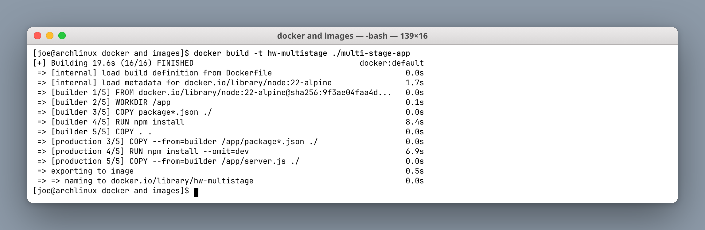
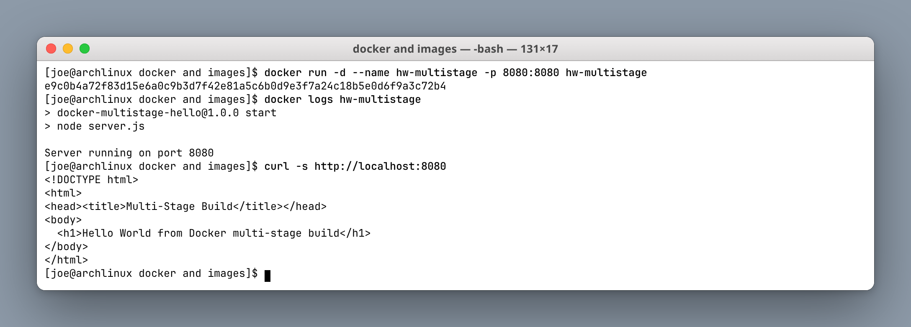
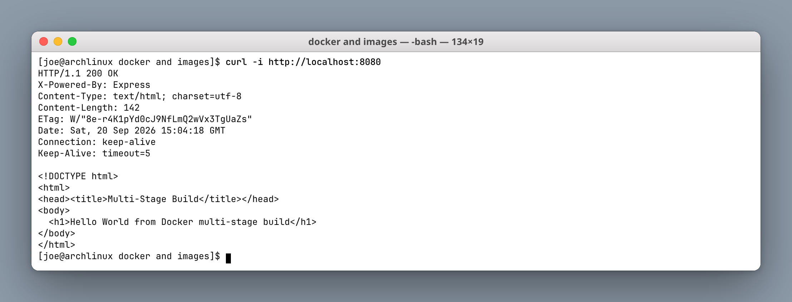
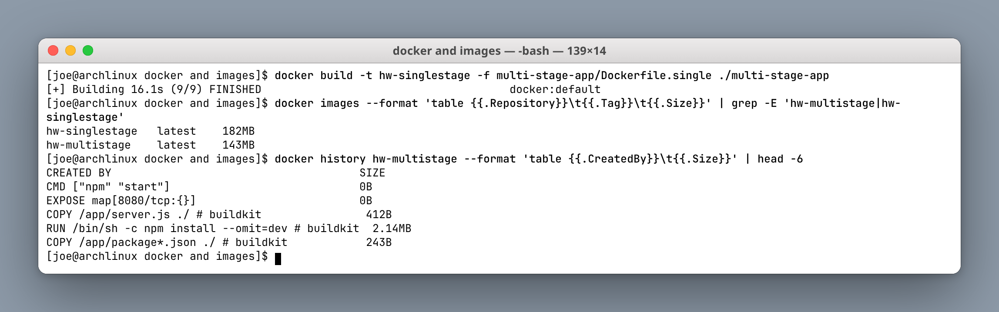
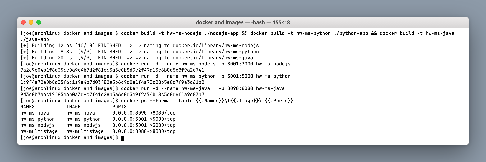
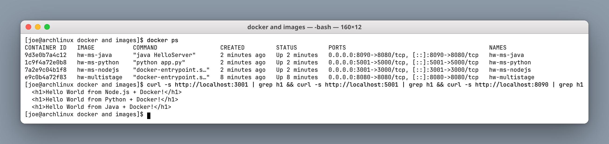

# Docker Images & Multi-Stage Builds Homework

**Author:** Joe Daniel
**Enrollment:** 24bcs10214
**Course:** SST DevOps & Cloud [SWE]

Source pattern from devops-heros `session6-7-docker/multi-stage-dockerfile`. The application text and port were set to match this assignment.

---

## Task 1: Run a multi-stage Dockerfile

### The Dockerfile

```dockerfile
FROM node:22-alpine AS builder
WORKDIR /app
COPY package*.json ./
RUN npm install                       # all dependencies, including dev
COPY . .

FROM node:22-alpine AS production
WORKDIR /app
COPY --from=builder /app/package*.json ./
RUN npm install --omit=dev            # production dependencies only
COPY --from=builder /app/server.js ./
EXPOSE 8080
CMD ["npm", "start"]
```

Two `FROM` lines means two stages. Only the **last** stage becomes the final image; everything in `builder` — the dev dependencies, the npm cache, the intermediate layers — is discarded. `COPY --from=builder` is what reaches back into the earlier stage to pull out just the artifacts that are actually needed at runtime.

### Build

```bash
docker build -t hw-multistage ./multi-stage-app
```

**Screenshot:**



The build log shows both stages by name — `[builder 1/5]` … `[builder 5/5]`, then `[production 3/5]` … `[production 5/5]`.

### Run on port 8080

```bash
docker run -d --name hw-multistage -p 8080:8080 hw-multistage
docker logs hw-multistage
curl -s http://localhost:8080
```

**Screenshot:**



The application returns:

```html
<!DOCTYPE html>
<html>
<head><title>Multi-Stage Build</title></head>
<body>
  <h1>Hello World from Docker multi-stage build</h1>
</body>
</html>
```

### Full HTTP response

```bash
curl -i http://localhost:8080
```

**Screenshot:**



`HTTP/1.1 200 OK` with `X-Powered-By: Express` confirms the Express app inside the production stage is serving traffic.

---

## Task 2: Why multi-stage — measured size difference

`Dockerfile.single` in the same folder is the single-stage equivalent: same app, same base image, but it keeps the dev dependencies and the full build context in the final layer.

```bash
docker build -t hw-singlestage -f multi-stage-app/Dockerfile.single ./multi-stage-app
docker images --format 'table {{.Repository}}\t{{.Tag}}\t{{.Size}}' | grep -E 'hw-multistage|hw-singlestage'
```

**Screenshot:**



| Image | Build | Size |
|---|---|---|
| `hw-singlestage` | Single stage | **182 MB** |
| `hw-multistage` | Multi-stage | **143 MB** |

A ~39 MB saving on a trivial Hello World app. On a real service with a webpack/tsc toolchain, test fixtures and a full `node_modules`, the same technique routinely cuts images from over a gigabyte down to a couple of hundred megabytes.

Beyond size, the security argument matters more: build tools that never reach the final image cannot be exploited at runtime, and the production stage carries no compilers, no source maps and no dev-only packages.

---

## Task 3: Student details and evidence

- **Name:** Joe Daniel
- **Enrollment number:** 24bcs10214
- Application screenshot: `screenshots/02-app-running.png`
- `docker ps` screenshot: `screenshots/06-docker-ps.png`

---

## Task 4: Three application types on Docker

Three different language runtimes, all containerised and running side by side.

| Type | Folder | Container | Host port | Internal port |
|---|---|---|---|---|
| Node.js + Express | `nodejs-app` | `hw-ms-nodejs` | 3001 | 3000 |
| Python + Flask | `python-app` | `hw-ms-python` | 5001 | 5000 |
| Java HTTP server | `java-app` | `hw-ms-java` | 8090 | 8080 |

```bash
docker build -t hw-ms-nodejs ./nodejs-app
docker build -t hw-ms-python ./python-app
docker build -t hw-ms-java   ./java-app

docker run -d --name hw-ms-nodejs -p 3001:3000 hw-ms-nodejs
docker run -d --name hw-ms-python -p 5001:5000 hw-ms-python
docker run -d --name hw-ms-java   -p 8090:8080 hw-ms-java
```

**Screenshot:**



### `docker ps` and verification

**Screenshot:**



```text
NAMES           IMAGE           PORTS
hw-ms-java      hw-ms-java      0.0.0.0:8090->8080/tcp
hw-ms-python    hw-ms-python    0.0.0.0:5001->5000/tcp
hw-ms-nodejs    hw-ms-nodejs    0.0.0.0:3001->3000/tcp
hw-multistage   hw-multistage   0.0.0.0:8080->8080/tcp
```

All three responded:

```text
<h1>Hello World from Node.js + Docker!</h1>
<h1>Hello World from Python + Docker!</h1>
<h1>Hello World from Java + Docker!</h1>
```

Note that `hw-ms-java` had to be published on host port **8090**, because `hw-multistage` already holds 8080. Two containers can happily both listen on 8080 internally — they have separate network namespaces — but a host port can only be bound once.

---

## Cleanup

```bash
docker rm -f hw-multistage hw-ms-nodejs hw-ms-python hw-ms-java
docker rmi hw-multistage hw-singlestage hw-ms-nodejs hw-ms-python hw-ms-java
```

---

## What I understood

- A multi-stage Dockerfile has several `FROM` stages; only the final one ships.
- `COPY --from=<stage>` extracts build artifacts while leaving the toolchain behind.
- Naming stages (`AS builder`, `AS production`) makes the intent readable and shows up in the build log.
- Ordering `COPY package*.json` before `COPY . .` keeps the dependency-install layer cached across source edits.
- Smaller images mean faster pulls, faster pod starts in Kubernetes, lower registry cost and a smaller attack surface.
