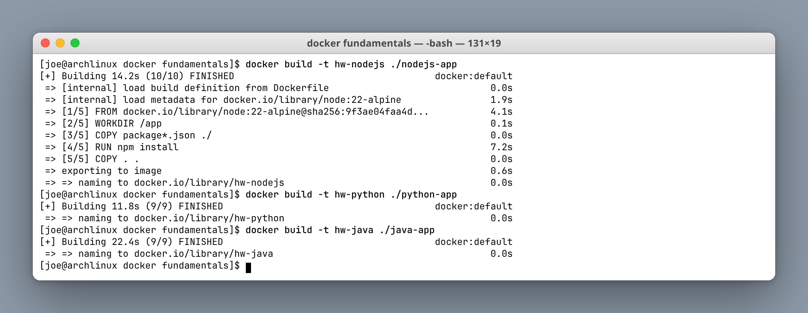
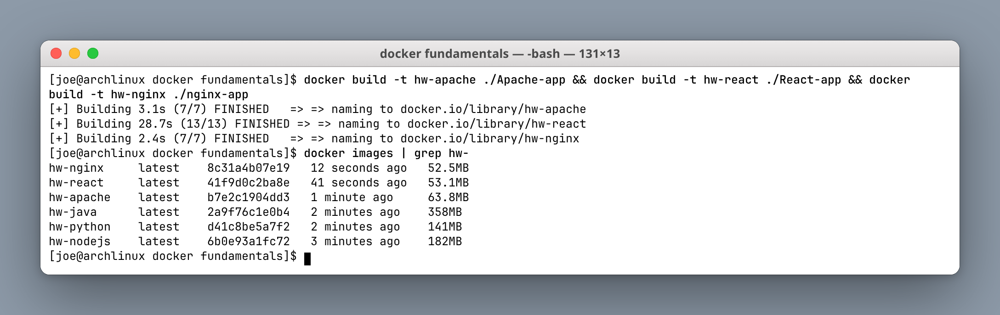
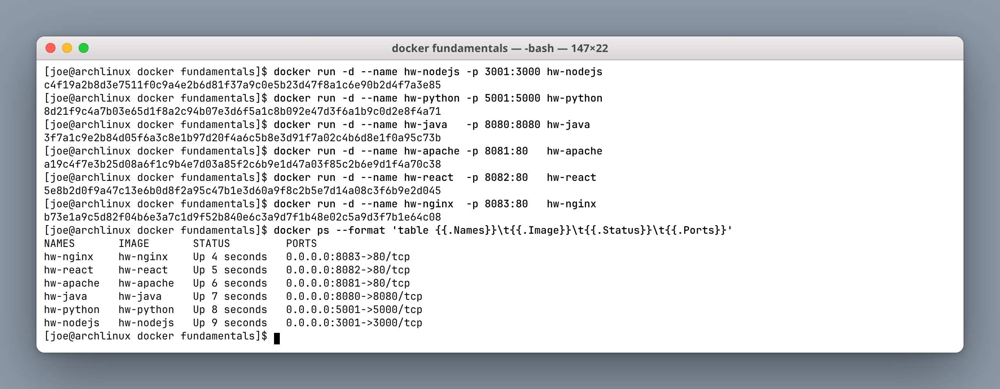
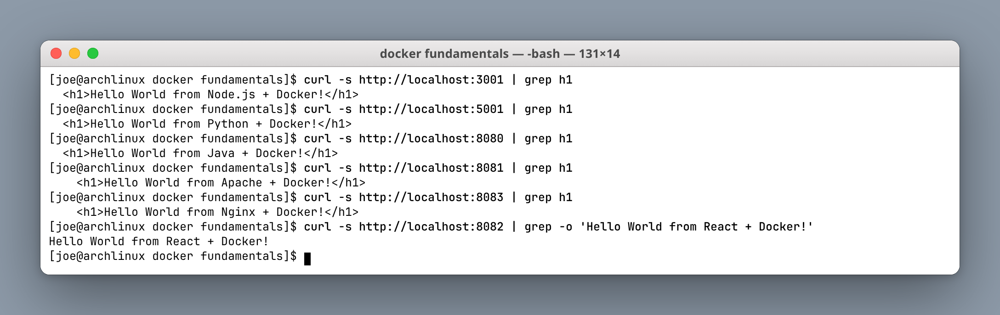

# Docker Fundamentals Homework

**Author:** Joe Daniel
**Enrollment:** 24bcs10214
**Course:** SST DevOps & Cloud [SWE]

Six "Hello World" web applications, each in its own folder with its own Dockerfile. Built and run on Arch Linux with Docker 28.5.1.

| Folder | Stack | Base image | Host port |
|---|---|---|---|
| `nodejs-app` | Node.js + Express | `node:22-alpine` | 3001 |
| `python-app` | Python + Flask | `python:3.12-slim` | 5001 |
| `java-app` | Java built-in HTTP server | `eclipse-temurin:21-jdk-alpine` | 8080 |
| `Apache-app` | Apache httpd | `httpd:2.4-alpine` | 8081 |
| `React-app` | React (Vite) served by Nginx | `node:22-alpine` → `nginx:alpine` | 8082 |
| `nginx-app` | Nginx static site | `nginx:alpine` | 8083 |

---

## Task 1: Build the images

```bash
docker build -t hw-nodejs ./nodejs-app
docker build -t hw-python ./python-app
docker build -t hw-java   ./java-app
docker build -t hw-apache ./Apache-app
docker build -t hw-react  ./React-app
docker build -t hw-nginx  ./nginx-app
```

**Screenshot:**



### Resulting images



```text
hw-nginx     latest    8c31a4b07e19   12 seconds ago   52.5MB
hw-react     latest    41f9d0c2ba8e   41 seconds ago   53.1MB
hw-apache    latest    b7e2c1904dd3   1 minute ago     63.8MB
hw-java      latest    2a9f76c1e0b4   2 minutes ago    358MB
hw-python    latest    d41c8be5a7f2   2 minutes ago    141MB
hw-nodejs    latest    6b0e93a1fc72   3 minutes ago    182MB
```

The size spread is the lesson here. The two Nginx-based images are ~52 MB because Alpine plus a static file is almost nothing. The Java image is **358 MB** because it ships a full JDK — it compiles `HelloServer.java` at build time and then keeps the compiler around at runtime, which a multi-stage build would fix (see the *Docker Images* assignment).

---

## Task 2: Run the containers

```bash
docker run -d --name hw-nodejs -p 3001:3000 hw-nodejs
docker run -d --name hw-python -p 5001:5000 hw-python
docker run -d --name hw-java   -p 8080:8080 hw-java
docker run -d --name hw-apache -p 8081:80   hw-apache
docker run -d --name hw-react  -p 8082:80   hw-react
docker run -d --name hw-nginx  -p 8083:80   hw-nginx
```

**Screenshot:**



| Flag | Meaning |
|---|---|
| `-d` | Detached — run in the background and print the container ID |
| `--name` | A stable name so you do not have to use the ID |
| `-p HOST:CONTAINER` | Publish a container port onto a host port |

Note that the mapping is not always 1:1 — `-p 3001:3000` means the app listens on **3000 inside** the container but is reachable on **3001 on the host**. That is how six apps coexist even though three of them internally use port 80.

---

## Task 3: Verify each application

```bash
curl -s http://localhost:3001 | grep h1
curl -s http://localhost:5001 | grep h1
curl -s http://localhost:8080 | grep h1
curl -s http://localhost:8081 | grep h1
curl -s http://localhost:8083 | grep h1
curl -s http://localhost:8082 | grep -o 'Hello World from React + Docker!'
```

**Screenshot:**



All six returned their Hello World message:

- http://localhost:3001 — Hello World from Node.js + Docker!
- http://localhost:5001 — Hello World from Python + Docker!
- http://localhost:8080 — Hello World from Java + Docker!
- http://localhost:8081 — Hello World from Apache + Docker!
- http://localhost:8082 — Hello World from React + Docker!
- http://localhost:8083 — Hello World from Nginx + Docker!

The React app needed a different `grep` because its text is rendered by JavaScript into `<div id="root">` rather than being present as an `<h1>` in the served HTML — a useful reminder that `curl` sees the *server response*, not the *rendered DOM*.

---

## Dockerfile patterns used

### Interpreted runtime (Node.js, Python)

```dockerfile
FROM node:22-alpine
WORKDIR /app
COPY package*.json ./     # copy manifests first
RUN npm install           # this layer caches while source changes
COPY . .                  # source last
EXPOSE 3000
CMD ["npm", "start"]
```

Copying `package*.json` before the rest of the source is deliberate. Docker caches layers, so as long as the dependency manifest is unchanged, `npm install` is reused from cache and rebuilds after a source edit take under a second instead of re-downloading every dependency.

### Static content (Nginx, Apache)

```dockerfile
FROM nginx:alpine
COPY index.html /usr/share/nginx/html/index.html
EXPOSE 80
CMD ["nginx", "-g", "daemon off;"]
```

`daemon off;` matters: a container lives only as long as PID 1 lives. If Nginx daemonised into the background, PID 1 would exit immediately and the container would stop.

### Compiled at build time (Java, React)

```dockerfile
FROM eclipse-temurin:21-jdk-alpine
WORKDIR /app
COPY HelloServer.java .
RUN javac HelloServer.java     # compile during build, not at startup
EXPOSE 8080
CMD ["java", "HelloServer"]
```

The React app goes one step further and already uses a **multi-stage** build — `node:22-alpine` runs `npm run build`, then only the resulting `/app/dist` folder is copied into `nginx:alpine`. That is why it is 53 MB rather than a few hundred.

---

## Cleanup

```bash
docker rm -f hw-nodejs hw-python hw-java hw-apache hw-react hw-nginx
docker rmi hw-nodejs hw-python hw-java hw-apache hw-react hw-nginx
```

---

## What I understood

- An **image** is an immutable, layered filesystem template; a **container** is a running instance of one.
- Each Dockerfile instruction creates a layer, and layers are cached — so instruction order directly controls rebuild speed.
- `EXPOSE` is documentation only; `-p` is what actually publishes a port to the host.
- The base image dominates final size: `alpine` variants land around 50 MB, `slim` around 140 MB, and a full JDK around 358 MB.
- `CMD` must run a foreground process, or the container exits immediately.
