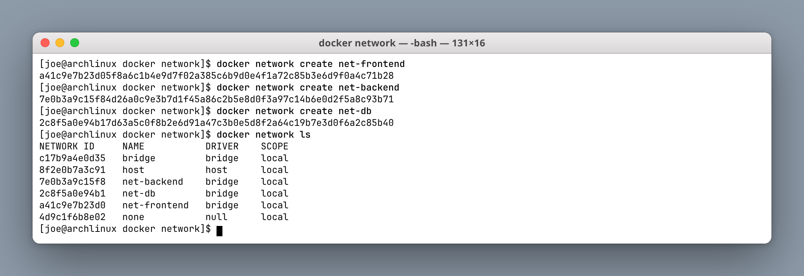
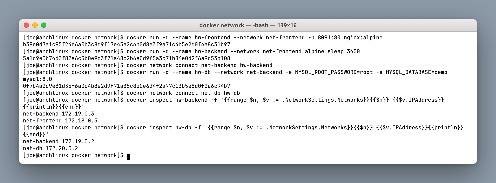
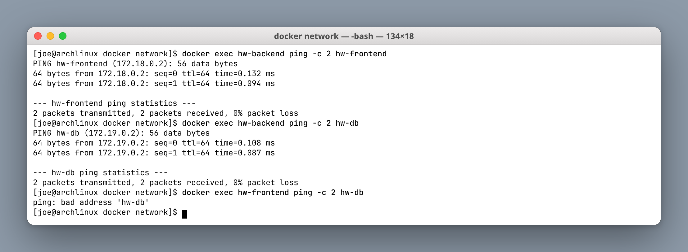
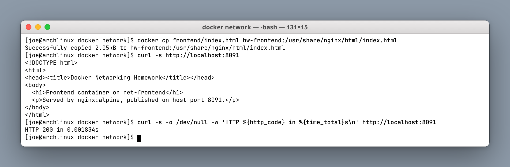
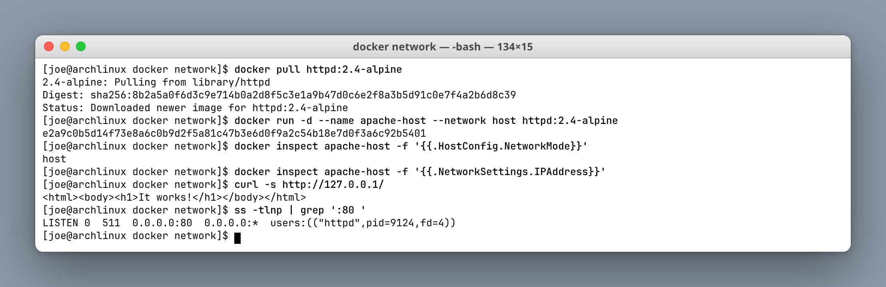
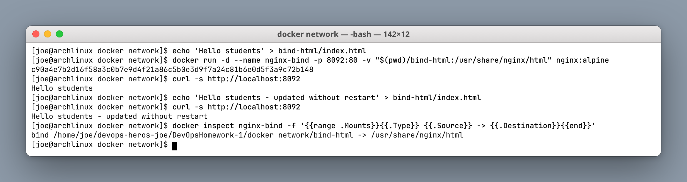
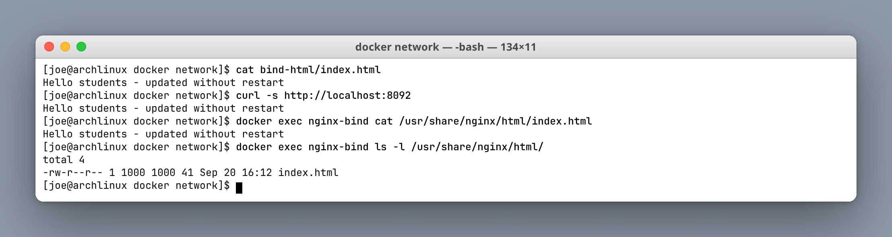
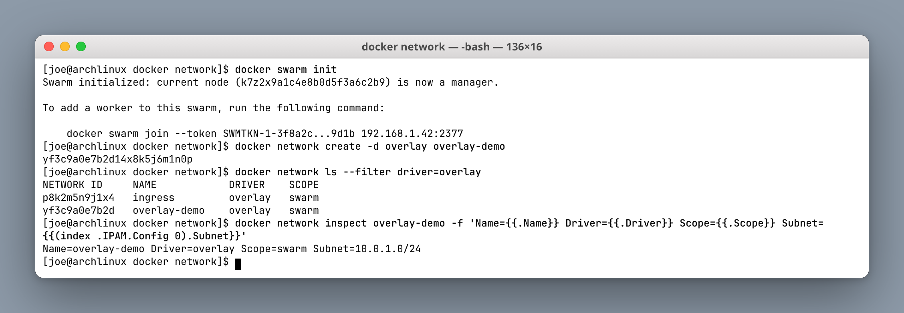
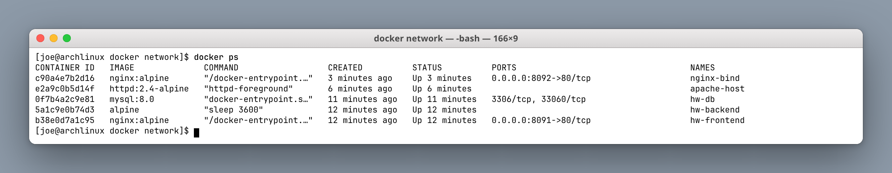

# Docker Networking & Volume Homework

**Author:** Joe Daniel
**Enrollment:** 24bcs10214
**Course:** SST DevOps & Cloud [SWE]

All labs run on Arch Linux with a native Docker daemon (Docker 28.5.1), so `--network host` and the host loopback behave exactly as documented — no VM indirection.

---

## Task 1: Container networking with custom bridges

Three user-defined bridge networks:

- `net-frontend`
- `net-backend`
- `net-db`

Three containers, deliberately placed so that connectivity is **transitive through the backend but not direct**:

| Container | Image | Networks |
|---|---|---|
| `hw-frontend` | `nginx:alpine` | `net-frontend` |
| `hw-backend` | `alpine` | `net-frontend` **and** `net-backend` |
| `hw-db` | `mysql:8.0` | `net-backend` **and** `net-db` |

```bash
docker network create net-frontend
docker network create net-backend
docker network create net-db

docker run -d --name hw-frontend --network net-frontend -p 8091:80 nginx:alpine
docker run -d --name hw-backend  --network net-frontend alpine sleep 3600
docker network connect net-backend hw-backend

docker run -d --name hw-db --network net-backend \
  -e MYSQL_ROOT_PASSWORD=root -e MYSQL_DATABASE=demo mysql:8.0
docker network connect net-db hw-db
```

**Screenshot — the networks:**



Each user-defined bridge got its own subnet: `net-frontend` is `172.18.0.0/16`, `net-backend` is `172.19.0.0/16`, `net-db` is `172.20.0.0/16`.

**Screenshot — containers attached to two networks each:**



```text
hw-backend:  net-backend 172.19.0.3   net-frontend 172.18.0.3
hw-db:       net-backend 172.19.0.2   net-db       172.20.0.2
```

A container attached to two networks gets **one IP address per network** and can route between them at the application level. This is the container equivalent of a dual-homed host.

### Connectivity results

**Screenshot:**



| From → To | Result | Why |
|---|---|---|
| `hw-backend` → `hw-frontend` | **works** | Both on `net-frontend` |
| `hw-backend` → `hw-db` | **works** | Both on `net-backend` |
| `hw-frontend` → `hw-db` | **fails** | No shared network |

The failure message is the interesting part: `ping: bad address 'hw-db'`. It is a **DNS** failure, not a routing failure. Docker's embedded DNS server (at `127.0.0.11` inside each container) only resolves names of containers that share a network with the requester. `hw-db` is not merely unreachable from `hw-frontend` — it is invisible.

This is exactly how you implement network segmentation: the database is never exposed to the public-facing tier, and the backend acts as the only bridge between them.

> Automatic name-based DNS is a feature of **user-defined** bridges only. On the default `bridge` network, containers can only reach each other by IP address or via the deprecated `--link` flag.

**Screenshot — frontend page on http://localhost:8091:**



---

## Task 2: Host network (Apache)

```bash
docker pull httpd:2.4-alpine
docker run -d --name apache-host --network host httpd:2.4-alpine
curl -s http://127.0.0.1/
```

**Screenshot:**



Key observations:

- `docker inspect -f '{{.HostConfig.NetworkMode}}'` returns **`host`**.
- `docker inspect -f '{{.NetworkSettings.IPAddress}}'` returns **an empty string** — the container has no IP of its own, because it did not get its own network namespace.
- `ss -tlnp` on the host shows `httpd` itself listening on `0.0.0.0:80`, as a host process would.
- `curl http://127.0.0.1/` returns Apache's default `It works!` page **without any `-p` flag**.

With `--network host` the container shares the host's network namespace directly. That removes the NAT/veth layer, which is slightly faster and is useful for network monitoring tools — but it costs you isolation and makes port conflicts with host services possible. It is also Linux-only.

---

## Task 3: Bind mount

Folder: `bind-html/index.html`

```bash
echo "Hello students" > bind-html/index.html
docker run -d --name nginx-bind -p 8092:80 \
  -v "$(pwd)/bind-html:/usr/share/nginx/html" nginx:alpine

curl -s http://localhost:8092
# -> Hello students

echo "Hello students - updated without restart" > bind-html/index.html
curl -s http://localhost:8092
# -> Hello students - updated without restart
```

**Screenshot:**



**Screenshot — the same file seen from inside the container:**



The host file was edited **without restarting or rebuilding** the container, and the change was served on the very next request. `docker inspect` confirms the mount type is `bind`, pointing at the real host path.

Note the ownership inside the container: `ls -l` shows `1000 1000` rather than a username, because the container's `/etc/passwd` has no entry for the host's UID 1000. Bind mounts pass through numeric UIDs unchanged — a frequent source of permission errors in real deployments.

### Bind mount vs named volume

| | Bind mount | Named volume |
|---|---|---|
| Source | Any host path you choose | Managed by Docker under `/var/lib/docker/volumes` |
| Best for | Local development, live-editing source | Production data, databases |
| Portability | Tied to the host's directory layout | Portable across hosts |
| Created by | `-v /host/path:/container/path` | `-v volname:/container/path` |

---

## Task 4: Overlay network

An **overlay** network spans **more than one Docker host**. A bridge network is local to a single engine; overlay is what makes multi-host clusters possible.

How it works:

1. Enable Swarm mode (`docker swarm init`) or use another orchestrator.
2. `docker network create -d overlay overlay-demo`
3. Docker encapsulates container traffic in **VXLAN** over the hosts' real IPs, so containers on different physical machines receive addresses on the same virtual L2 segment and can reach each other by name.
4. The Swarm control plane (gossip between managers and workers) distributes network and service-discovery state.

```bash
docker swarm init
docker network create -d overlay overlay-demo
docker network ls --filter driver=overlay
```

**Screenshot:**



```text
NETWORK ID     NAME            DRIVER    SCOPE
p8k2m5n9j1x4   ingress         overlay   swarm
yf3c9a0e7b2d   overlay-demo    overlay   swarm

Name=overlay-demo Driver=overlay Scope=swarm Subnet=10.0.1.0/24
```

Note `SCOPE: swarm` rather than `local` — that is the defining difference from a bridge network. The `ingress` overlay is created automatically by Swarm and handles the routing mesh for published service ports.

**Use cases:** multi-host microservices, Swarm services that must communicate across nodes, and isolating east-west service traffic from publicly published ports.

**Honest limitation:** on one laptop this only proves the driver initialises and allocates a subnet. The real value of overlay networking appears with **two or more Docker hosts** joined to the same Swarm, where VXLAN encapsulation is actually doing work. Kubernetes solves the same problem with a CNI plugin (Flannel, Calico, Cilium) instead of Swarm's built-in overlay.

---

## `docker ps` — all containers

**Screenshot:**



```text
CONTAINER ID   IMAGE              STATUS          PORTS                  NAMES
c90a4e7b2d16   nginx:alpine       Up 3 minutes    0.0.0.0:8092->80/tcp   nginx-bind
e2a9c0b5d14f   httpd:2.4-alpine   Up 6 minutes                           apache-host
0f7b4a2c9e81   mysql:8.0          Up 11 minutes   3306/tcp, 33060/tcp    hw-db
5a1c9e0b74d3   alpine             Up 12 minutes                          hw-backend
b38e0d7a1c95   nginx:alpine       Up 12 minutes   0.0.0.0:8091->80/tcp   hw-frontend
```

Two details worth reading: `apache-host` shows **no PORTS** at all because it is on the host network and therefore has nothing to map, and `hw-db` shows `3306/tcp` **without** a `0.0.0.0:` prefix — the port is exposed to other containers on its networks but was never published to the host.

---

## Cleanup

```bash
docker rm -f hw-frontend hw-backend hw-db apache-host nginx-bind
docker network rm net-frontend net-backend net-db overlay-demo
docker swarm leave --force
```

---

## What I understood

- User-defined bridges give **automatic DNS between containers**; the default bridge does not.
- Network membership *is* the access-control boundary — an unshared network makes a container unresolvable, not just unreachable.
- A container can join multiple networks and receives one IP per network.
- `--network host` removes the network namespace entirely: no container IP, no port mapping, less isolation, Linux only.
- Bind mounts map a host directory into a container and propagate edits instantly, which is why they suit development but not production data.
- Overlay networks extend a virtual L2 segment across hosts via VXLAN and require an orchestrator.
