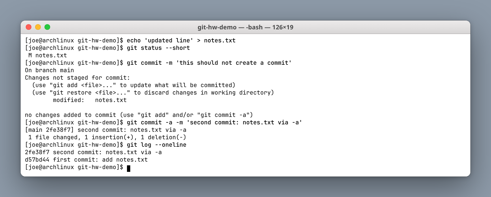
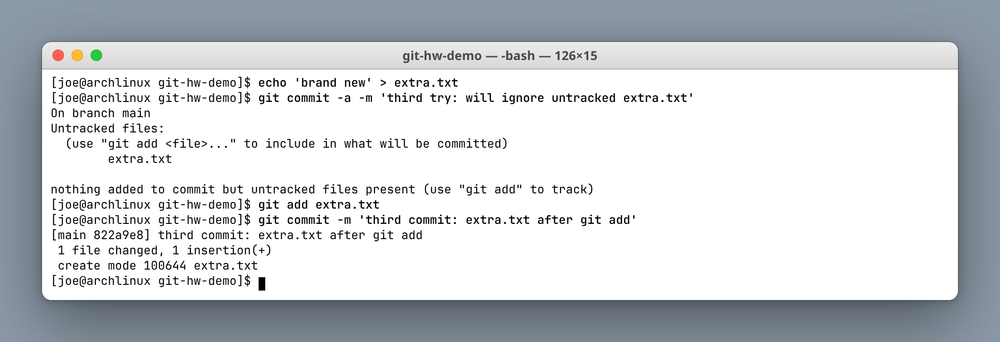
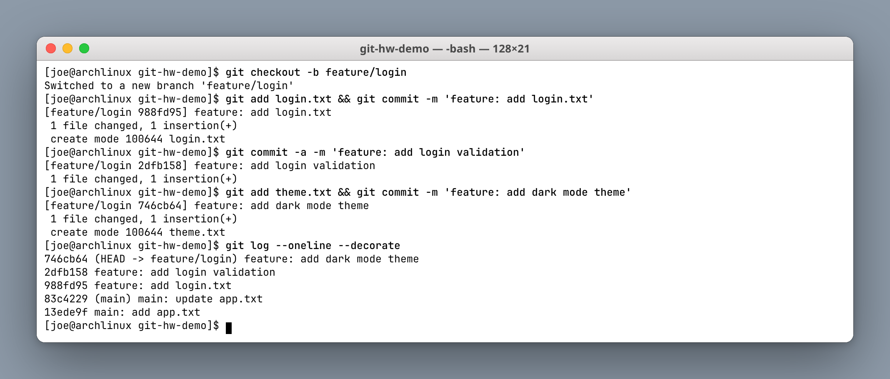
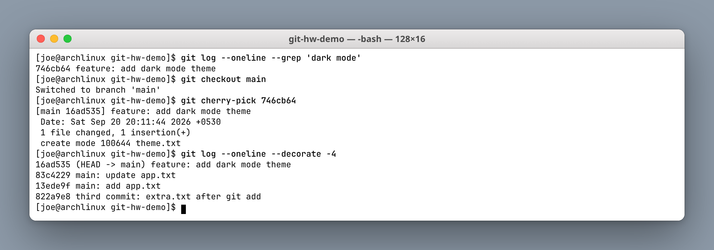
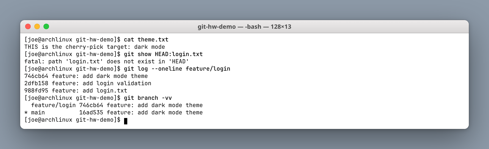

# Git Homework

**Author:** Joe Daniel
**Enrollment:** 24bcs10214
**Course:** SST DevOps & Cloud [SWE]

Practiced in a throwaway local repo (`/tmp/git-hw-demo`) so this course repository's history stays clean. Commands and real output below.

---

## Task 1: `git commit -a -m` vs `git commit -m`

### Difference

| | `git commit -m "msg"` | `git commit -a -m "msg"` |
|---|---|---|
| What it commits | Only what is already in the **staging area** (`git add`) | All **tracked** files that were modified or deleted |
| New (untracked) files | Ignored until `git add` | Still ignored — `-a` does **not** add new files |
| Typical use | After staging a chosen subset of changes | Quick save of edits to files git already knows about |

`-a` means "stage all tracked changes, then commit". It is a shortcut for `git add -u && git commit`, **not** a substitute for `git add` on brand-new files.

### Test 1 — `git commit -m` with nothing staged

`notes.txt` is tracked and was modified, but never staged.



```text
$ git status --short
 M notes.txt

$ git commit -m "this should not create a commit"
On branch main
Changes not staged for commit:
	modified:   notes.txt

no changes added to commit (use "git add" and/or "git commit -a")
```

**Result:** no commit was created. Git explicitly suggests `git add` or `git commit -a`.

### Test 2 — `git commit -a -m` on the same tracked file

```text
$ git commit -a -m "second commit: notes.txt via -a"
[main 2fe38f7] second commit: notes.txt via -a
 1 file changed, 1 insertion(+), 1 deletion(-)

$ git log --oneline
2fe38f7 second commit: notes.txt via -a
d57bd44 first commit: add notes.txt
```

**Result:** `-a` staged the tracked edit and committed it in one step. No separate `git add` was needed.

### Test 3 — `-a` does not pick up untracked files



```text
$ echo "brand new" > extra.txt
$ git commit -a -m "third try: will ignore untracked extra.txt"
On branch main
Untracked files:
	extra.txt

nothing added to commit but untracked files present (use "git add" to track)

$ git add extra.txt
$ git commit -m "third commit: extra.txt after git add"
[main 822a9e8] third commit: extra.txt after git add
 1 file changed, 1 insertion(+)
 create mode 100644 extra.txt
```

**Result:** a brand-new file still requires an explicit `git add`. This is the single most common surprise with `-a`.

---

## Task 2: Cherry-pick

`git cherry-pick` copies the changes from **one commit** onto the current branch. Every other commit on the source branch stays where it is.

### 1. Create a branch with three commits



```text
$ git checkout -b feature/login
Switched to a new branch 'feature/login'

$ git log --oneline --decorate
746cb64 (HEAD -> feature/login) feature: add dark mode theme
2dfb158 feature: add login validation
988fd95 feature: add login.txt
83c4229 (main) main: update app.txt
13ede9f main: add app.txt
```

### 2. Identify the one commit to move

```text
$ git log --oneline --grep "dark mode"
746cb64 feature: add dark mode theme
```

Picked hash: **`746cb64`** — `feature: add dark mode theme`.

### 3. Cherry-pick it onto `main`



```text
$ git checkout main
Switched to branch 'main'

$ git cherry-pick 746cb64
[main 16ad535] feature: add dark mode theme
 Date: Sat Sep 20 20:11:44 2026 +0530
 1 file changed, 1 insertion(+)
 create mode 100644 theme.txt
```

Note the **new hash**: `16ad535` on `main`, not `746cb64`. Cherry-pick replays the *diff* as a fresh commit; the original commit still exists untouched on the feature branch. The original author date is preserved, which is why git prints a separate `Date:` line.

### 4. Verify what did and did not move



```text
$ cat theme.txt
THIS is the cherry-pick target: dark mode

$ git show HEAD:login.txt
fatal: path 'login.txt' does not exist in 'HEAD'

$ git log --oneline feature/login
746cb64 feature: add dark mode theme
2dfb158 feature: add login validation
988fd95 feature: add login.txt
```

**Result:** `theme.txt` (the dark mode change) is now on `main`. `login.txt` is **not** — only the single cherry-picked commit moved. `feature/login` still holds all three of its commits.

---

## What I understood

- `git commit -m` commits **what is staged**.
- `git commit -a -m` **auto-stages tracked edits** and then commits, skipping untracked files entirely.
- `git cherry-pick <hash>` copies one commit's changes onto the current branch as a **new commit with a new hash**.
- Cherry-pick is the right tool when you need one hotfix out of a feature branch without merging the whole branch. The cost is a duplicated commit, so if the branch is merged later git may report the change twice — which is why long-lived duplicate cherry-picks are discouraged in favour of a proper merge or rebase.
