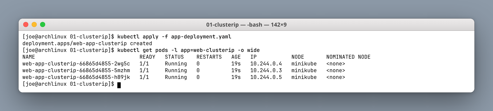
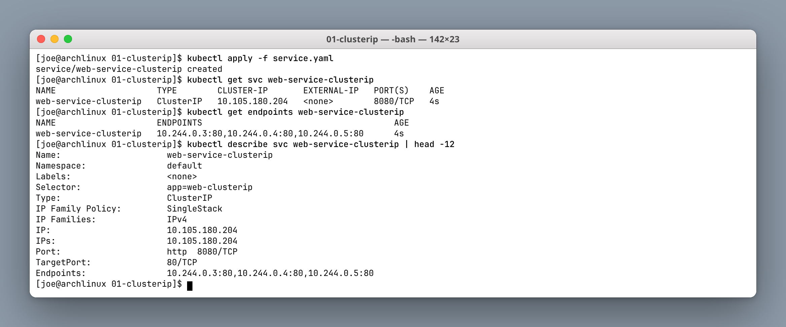
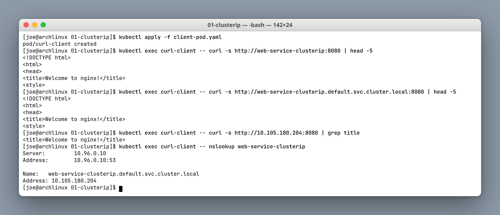
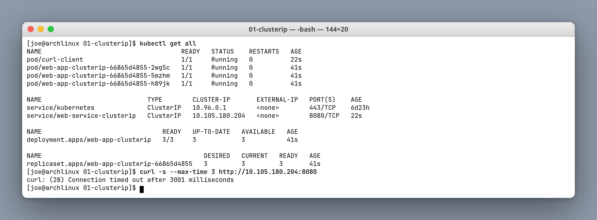

# Kubernetes Services — ClusterIP Homework

**Author:** Joe Daniel
**Enrollment:** 24bcs10214
**Course:** SST DevOps & Cloud [SWE]

**Manifests:** `session-11-kubernetes-services/01-clusterip/`

---

## Prerequisites

```bash
minikube start --driver=docker
kubectl cluster-info
```

---

## Task: Deploy a ClusterIP Service and test internal access

### Step 1 — Deploy the nginx backend (3 replicas)

```bash
cd session-11-kubernetes-services/01-clusterip
kubectl apply -f app-deployment.yaml
kubectl get pods -l app=web-clusterip -o wide
```

**Screenshot:**



```text
NAME                                 READY   STATUS    RESTARTS   AGE   IP           NODE
web-app-clusterip-66865d4855-2wg5c   1/1     Running   0          19s   10.244.0.4   minikube
web-app-clusterip-66865d4855-5mzhm   1/1     Running   0          19s   10.244.0.3   minikube
web-app-clusterip-66865d4855-h89jk   1/1     Running   0          19s   10.244.0.5   minikube
```

Each pod has its own IP from the pod CIDR (`10.244.0.0/24`). These IPs are **ephemeral** — delete a pod and the replacement gets a different one. That churn is precisely the problem a Service exists to solve.

### Step 2 — Create the ClusterIP Service

```bash
kubectl apply -f service.yaml
kubectl get svc web-service-clusterip
kubectl get endpoints web-service-clusterip
kubectl describe svc web-service-clusterip
```

**Screenshot:**



```text
NAME                    TYPE        CLUSTER-IP       EXTERNAL-IP   PORT(S)    AGE
web-service-clusterip   ClusterIP   10.105.180.204   <none>        8080/TCP   4s

NAME                    ENDPOINTS
web-service-clusterip   10.244.0.3:80,10.244.0.4:80,10.244.0.5:80
```

The `describe` output shows how the pieces link up:

| Field | Value | Meaning |
|---|---|---|
| `Selector` | `app=web-clusterip` | Which pods belong behind this Service |
| `Type` | `ClusterIP` | Internal-only virtual IP |
| `IP` | `10.105.180.204` | The stable VIP, from the service CIDR |
| `Port` | `8080/TCP` | Port the Service listens on |
| `TargetPort` | `80/TCP` | Port on each pod traffic is forwarded to |
| `Endpoints` | three pod IPs | Built automatically from the selector |

`EXTERNAL-IP` is `<none>` — that is the definition of ClusterIP.

### Step 3 — Deploy a client pod and test internal access

```bash
kubectl apply -f client-pod.yaml
kubectl exec curl-client -- curl -s http://web-service-clusterip:8080 | head -5
kubectl exec curl-client -- curl -s http://web-service-clusterip.default.svc.cluster.local:8080 | head -5
kubectl exec curl-client -- curl -s http://10.105.180.204:8080 | grep title
kubectl exec curl-client -- nslookup web-service-clusterip
```

**Screenshot:**



All three addressing forms returned the nginx welcome page:

1. **Short name** — `web-service-clusterip` (works because the pod's `/etc/resolv.conf` has a `default.svc.cluster.local` search suffix)
2. **FQDN** — `web-service-clusterip.default.svc.cluster.local`
3. **ClusterIP directly** — `10.105.180.204`

`nslookup` confirms CoreDNS (at `10.96.0.10`) resolves the short name to the Service VIP.

### Step 4 — Verify all resources, and confirm it is internal-only

```bash
kubectl get all
curl -s --max-time 3 http://10.105.180.204:8080
```

**Screenshot:**



```text
NAME                                     READY   STATUS    RESTARTS   AGE
pod/curl-client                          1/1     Running   0          22s
pod/web-app-clusterip-66865d4855-2wg5c   1/1     Running   0          41s
pod/web-app-clusterip-66865d4855-5mzhm   1/1     Running   0          41s
pod/web-app-clusterip-66865d4855-h89jk   1/1     Running   0          41s

NAME                            TYPE        CLUSTER-IP       EXTERNAL-IP   PORT(S)    AGE
service/kubernetes              ClusterIP   10.96.0.1        <none>        443/TCP    6d23h
service/web-service-clusterip   ClusterIP   10.105.180.204   <none>        8080/TCP   22s

NAME                                READY   UP-TO-DATE   AVAILABLE   AGE
deployment.apps/web-app-clusterip   3/3     3            3           41s
```

The final command is the proof of the whole lesson. Running `curl` against the ClusterIP from the **Arch host** — outside the cluster — times out:

```text
curl: (28) Connection timed out after 3001 milliseconds
```

The same IP and port worked perfectly from `curl-client` *inside* the cluster. A ClusterIP is a virtual address that only exists as iptables/IPVS rules programmed by `kube-proxy` on cluster nodes. It is not routable from anywhere else.

---

## Cleanup

```bash
kubectl delete -f client-pod.yaml -f service.yaml -f app-deployment.yaml
```

---

## What I understood

- **ClusterIP** is the default Service type — internal-only, with no external reachability by design.
- The Service provides a **stable virtual IP and DNS name** in front of pods whose own IPs change constantly.
- `port: 8080` is what the Service listens on; `targetPort: 80` is the container port it forwards to. They are independent and frequently differ.
- The **Endpoints** object is generated automatically from the `selector` and is the actual list of backends. An empty `ENDPOINTS` column almost always means the selector does not match any pod labels.
- `kube-proxy` implements the VIP through iptables/IPVS rules and load-balances across endpoints, which is why the address works from inside the cluster and nowhere else.
- To expose this service externally you would change the type to `NodePort` or `LoadBalancer`, or put an Ingress in front of it.
