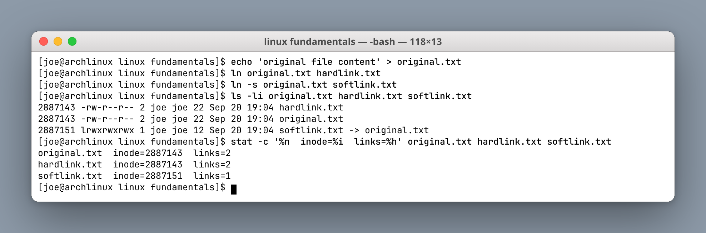
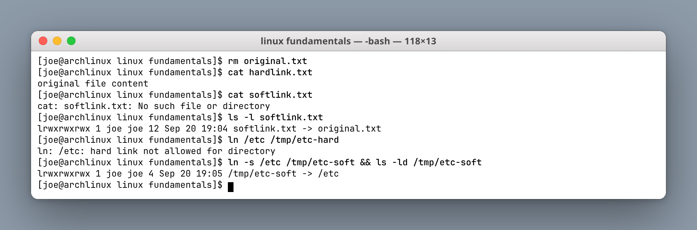
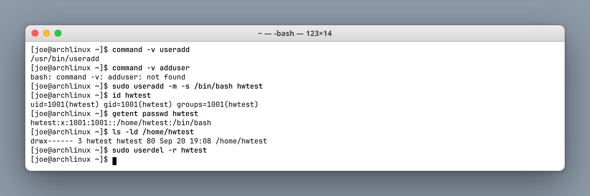
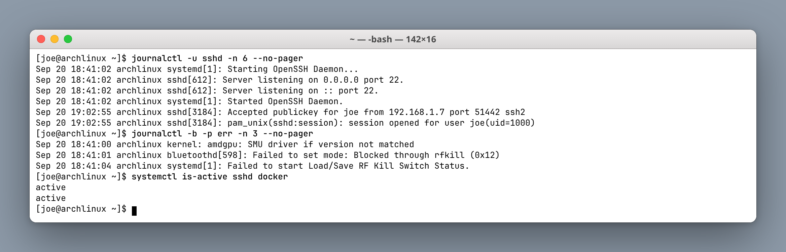

# Linux Fundamentals

**Author:** Joe Daniel
**Enrollment:** 24bcs10214
**Course:** SST DevOps & Cloud [SWE]

Homework notes from the Linux session: soft vs hard links, `adduser` vs `useradd`, `journalctl`, and a command cheat sheet. All commands were run on Arch Linux (`joe@archlinux`).

---

## Task 1: Soft link and hard link

### What I learned

A **hard link** is another name for the **same file** — the same inode. Both names point at the same data blocks on disk.

A **soft link** (symlink) is a **separate small file** that stores a path to a target. It is a pointer, not a second name for the same inode.

### Commands

```bash
# hard link
ln original.txt hardlink.txt

# soft link
ln -s original.txt softlink.txt

# inspect inode (column 1) and link count (column 3)
ls -li original.txt hardlink.txt softlink.txt
stat -c '%n  inode=%i  links=%h' original.txt hardlink.txt softlink.txt
```

**Screenshot:**



### What the output shows

```
2887143 -rw-r--r-- 2 joe joe 22 Sep 20 19:04 hardlink.txt
2887143 -rw-r--r-- 2 joe joe 22 Sep 20 19:04 original.txt
2887151 lrwxrwxrwx 1 joe joe 12 Sep 20 19:04 softlink.txt -> original.txt
```

- `original.txt` and `hardlink.txt` share inode **2887143** and both report a link count of **2**.
- `softlink.txt` has its own inode **2887151**, a link count of **1**, and the `l` file type with a visible `-> original.txt` target.

### Deleting the original

```bash
rm original.txt
cat hardlink.txt   # still works — data is still referenced
cat softlink.txt   # broken — dangling symlink
```

**Screenshot:**



- The hard link **still has the data**: removing one name only decrements the link count, and the inode survives until the count hits zero.
- The soft link **broke** with `No such file or directory` — it became a **dangling symlink**, though `ls -l` still shows the stored path.
- `ln /etc /tmp/etc-hard` failed with `hard link not allowed for directory`. `ln -s /etc /tmp/etc-soft` worked fine.

### Interview answer

A hard link is a second directory entry pointing at the same inode. Same data, same permissions, same everything — the file exists until the last hard link is removed. Hard links cannot point at directories (as a normal user) and cannot cross filesystems, because inode numbers are only unique within one filesystem.

A soft link is a separate file whose contents are a path. It can point at directories and across filesystems. If the target is renamed or deleted, the symlink dangles. `ln` creates a hard link; `ln -s` creates a soft link.

| | Hard link | Soft link |
|---|---|---|
| Command | `ln file link` | `ln -s target link` |
| Inode | Same as original | Its own inode |
| After deleting original | Data still reachable | Broken (dangling) |
| Directories | No | Yes |
| Across filesystems | No | Yes |
| `ls -l` | Looks like a normal file | `link -> target` |

---

## Task 2: `adduser` vs `useradd`

### Difference

| | `useradd` | `adduser` |
|---|---|---|
| What it is | Low-level binary from `shadow-utils` | Debian/Ubuntu Perl helper script that wraps `useradd` |
| How you use it | Flags only, non-interactive | Interactive by default |
| Home directory | Only if you pass `-m` | Created automatically |
| Password | Set separately with `passwd` | Prompts during creation |
| Extra info (GECOS) | You pass `-c` yourself | Prompts (name, room, phone) |
| Distros | Every Linux distribution | Debian/Ubuntu only (on RHEL/Arch it is absent or a symlink) |

### Which is preferred on Ubuntu, and why

**`adduser` is preferred on Ubuntu.**

It is the Debian-recommended command for creating human accounts. It creates `/home/<user>`, copies the `/etc/skel` templates, sets a password, and creates a matching default group — all in one interactive pass. `useradd` is easy to misuse: `useradd bob` with no `-m` creates an account **with no home directory**, which then breaks the first login.

Use `useradd` in scripts, where you need exact flags (`-u`, `-g`, `-s`) and the same command to work across mixed distributions.

### Verified on Arch Linux

Arch ships `shadow-utils` but **not** the Debian `adduser` script, which demonstrates the difference directly:

```bash
command -v useradd    # /usr/bin/useradd
command -v adduser    # not found

sudo useradd -m -s /bin/bash hwtest
id hwtest
getent passwd hwtest
ls -ld /home/hwtest
sudo userdel -r hwtest
```

**Screenshot:**



The `-m` flag is what created `/home/hwtest`. Without it the account would exist in `/etc/passwd` with a home path that does not exist on disk.

On Ubuntu, the equivalent preferred commands are:

```bash
sudo adduser hwtest                                              # interactive
sudo adduser --disabled-password --gecos "Test User" hwtest      # scripted
sudo deluser --remove-home hwtest                                # cleanup
```

---

## Task 3: `journalctl`

### What it is used for

`journalctl` reads the **systemd journal** — the structured, indexed log stream from the kernel, systemd itself, and every service systemd supervises. On a systemd distribution this replaces grepping through scattered files in `/var/log`.

### View system logs

```bash
journalctl                     # everything
journalctl -b                  # this boot only
journalctl -f                  # follow live (like tail -f)
journalctl -p err -b           # errors and worse, this boot
journalctl --since "1 hour ago"
journalctl -k                  # kernel ring buffer only
```

### Check logs for a specific service

```bash
# -u = systemd unit name — this is the important one
journalctl -u sshd
journalctl -u sshd -n 20 --no-pager
journalctl -u nginx -f
journalctl -u docker.service --since today

# find the unit name if you are not sure
systemctl list-units --type=service --state=running
```

**Screenshot:**



| Flag | Meaning |
|---|---|
| `-u <unit>` | Logs for one service only |
| `-n 20` | Last 20 lines |
| `--no-pager` | Print straight to the terminal instead of paging through `less` |
| `-f` | Follow new lines as they arrive |
| `-b` | Current boot |
| `-p err` | Priority filter (`emerg`…`debug`) |

The typical debugging loop is `systemctl status <unit>` to see the current state, then `journalctl -u <unit> -n 50 --no-pager` to read why it got there.

---

## Task 4: Linux command cheat sheet

### Files and navigation

| Command | Purpose | Example |
|---|---|---|
| `pwd` | Print working directory | `pwd` |
| `ls` | List files | `ls -la` |
| `cd` | Change directory | `cd /var/log` |
| `cat` | Print whole file | `cat /etc/os-release` |
| `less` | Page through a file | `less /var/log/pacman.log` |
| `head` / `tail` | First / last lines | `tail -n 100 app.log` |
| `cp` / `mv` / `rm` | Copy / rename / delete | `cp a.txt b.txt` |
| `mkdir` | Create directory | `mkdir -p demo/logs` |
| `touch` | Create empty file | `touch notes.md` |
| `ln` / `ln -s` | Hard / soft link | `ln -s /etc/hosts hosts.link` |
| `find` | Search files | `find /var/log -name "*.log"` |
| `grep` | Search text | `grep -R "error" /var/log` |

### Users and permissions

| Command | Purpose | Example |
|---|---|---|
| `whoami` / `id` | Current user and groups | `id` |
| `chmod` | Change permissions | `chmod 755 script.sh` |
| `chown` | Change owner | `sudo chown bob:bob file` |
| `sudo` | Run as root | `sudo pacman -Syu` |
| `useradd` / `adduser` | Create a user | `sudo useradd -m -s /bin/bash bob` |
| `passwd` | Set password | `sudo passwd bob` |

### Process, disk, network

| Command | Purpose | Example |
|---|---|---|
| `ps` | Process list | `ps aux \| grep sshd` |
| `top` / `htop` | Live processes | `htop` |
| `kill` | Stop a process | `kill -9 PID` |
| `df -h` | Disk free | `df -h` |
| `du -sh` | Size of a path | `du -sh /var/log` |
| `free -h` | Memory | `free -h` |
| `uname -a` | Kernel and arch | `uname -a` |
| `ip a` | IP addresses | `ip a` |
| `ss -tulpn` | Listening ports | `ss -tulpn` |
| `ping` / `curl` | Network / HTTP | `curl -I https://example.com` |

### Services and logs

| Command | Purpose | Example |
|---|---|---|
| `systemctl status` | Is a service running? | `systemctl status sshd` |
| `systemctl restart` | Restart a service | `sudo systemctl restart nginx` |
| `systemctl enable` | Start on boot | `sudo systemctl enable docker` |
| `journalctl -u` | Logs for one service | `journalctl -u sshd -n 50` |
