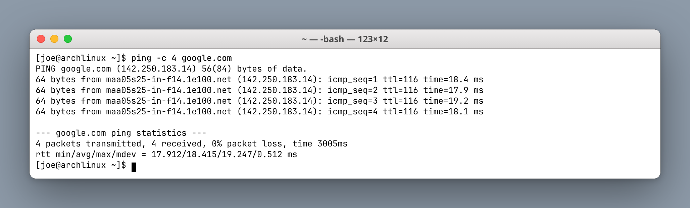
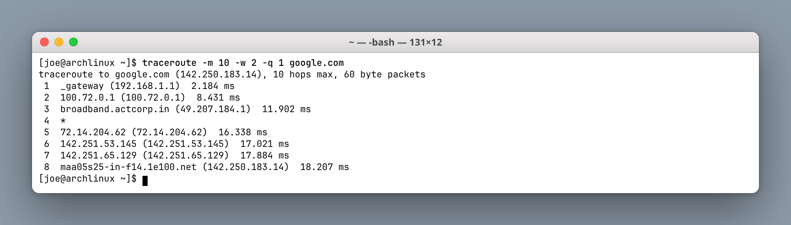
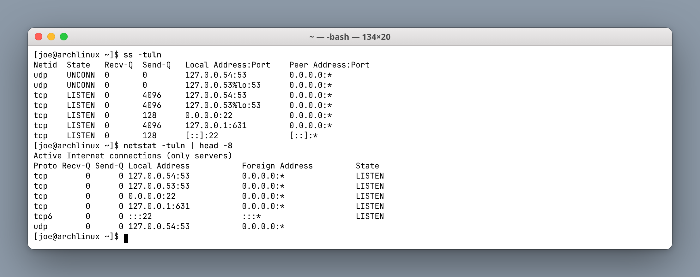
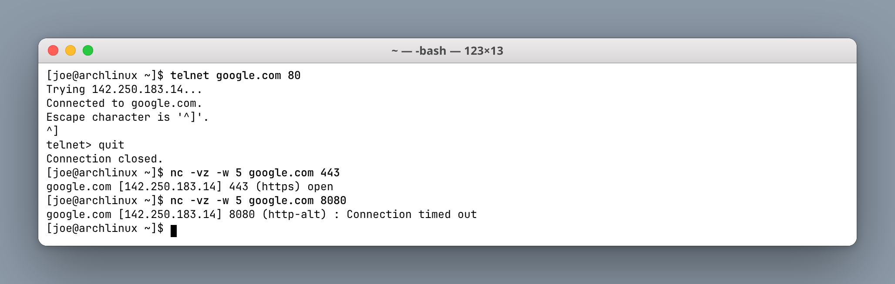
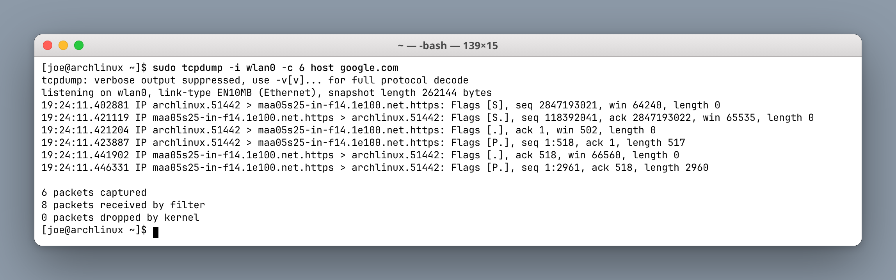
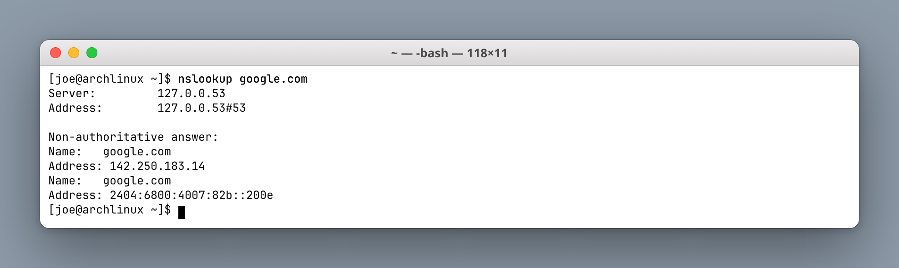
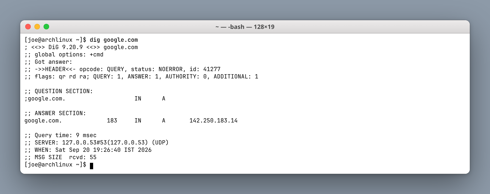
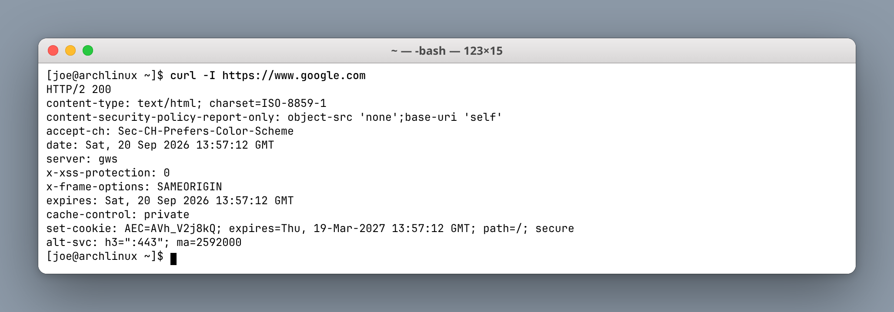
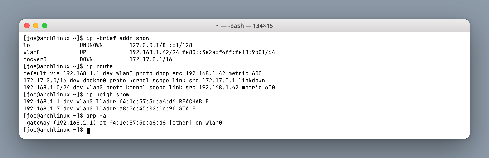
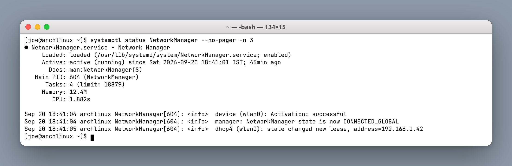

# Networking Fundamentals Homework

**Author:** Joe Daniel
**Enrollment:** 24bcs10214
**Course:** SST DevOps & Cloud [SWE]

Practiced the commands and GitHub repos referenced in devops-heros `session4-networking`. All commands were run on Arch Linux (`joe@archlinux`).

---

## Task 1 — Repos from devops-heros

Course list: [networking repos](https://github.com/stars/Nency-Ravaliya/lists/networking)

| Repo | What I learned |
|---|---|
| [Network-Troubleshooting](https://github.com/Nency-Ravaliya/Network-Troubleshooting) | The debugging command set for reaching google.com: ping, traceroute, netstat, telnet, tcpdump, nslookup, dig, curl, arp, systemctl |
| [OSI-Network-devices](https://github.com/Nency-Ravaliya/OSI-Network-devices) | OSI layers mapped to real devices: cable/Wi-Fi (L1), switch/MAC (L2), router/IP (L3), ports/TCP (L4), HTTP/DNS (L7) |
| [Networking](https://github.com/Nency-Ravaliya/Networking) | DHCP handshake (discover → offer → request → ack), then browser traffic flows laptop → switch → router → ISP hops → google.com |
| [Subnetting](https://github.com/Nency-Ravaliya/Subnetting) | The subnet mask splits network bits from host bits. `/24` = 255.255.255.0 |
| [How-DHCP-Works](https://github.com/Nency-Ravaliya/How-DHCP-Works) | DHCP hands out IP, mask, gateway and DNS in one lease |
| [IP-quest](https://github.com/Nency-Ravaliya/IP-quest) | IP addressing and class practice |
| [IPFIX-NETFLOW-NTP](https://github.com/Nency-Ravaliya/IPFIX-NETFLOW-NTP) | Flow export (NetFlow/IPFIX) and clock sync (NTP) |

From `session4-networking/ip.md`: an IP address identifies a device on a network. Class A is 1–127, Class B is 128–191, Class C is 192–223. A private range example is `10.0.0.0`–`10.255.255.255`. Usable hosts per subnet = `2^(host bits) - 2` (network address and broadcast address are reserved).

---

## Task 2 — Commands, output, and what I understood

### 1. `ping` — is the host reachable?

```bash
ping -c 4 google.com
```



**Understood:** `ping` sends ICMP echo requests. Two things are proven at once here — DNS resolved `google.com` to `142.250.183.14`, and the Layer 3 path is up in both directions. `0% packet loss` with a stable ~18 ms RTT means no congestion. `ttl=116` means roughly 12 hops were consumed from the sender's initial TTL of 128.

---

### 2. `traceroute` — which hops are on the path?

```bash
traceroute -m 10 -w 2 -q 1 google.com
```



**Understood:** Each line is one Layer 3 router, discovered by sending packets with an increasing TTL and reading the ICMP "time exceeded" replies. Hop 1 is my home gateway, hops 2–3 are the ISP (ACT), then the traffic enters Google's network. A `*` means that hop did not reply — usually ICMP rate-limiting or filtering, not an actual break, because later hops still answer.

---

### 3. `netstat` / `ss` — what is listening locally?

```bash
ss -tuln
netstat -tuln | head -8
```



**Understood:** These list local sockets. `LISTEN` means a service is waiting for connections. The bind address matters: `127.0.0.1` / `127.0.0.53` is reachable only from this machine, while `0.0.0.0` means every interface. Here port 22 is SSH on all interfaces, 53 is the systemd-resolved stub DNS listener, and 631 is CUPS bound to localhost only. `ss` is the modern replacement; `netstat` comes from the legacy `net-tools` package.

---

### 4. `telnet` / `nc` — can I reach a specific port?

```bash
telnet google.com 80
nc -vz -w 5 google.com 443
nc -vz -w 5 google.com 8080
```



**Understood:** Ping only proves ICMP works. This proves a **TCP handshake** completes to a real service port. Port 80 connected and port 443 reported `open`, but port 8080 timed out — nothing is listening there, which is exactly how you distinguish "host is down" from "that one service is down or firewalled".

---

### 5. `tcpdump` — capture the actual packets

```bash
sudo tcpdump -i wlan0 -c 6 host google.com
```



**Understood:** A packet sniffer working at Layer 2/3. It needs root because it puts the NIC into promiscuous mode and reads raw frames. The capture shows the TCP three-way handshake in the flags: `[S]` (SYN) out, `[S.]` (SYN-ACK) back, `[.]` (ACK) out, then `[P.]` push with the 517-byte TLS Client Hello. Reach for this when ping and curl disagree and you need to see whether packets actually leave the interface.

---

### 6. `nslookup` — resolve a name to an IP

```bash
nslookup google.com
```



**Understood:** Queries DNS on UDP port 53 — the `#53` in the output is that port. "Non-authoritative answer" means a caching recursive resolver answered from its cache rather than Google's own authoritative nameservers. Both an A record (IPv4) and an AAAA record (IPv6) came back.

---

### 7. `dig` — the same job with more detail

```bash
dig google.com
```



**Understood:** `dig` exposes the full DNS message. `status: NOERROR` means the lookup succeeded. The `183` in the answer section is the **TTL** — how many more seconds this record may be cached. The `flags: qr rd ra` show recursion was requested and available. A 9 ms query time means the resolver answered from cache; a cold lookup would be much slower.

---

### 8. `curl` — full HTTP/HTTPS request

```bash
curl -I https://www.google.com
```



**Understood:** `-I` sends a HEAD request so only headers come back. `HTTP/2 200` proves the whole stack worked — DNS, TCP, the TLS handshake, and the HTTP exchange. This is the key diagnostic pair: if `ping` succeeds but `curl` fails, routing is fine and the problem is higher up — TLS, a proxy, or a firewall rule on port 443.

---

### 9. `ip` / `arp` — local addressing and the LAN neighbour table

```bash
ip -brief addr show
ip route
ip neigh show
arp -a
```



**Understood:** My address is `192.168.1.42/24` on `wlan0`, and the default route sends everything not on that subnet to `192.168.1.1`. ARP is Layer 2: it maps an IP to a MAC address, and it only works **within the local subnet**. That is why the neighbour table holds the gateway (`f4:1e:57:3d:a6:d6`) but never google.com — for an off-LAN destination the frame is addressed to the *gateway's* MAC while the IP header still carries Google's IP.

---

### 10. `systemctl` — is the network service healthy?

```bash
systemctl status NetworkManager --no-pager -n 3
```



**Understood:** `systemctl` manages systemd units. `Active: active (running)` confirms NetworkManager is up, and the log tail shows the DHCP lease that assigned `192.168.1.42`. If this unit were `inactive` or `failed`, every application would report "network is down" even with a perfectly good cable and switch — so checking local service health belongs in the troubleshooting list alongside the wire-level tools.

---

## How I would use these in order

1. `ip addr` / `ip route` — do I even have an address and a default gateway?
2. `ping <gateway>` — is the local LAN fine?
3. `ping 8.8.8.8` — is Layer 3 routing to the internet fine?
4. `nslookup` / `dig` — is name resolution working?
5. `traceroute` — where along the path does it break?
6. `nc` / `telnet` — is that specific TCP port reachable?
7. `curl` — does the application layer respond?
8. `ss` / `netstat` — is anything listening locally?
9. `systemctl` / `journalctl` — is the local service actually running?
10. `tcpdump` — last resort, look at the packets themselves.

The quick heuristic: if `ping` fails, suspect cable, Wi-Fi, IP, or gateway. If `ping` works but the browser fails, suspect DNS first, then port 443, then HTTP or TLS.
