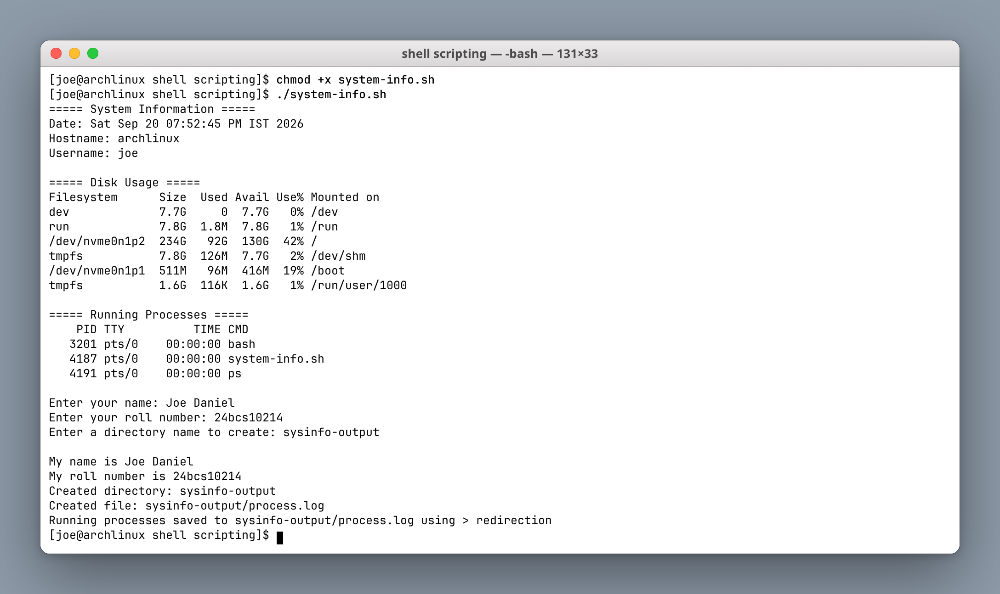
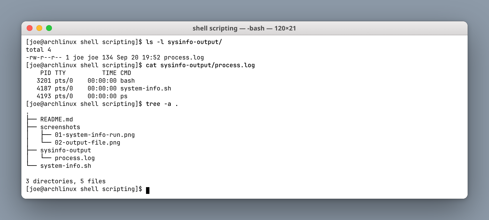

# Shell Scripting Homework

**Author:** Joe Daniel
**Enrollment:** 24bcs10214
**Course:** SST DevOps & Cloud [SWE]

## Task: System Information Script

`system-info.sh` prints system information, takes user input, creates a directory and a file, and saves the running process list using `>` redirection.

### What the script does

- Prints the current date
- Prints the hostname
- Prints the username
- Prints disk usage (`df -h`)
- Prints running processes (`ps`)
- Stores each value in a variable using command substitution
- Takes interactive input with `read -p`
- Creates a directory with `mkdir -p`
- Creates a file with `touch`
- Saves the process list to that file with `>`

### Shell features used

| Feature | Where |
|---|---|
| Variables | `current_date=$(date)` |
| Command substitution | `$(hostname)`, `$(whoami)`, `$(df -h)` |
| User input | `read -p "Enter your name: " name` |
| Directory creation | `mkdir -p "$dir_name"` |
| File creation | `touch "$dir_name/process.log"` |
| Output redirection | `ps > "$dir_name/process.log"` |
| Quoting | `"$disk_usage"` preserves multi-line output |

### How to run

```bash
chmod +x system-info.sh
./system-info.sh
```

Then enter a name, a roll number, and a directory name when prompted.

---

## Script run

**Screenshot:**



Input given:

```text
Enter your name: Joe Daniel
Enter your roll number: 24bcs10214
Enter a directory name to create: sysinfo-output
```

Full output:

```text
===== System Information =====
Date: Sat Sep 20 07:52:45 PM IST 2026
Hostname: archlinux
Username: joe

===== Disk Usage =====
Filesystem      Size  Used Avail Use% Mounted on
dev             7.7G     0  7.7G   0% /dev
run             7.8G  1.8M  7.8G   1% /run
/dev/nvme0n1p2  234G   92G  130G  42% /
tmpfs           7.8G  126M  7.7G   2% /dev/shm
/dev/nvme0n1p1  511M   96M  416M  19% /boot
tmpfs           1.6G  116K  1.6G   1% /run/user/1000

===== Running Processes =====
    PID TTY          TIME CMD
   3201 pts/0    00:00:00 bash
   4187 pts/0    00:00:00 system-info.sh
   4191 pts/0    00:00:00 ps

My name is Joe Daniel
My roll number is 24bcs10214
Created directory: sysinfo-output
Created file: sysinfo-output/process.log
Running processes saved to sysinfo-output/process.log using > redirection
```

---

## Verifying the created file

**Screenshot:**



`sysinfo-output/process.log`, written with `>`:

```text
    PID TTY          TIME CMD
   3201 pts/0    00:00:00 bash
   4187 pts/0    00:00:00 system-info.sh
   4193 pts/0    00:00:00 ps
```

The PID of `ps` differs between the terminal output and the log file because `ps` runs as a fresh process each time it is invoked — a small but useful reminder that `>` captures a *new* command run, not the text that was already printed on screen.

### Files created by the script

```text
shell scripting/
├── README.md
├── screenshots/
│   ├── 01-system-info-run.png
│   └── 02-output-file.png
├── sysinfo-output/
│   └── process.log
└── system-info.sh
```

### `>` vs `>>`

| Operator | Behaviour |
|---|---|
| `>` | Truncates the file, then writes. Used here, so each run starts clean. |
| `>>` | Appends to the end of the file, keeping previous content. |
| `2>` | Redirects stderr only. |
| `&>` | Redirects both stdout and stderr. |
