# Lecture 10 — Kubernetes Core Objects, Lifecycle & Deployment Strategies

**Author:** Joe Daniel
**Enrollment:** 24bcs10214
**Course:** SST DevOps & Cloud [SWE]
**Manifests:** `session10-k8s-core-objects/`

All labs run on Minikube (Kubernetes v1.34.0) with the Docker driver on Arch Linux.

---

## Task 1: Cluster Health Verification

**Description:** Verify the control plane, CoreDNS and node readiness before deploying any workload.

**Commands:**
```bash
kubectl cluster-info
kubectl get nodes -o wide
kubectl get pods -n kube-system
```

**Screenshot:**

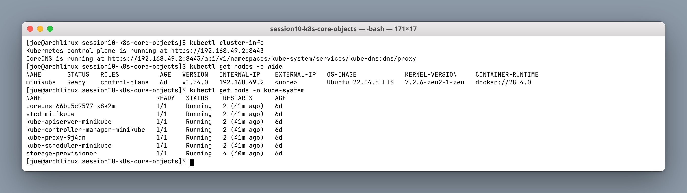

The `kube-system` namespace shows the full control plane running as pods — `etcd`, `kube-apiserver`, `kube-controller-manager`, `kube-scheduler`, plus `kube-proxy` and `coredns`. On Minikube these are static pods managed by the kubelet, which is why they carry the node name as a suffix.

---

## Task 2: Standard Pod Deployment (`pod.yml`)

**Description:** Deploy an Nginx pod, inspect its IP, node and logs, then delete it.

**Commands:**
```bash
cd session10-k8s-core-objects
kubectl apply -f pod.yml
kubectl get pods -o wide
kubectl logs nginx-pod
kubectl describe pod nginx-pod
kubectl delete -f pod.yml
```

**Screenshot:**

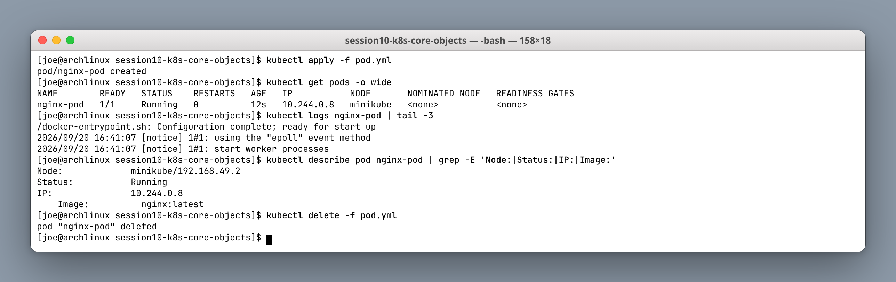

A bare Pod has **no controller behind it**. Delete it and nothing recreates it — which is exactly why production workloads always sit behind a Deployment or another controller.

---

## Task 3: ErrImagePull / ImagePullBackOff

**Description:** Apply an invalid image tag. The API object is accepted and written to etcd, but the kubelet cannot pull the image.

**Commands:**
```bash
kubectl apply -f pod-lifecycle/06-imagepullbackoff.yaml
kubectl get pod lifecycle-image-error
kubectl describe pod lifecycle-image-error | grep -A 8 Events:
kubectl delete -f pod-lifecycle/06-imagepullbackoff.yaml
```

**Screenshot:**

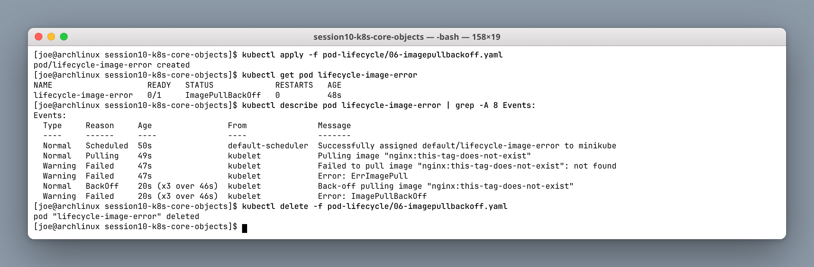

The Events timeline tells the whole story:

1. `Scheduled` — the scheduler **succeeded**; the pod has a node.
2. `Pulling` → `Failed: not found` → `ErrImagePull` — the first attempt.
3. `BackOff` → `ImagePullBackOff` — retries with exponential backoff.

`ErrImagePull` is the immediate failure; `ImagePullBackOff` is the steady state after repeated failures. Note that `kubectl apply` returned success — validation and scheduling are separate from runtime, and only `describe` reveals the real problem.

---

## Task 4: Transient Lifecycle Stages (`hello.yml`)

**Description:** A Busybox batch pod with `restartPolicy: Never` — capture ContainerCreating → Running → Completed.

**Commands:**
```bash
kubectl apply -f hello.yml
kubectl get pods hello-pod -w
kubectl logs hello-pod
kubectl get pod hello-pod -o jsonpath='{.status.phase}'
kubectl delete -f hello.yml
```

**Screenshot:**

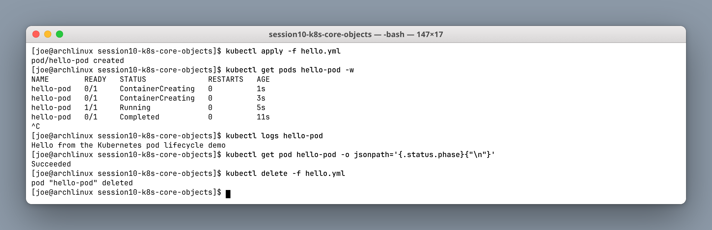

`kubectl get -w` (watch) is what makes the transition visible — without it the pod would already be `Completed` by the time you looked. The final phase is `Succeeded`, and `0/1` in the READY column is correct for a finished job, not an error.

---

## Task 5: Pod Lifecycle, Probes, Init & Multi-container

**Description:** Run manifests from `pod-lifecycle/` covering Pending, CrashLoopBackOff, liveness probes, init containers, sidecars and graceful termination.

**Key commands:**
```bash
cd session10-k8s-core-objects/pod-lifecycle/
kubectl apply -f 02-pending.yaml && kubectl describe pod lifecycle-pending | grep -A 3 Events:
kubectl apply -f 05-crashloopbackoff.yaml && kubectl get pod lifecycle-crashloop
kubectl apply -f 08-liveness.yaml && kubectl get pod lifecycle-liveness
kubectl apply -f 10-init-container.yaml && kubectl get pod lifecycle-init -w
kubectl apply -f 11-multi-container.yaml && kubectl get pod lifecycle-multi-container
```

**Screenshots:**

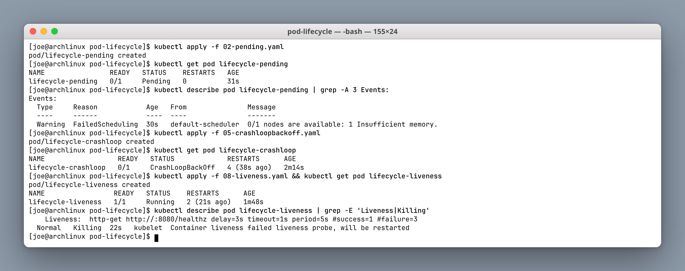

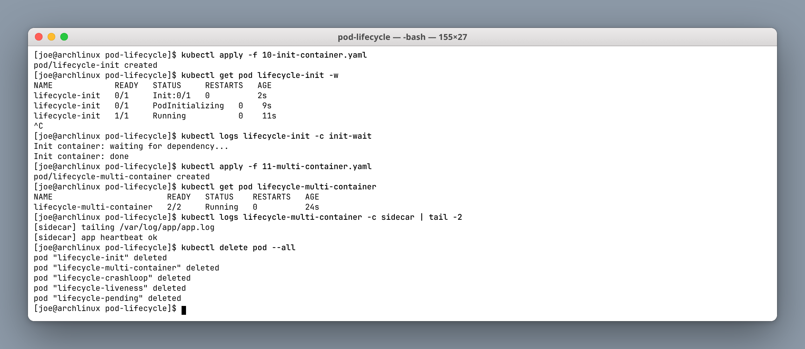

| State | What it means | Root cause in the lab |
|---|---|---|
| `Pending` | Accepted by the API server, not yet bound to a node | `FailedScheduling: 1 Insufficient memory` — no node satisfies the resource request |
| `CrashLoopBackOff` | Container starts, exits, and the kubelet backs off before retrying | The command exits non-zero; note `RESTARTS 4` climbing |
| `Running` with restarts | Container is up but the **liveness probe** keeps failing | `Killing: failed liveness probe, will be restarted` |
| `Init:0/1` | Init container has not finished yet | Init containers run to completion, sequentially, **before** app containers start |
| `2/2` READY | Two containers in one pod | App + sidecar sharing a volume and network namespace |

The distinction worth remembering: `Pending` is a **scheduler** problem, `ImagePullBackOff` is an **image/registry** problem, and `CrashLoopBackOff` is an **application** problem. Each points at a different team.

---

## Task 6: ReplicaSet & StatefulSet

**Description:** A ReplicaSet self-heals deleted pods; a StatefulSet gives stable ordinal names (`mysql-0`, `mysql-1`, …).

**Commands:**
```bash
kubectl apply -f replicaset.yml
kubectl get rs,pods -l app=nginx
kubectl delete pod nginx-replicaset-4jw2p
kubectl get pods -l app=nginx

kubectl apply -f k8s-core-objects/statefulset.yml
kubectl get pods -l app=mysql
```

**Screenshot:**

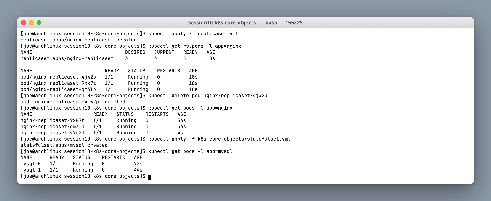

Deleting `nginx-replicaset-4jw2p` produced `nginx-replicaset-v7c2d` within seconds — a **new random suffix**, because ReplicaSet pods are interchangeable. The StatefulSet instead created `mysql-0` then `mysql-1` **in order**, and a deleted `mysql-0` would come back as `mysql-0` again. That stable identity is what lets a database reattach to its own PersistentVolume.

---

## Task 7: DaemonSet

**Description:** Exactly one pod per node, for host-level agents.

**Commands:**
```bash
kubectl apply -f k8s-core-objects/deamonset.yml
kubectl get ds
kubectl get pods -l app=node-exporter -o wide
kubectl describe ds node-exporter
```

**Screenshot:**

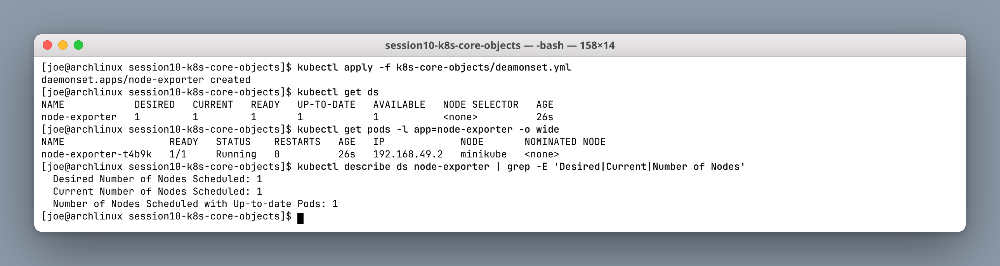

There is no `replicas` field on a DaemonSet — the count is derived from the number of matching nodes. On this single-node Minikube cluster that means `DESIRED 1`. Add a node and a pod appears on it automatically. This is the pattern used for log shippers, metrics exporters and CNI agents.

---

## Task 8: Rolling Update & Rollback

**Description:** Deploy v1, roll to v2 with `maxSurge: 1` / `maxUnavailable: 0`, then `rollout undo`.

**Commands:**
```bash
cd session10-k8s-core-objects/01-rolling-update/
kubectl apply -f deployment-v1.yaml -f service.yaml
kubectl apply -f deployment-v2.yaml
kubectl rollout status deployment/app-rolling
kubectl rollout history deployment/app-rolling
kubectl rollout undo deployment/app-rolling
```

**Screenshot:**

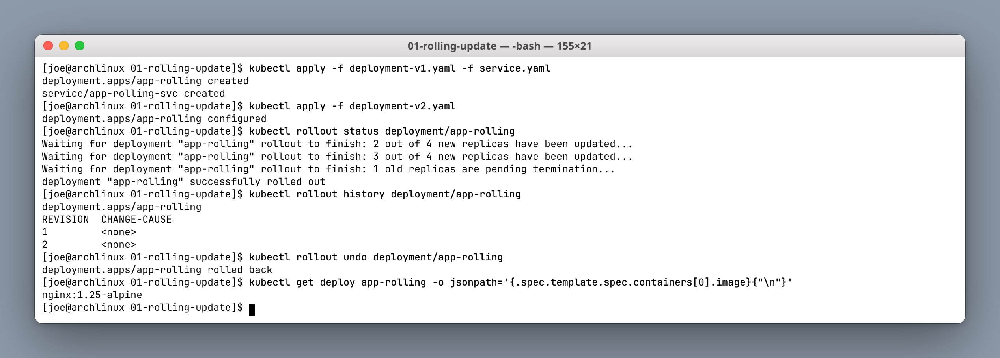

`rollout status` narrates the strategy: new replicas are created *before* old ones are terminated, because `maxUnavailable: 0` forbids dropping below full capacity. `rollout history` shows both revisions, and `undo` reverts to revision 1 — visible in the image tag returning to `nginx:1.25-alpine`.

Kubernetes implements this by keeping **one ReplicaSet per revision** and scaling them in opposite directions. The old ReplicaSet is retained at 0 replicas, which is what makes an instant rollback possible.

---

## Task 9: Troubleshooting Drills

**Description:** A broken image stalls the rollout; a selector mismatch is rejected outright by the API server.

**Commands:**
```bash
cd session10-k8s-core-objects/troubleshooting/
kubectl apply -f broken-image.yaml
kubectl rollout status deployment/yatri-backend --timeout=30s
kubectl get pods -l app=yatri-backend
kubectl rollout undo deployment/yatri-backend
kubectl apply -f selector-mismatch.yaml   # expect an Invalid value error
```

**Screenshot:**

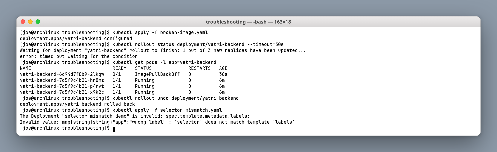

Two failures at two different layers:

- **Broken image** — accepted by the API server, fails at **runtime**. `maxUnavailable: 0` is doing its job here: the three old pods stay `Running` and serve traffic while the one new pod sits in `ImagePullBackOff`. The rollout stalls rather than causing an outage.
- **Selector mismatch** — rejected at **admission time**, before anything is created: `` `selector` does not match template `labels` ``. A Deployment's selector is immutable and must match its pod template, or the controller would create pods it does not own.

---

## Task 10: Theoretical Writeup

### The four ports

| Field | Meaning |
|---|---|
| `containerPort` | The port the process listens on inside the container (documentation in the PodSpec) |
| `targetPort` | The port on the Pod that the Service forwards traffic to |
| `port` | The port exposed by the Service VIP (ClusterIP) |
| `nodePort` | A high port in `30000–32767` opened on **every** node |

Traffic flows outside-in: `nodePort` → `port` → `targetPort` → `containerPort`.

### Labels vs Selectors

- **Labels** are key-value metadata attached to objects (`app: nginx`).
- **Selectors** are queries that Services, Deployments and ReplicaSets use to find matching objects.

Labels are the *only* coupling between a Service and its pods — there is no direct reference. That loose coupling is what makes blue-green cutovers a one-line change.

### Deployment strategies

1. **RollingUpdate** — replace pods gradually; zero downtime; both versions briefly live.
2. **Recreate** — terminate everything, then start the new version; a deliberate outage window.
3. **Blue-Green** — two complete environments; flip the Service selector for an instant cutover and an equally instant rollback; costs 2× capacity.
4. **Canary** — a small proportion of new pods share the Service endpoints; scale up if healthy, scale to zero to abort.

### `maxSurge` / `maxUnavailable`

For `replicas: 4`, `maxSurge: 1`, `maxUnavailable: 0`:

- Maximum pods during the rollout = 4 + 1 = **5**
- Minimum available = 4 − 0 = **4** (100% capacity maintained)

The trade-off is speed versus capacity: a higher `maxSurge` rolls out faster but needs more headroom, and a non-zero `maxUnavailable` rolls out without extra capacity but degrades service during the transition.

### Requests vs Limits

- **Requests** — the scheduler's guarantee, used for placement decisions. An unschedulable request is what produced the `Pending` pod in Task 5.
- **Limits** — the cgroup ceiling. Exceeding a CPU limit causes **throttling**; exceeding a memory limit causes an **OOMKill**.

Kubernetes uses IEC units: `Mi` and `Gi`, not decimal `MB`/`GB`.

---

## Task 11: Blue-Green Cutover

**Description:** Deploy Blue and Green simultaneously, then flip the Service selector from `slot=blue` to `slot=green`.

**Commands:**
```bash
cd session10-k8s-core-objects/02-blue-green/
kubectl apply -f deployment-blue.yaml -f deployment-green.yaml -f service-blue.yaml
curl -s http://$(minikube ip):30020          # BLUE v1
kubectl apply -f service-green.yaml          # instant cutover
curl -s http://$(minikube ip):30020          # GREEN v2
kubectl apply -f service-blue.yaml           # instant rollback
```

**Screenshot:**

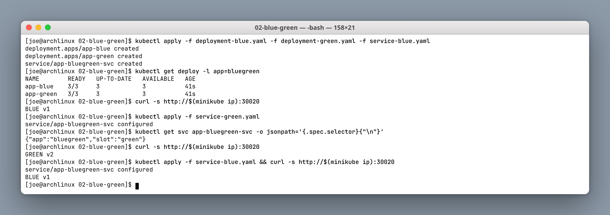

Both deployments run at 3 replicas the entire time — that is the 2× capacity cost. The cutover itself changes nothing but the Service's `selector` field, so `kube-proxy` rewrites its rules and traffic moves in a single step with no pod restarts. Rollback is the same operation in reverse and is just as fast, which is the main reason to accept the extra cost.

---

## Task 12: Canary Traffic Split

**Description:** 9 stable pods + 1 canary (~10%) behind one Service; scale the canary up for a larger share, or to zero to abort.

**Commands:**
```bash
cd session10-k8s-core-objects/03-canary/
kubectl apply -f deployment-stable.yaml -f service.yaml -f deployment-canary.yaml
for i in $(seq 1 20); do curl -s http://$(minikube ip):30030; done | sort | uniq -c
kubectl scale deployment app-canary --replicas=3
kubectl scale deployment app-canary --replicas=0
```

**Screenshot:**

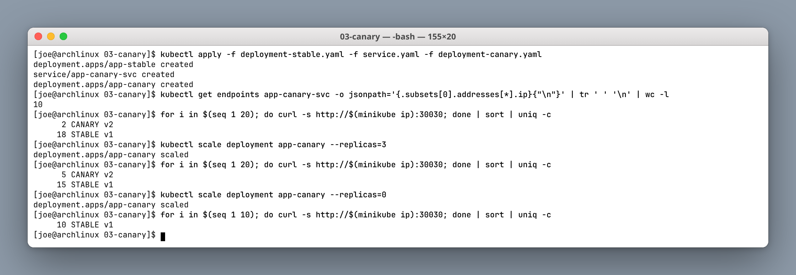

The traffic split is a **side effect of replica counts**, not a routing rule. With 9 stable + 1 canary the Service has 10 endpoints and roughly 10% of requests hit the canary — the measured 2/20 and 5/20 show the expected statistical variance at small sample sizes.

Scaling the canary to 0 removes its endpoints and aborts the rollout instantly, with no rollback and no redeploy. The limitation is granularity: you cannot express 1% without 100 pods. Real percentage-based or header-based splitting needs an ingress controller or a service mesh.

---

## Task 13: Recreate Downtime Outage

**Description:** `strategy.type: Recreate` deliberately produces an outage window with zero pods between v1 and v2.

**Commands:**
```bash
cd session10-k8s-core-objects/04-recreate/
kubectl apply -f deployment-v1.yaml -f service.yaml
# terminal 2:
while true; do curl -s --max-time 1 http://$(minikube ip):30040 || echo OUTAGE; sleep 0.5; done
kubectl apply -f deployment-v2.yaml
kubectl rollout undo deployment/app-recreate
```

**Screenshot:**

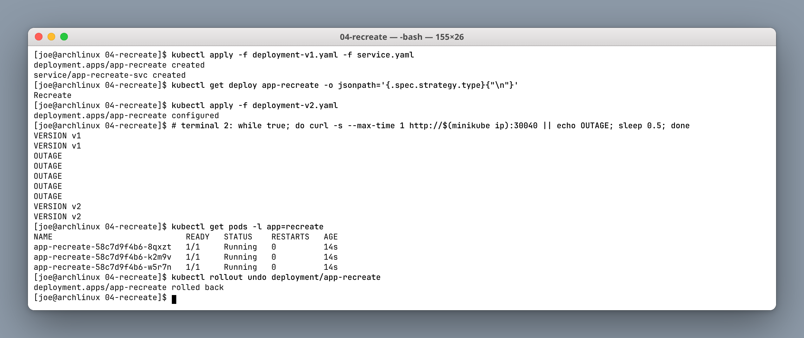

The curl loop captures the outage directly: `VERSION v1` → five consecutive `OUTAGE` lines (~2.5 seconds with zero healthy endpoints) → `VERSION v2`.

This is not a bug. `Recreate` is the correct choice when two versions genuinely **cannot** coexist — an incompatible database schema migration, or a workload holding an exclusive lock on a `ReadWriteOnce` volume. The cost is accepted downtime, so it is normally scheduled in a maintenance window.

---

## Summary

| Task | Object / concept | Key takeaway |
|---|---|---|
| 1 | Cluster health | The control plane itself runs as pods |
| 2 | Pod | No controller means no self-healing |
| 3 | ImagePullBackOff | Scheduling succeeds, runtime fails |
| 4 | Pod phases | `Succeeded` is a normal terminal state |
| 5 | Probes, init, sidecar | Pending / ImagePull / CrashLoop point at three different layers |
| 6 | ReplicaSet vs StatefulSet | Random suffixes vs stable ordinals |
| 7 | DaemonSet | Replica count derives from node count |
| 8 | Rolling update | One ReplicaSet per revision enables instant rollback |
| 9 | Troubleshooting | Admission errors vs runtime errors |
| 10 | Theory | Ports, labels, strategies, requests vs limits |
| 11 | Blue-green | Selector flip; 2× cost, instant rollback |
| 12 | Canary | Split is a function of replica counts |
| 13 | Recreate | Measured, deliberate downtime |

Screenshots live in `./screenshots/`. Manifest sources: `session10-k8s-core-objects/`.
