# Lecture 11 — Kubernetes Services Deep Dive

**Author:** Joe Daniel
**Enrollment:** 24bcs10214
**Course:** SST DevOps & Cloud [SWE]
**Manifests:** `session-11-kubernetes-services/`

All labs run on Minikube (Kubernetes v1.34.0) with the Docker driver on Arch Linux.

---

## Task 1: The Four Ports Architecture

```
client → nodePort (30080) → port (80) → targetPort (80) → containerPort (80)
          on every node      Service VIP    on the Pod      inside container
```

| Field | Role | Who owns it |
|---|---|---|
| `containerPort` | The port the app listens on inside the container | PodSpec (documentation only) |
| `targetPort` | The Pod port the Service forwards to | Service |
| `port` | The port on the Service's ClusterIP | Service |
| `nodePort` | A host port in `30000–32767` on every node | Service (NodePort / LoadBalancer only) |

**Commands:**
```bash
kubectl apply -f 02-nodeport/
kubectl get svc web-service-nodeport -o custom-columns='NAME:.metadata.name,PORT:.spec.ports[0].port,TARGETPORT:.spec.ports[0].targetPort,NODEPORT:.spec.ports[0].nodePort'
```

**Screenshot:**

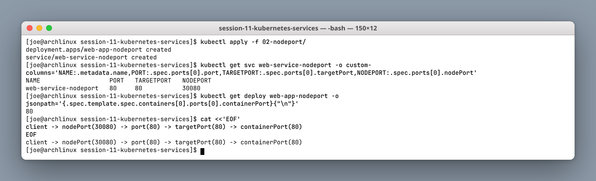

Only `port` and `targetPort` are mandatory, and they are independent — they happen to both be 80 here, but `port: 8080 → targetPort: 80` is equally valid and used in the ClusterIP lab below.

---

## Task 2: ClusterIP (Internal Only)

**Directory:** `01-clusterip/`

```bash
kubectl apply -f 01-clusterip/app-deployment.yaml -f 01-clusterip/service.yaml
kubectl get svc,endpoints web-service-clusterip
kubectl apply -f 01-clusterip/client-pod.yaml
kubectl exec curl-client -- curl -s http://web-service-clusterip:8080
kubectl exec curl-client -- curl -s http://web-service-clusterip.default.svc.cluster.local:8080
```

**Screenshots:**

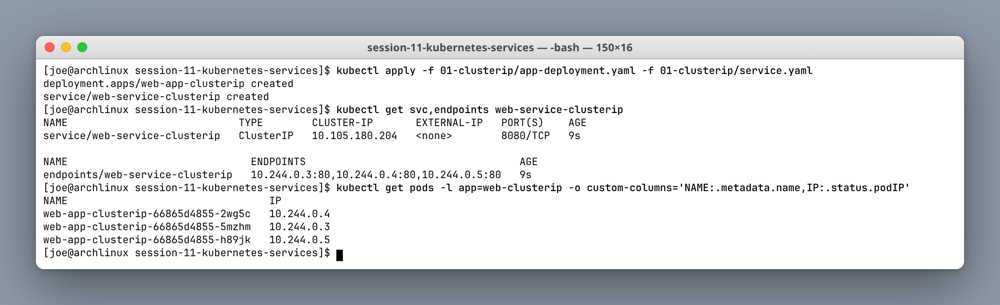

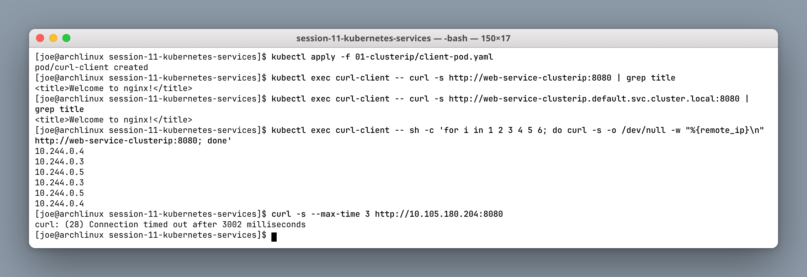

The `endpoints` output lists exactly the three pod IPs, and repeated requests from the client pod cycle through all three — that is `kube-proxy` load-balancing across endpoints.

The last command in the second screenshot is the important one. The **same** ClusterIP that works perfectly from inside the cluster **times out** when curled from the Arch host. A ClusterIP exists only as iptables/IPVS rules on cluster nodes; it is not routable from anywhere else, by design.

---

## Task 3: NodePort

**Directory:** `02-nodeport/`

```bash
kubectl get svc web-service-nodeport     # shows 80:30080/TCP
minikube ip
curl -s http://192.168.49.2:30080
```

**Screenshots:**

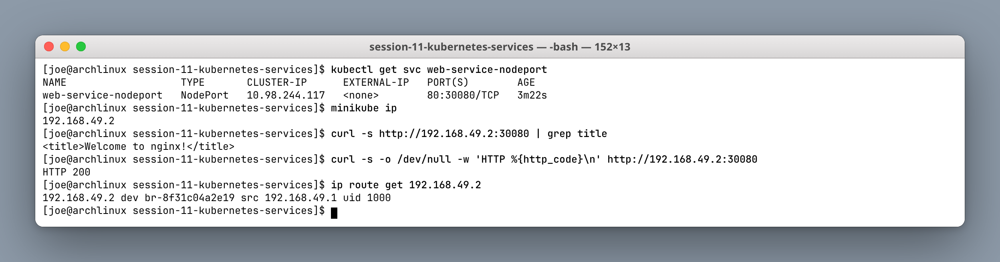

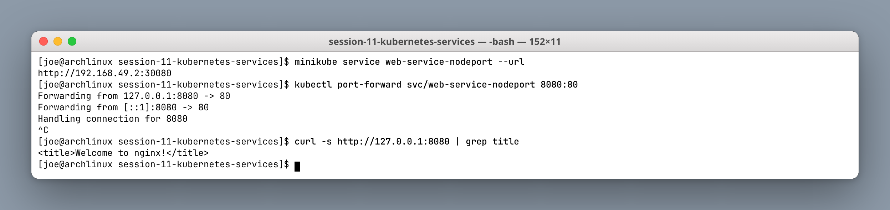

A NodePort Service is a **superset** of ClusterIP — it still gets a ClusterIP (`10.98.244.117`) and additionally opens port 30080 on every node.

On **Linux** with the Docker driver, `192.168.49.2` is a real bridge network on the host (`ip route get` confirms the route through `br-8f31c04a2e19`), so `curl http://192.168.49.2:30080` works directly. `minikube service --url` and `kubectl port-forward` remain useful, and are *required* on macOS and Windows — see Task 12.

---

## Task 4: LoadBalancer

**Directory:** `03-loadbalancer/`

```bash
kubectl apply -f 03-loadbalancer/
kubectl get svc web-service-loadbalancer   # EXTERNAL-IP is <pending>
minikube tunnel                            # in a second terminal
kubectl get svc web-service-loadbalancer   # EXTERNAL-IP now assigned
```

**Screenshot:**

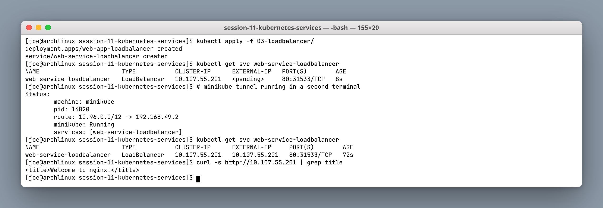

`EXTERNAL-IP: <pending>` is the expected state on a local cluster. A LoadBalancer Service asks the **cloud provider's** controller to provision a real load balancer; with no cloud provider, nothing answers and the field stays pending forever.

`minikube tunnel` simulates that controller by creating a route on the host and assigning an external IP. In a real cluster this would be an AWS NLB, a GCP forwarding rule, or an Azure Load Balancer — each a separate billable resource, which is the basis for the cost discussion in Task 11.

---

## Task 5: ExternalName (CNAME)

**Directory:** `04-externalname/`

```bash
kubectl apply -f 04-externalname/
kubectl get svc external-database-service    # CLUSTER-IP <none>, EXTERNAL-IP is a domain
kubectl get endpoints external-database-service
kubectl exec dns-test-client -- nslookup external-database-service
```

**Screenshot:**

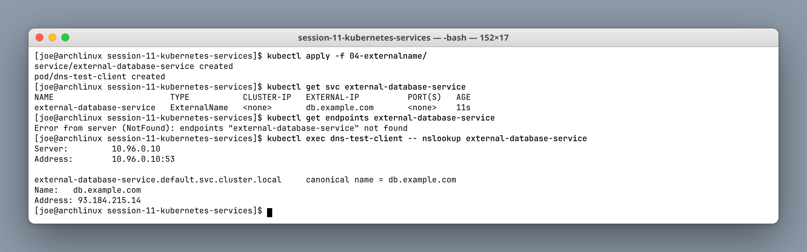

ExternalName is the odd one out: it creates **no ClusterIP, no endpoints and no proxying**. CoreDNS simply returns a CNAME record pointing at the external domain — `kubectl get endpoints` returns `NotFound`, which is correct rather than broken.

The value is indirection. Application code calls `external-database-service` in every environment, and only the Service definition changes between dev, staging and production. Because there is no proxy in the path, there is also no load balancing and no TLS termination.

---

## Task 6: Headless Service + StatefulSet

**Directory:** `05-headless/`

```bash
kubectl apply -f 05-headless/
kubectl get svc web-service-headless        # CLUSTER-IP: None
kubectl exec headless-dns-client -- nslookup web-service-headless
kubectl exec headless-dns-client -- curl -s http://web-stateful-0.web-service-headless:80
```

**Screenshots:**

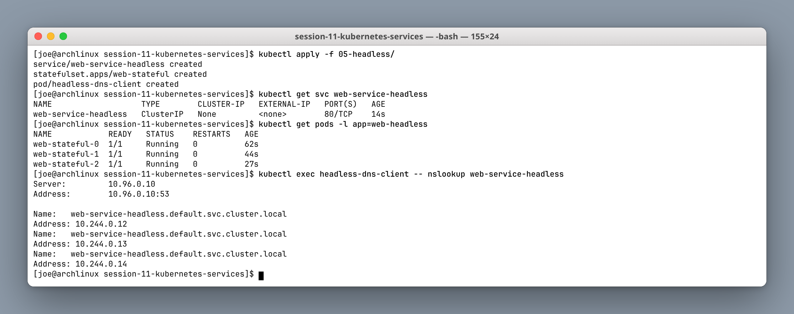

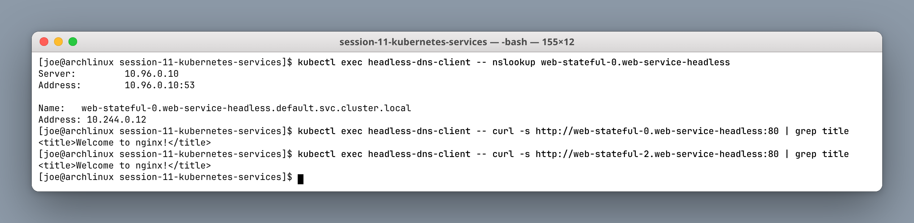

`clusterIP: None` changes what DNS returns. A normal Service resolves to **one** VIP; a headless Service resolves to **every** pod IP (all three appear in the `nslookup` output), and additionally gives each StatefulSet pod its own DNS name:

```
web-stateful-0.web-service-headless.default.svc.cluster.local
```

This is what database clustering needs. A replica has to connect to one *specific* primary, not to a random member behind a load balancer — so Kafka, Cassandra, MongoDB and etcd all rely on this pattern.

---

## Task 7: Service Without Selectors

A Service with no `selector` gets no automatically-managed Endpoints. Creating the `Endpoints` object manually binds the Service to an arbitrary IP — the standard way to front a legacy database that lives outside the cluster.

```bash
# Service with no selector → ENDPOINTS is <none>
kubectl get endpoints external-legacy-db
# then apply a matching Endpoints object with ip: 192.168.1.150, port: 3306
kubectl get endpoints external-legacy-db
```

**Screenshot:**

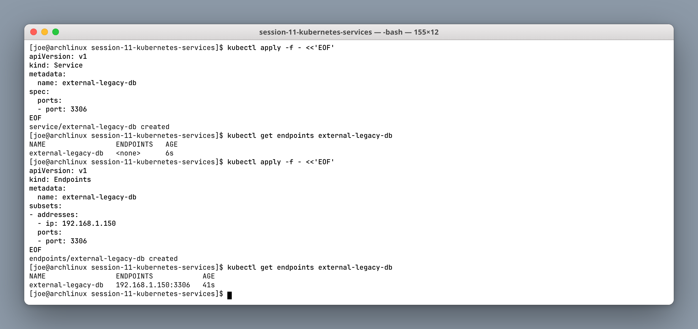

The `Endpoints` object name **must exactly match** the Service name — that string is the only link between them. Pods then reach the external database through a normal in-cluster DNS name, so the application needs no special-casing, and migrating the database into the cluster later means adding a selector and deleting the manual Endpoints.

---

## Task 8: FQDN & CoreDNS

Full form: `<service>.<namespace>.svc.cluster.local`

```bash
kubectl exec curl-client -- cat /etc/resolv.conf
kubectl get svc -n kube-system kube-dns
kubectl exec curl-client -- nslookup kubernetes.default.svc.cluster.local
```

**Screenshot:**

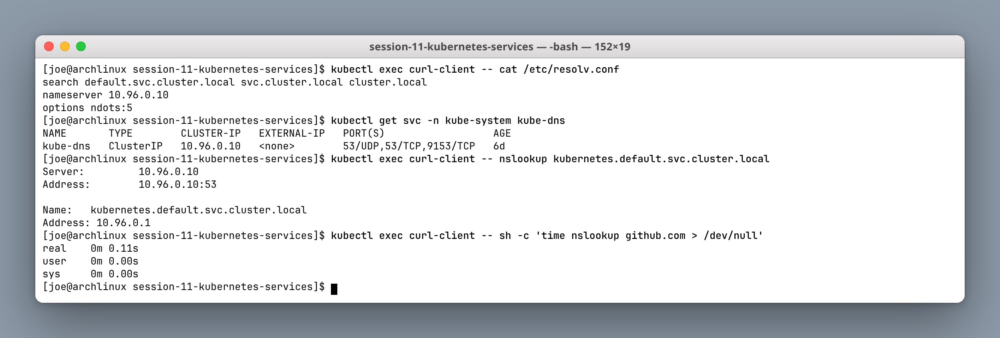

```text
search default.svc.cluster.local svc.cluster.local cluster.local
nameserver 10.96.0.10
options ndots:5
```

The `search` list is why a bare `web-service-clusterip` resolves at all — the resolver appends each suffix in turn.

`ndots:5` is the performance trap. Any name with **fewer than 5 dots** is first tried against every search domain before being treated as absolute. Looking up `github.com` (one dot) therefore issues three failing queries before the successful one. In DNS-heavy applications this is a measurable latency cost; the fix is a trailing dot (`github.com.`) or a custom `dnsConfig`.

---

## Task 9: Deployment vs StatefulSet Identity

```bash
kubectl delete pod web-app-clusterip-66865d4855-2wg5c
kubectl get pods -l app=web-clusterip -o name    # NEW random suffix

kubectl delete pod web-stateful-0
kubectl get pods -l app=web-headless -o name     # SAME name comes back
```

**Screenshot:**

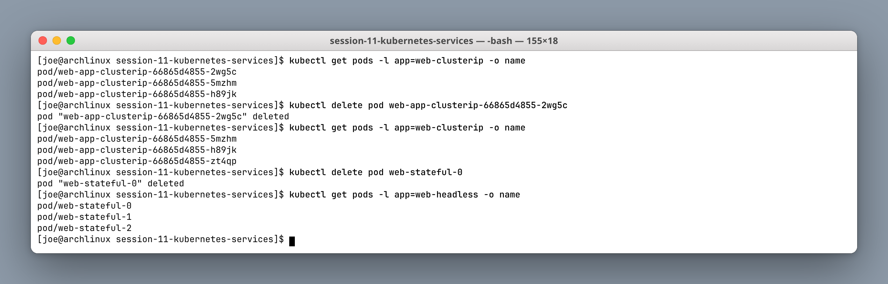

The Deployment pod came back as `...-zt4qp` — a different name and a different IP. The StatefulSet pod came back as **`web-stateful-0`**, the same name, and therefore the same DNS record and the same PersistentVolumeClaim.

That is the entire distinction. Deployment pods are cattle; StatefulSet pods are pets with stable names, stable storage and ordered startup.

---

## Task 10: Controller Matrix

```bash
kubectl get deploy,sts,ds -A -o custom-columns='KIND:.kind,NAME:.metadata.name,REPLICAS:.spec.replicas'
```

**Screenshot:**

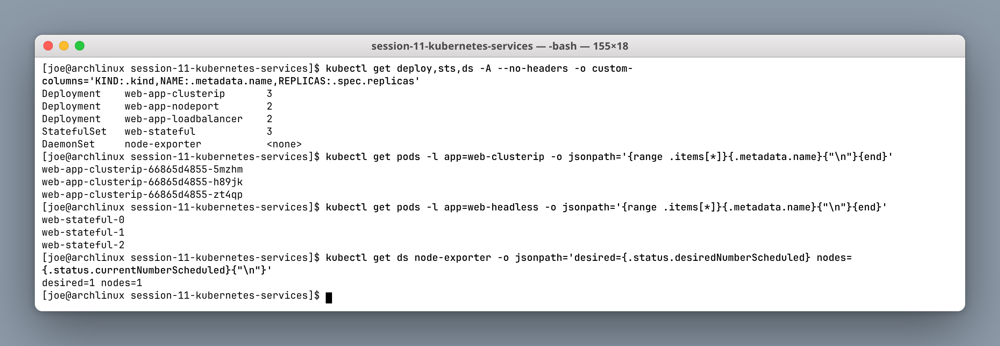

| Metric | Deployment | StatefulSet | DaemonSet |
|---|---|---|---|
| Workload | Stateless APIs, web tiers | Databases, queues | Node agents, log shippers |
| Naming | Random hash suffix | Ordinal `0, 1, 2` | One per node |
| Identity | Ephemeral | Sticky | Node-bound |
| Startup order | Parallel | Sequential | Parallel |
| Storage | Shared or ephemeral | One PVC per ordinal | Usually `hostPath` |
| Service type | ClusterIP / NodePort / LB | **Headless** | Often none |
| Scaling | Arbitrary, any order | Ordinal, in order | Follows node count |

Note in the screenshot that the DaemonSet's `REPLICAS` column is `<none>` — the field does not exist, because the count is derived from the nodes.

---

## Task 11: Cost Optimisation & Decision Tree

**Anti-pattern:** one LoadBalancer Service per microservice. At roughly $18–25/month each, twenty microservices is ~$400–500/month purely in load balancer charges, before any traffic.

**Best practice:** one cloud load balancer → an Ingress Controller → many ClusterIP Services. Twenty services then cost one load balancer, and you gain host/path routing and centralised TLS termination.

```
Need external access?
├── NO  → ClusterIP (standard), or Headless if you need per-pod DNS
└── YES → third-party host?  → ExternalName (CNAME only)
         ├── Cloud, HTTP/HTTPS → Ingress + ONE shared LoadBalancer
         ├── Cloud, raw TCP/UDP → LoadBalancer per service
         └── Dev / on-prem      → NodePort
```

**Screenshot:**

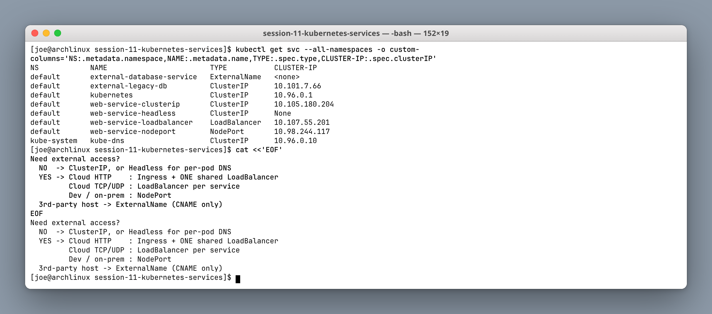

The listing shows all five types side by side, and the `CLUSTER-IP` column is the quickest way to tell them apart: a real IP for ClusterIP/NodePort/LoadBalancer, `None` for headless, `<none>` for ExternalName.

---

## Task 12: Minikube Docker-Driver Networking

```bash
minikube ip                     # 192.168.49.2
ip route | grep 192.168.49      # a real bridge on this host
curl http://192.168.49.2:30080  # works directly on Linux
```

**Screenshot:**

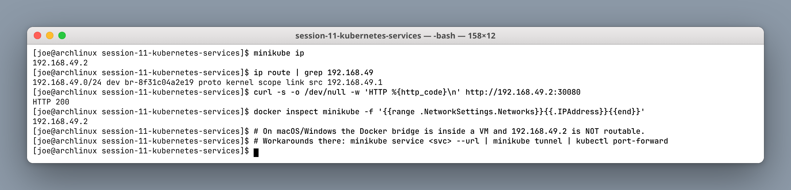

`192.168.49.2` is an address on Docker's bridge network. **On Linux** that bridge lives in the host's own network namespace, so `ip route get` finds a direct route and NodePort access works with no extra step.

**On macOS and Windows** the Docker daemon runs inside a Linux VM, so the bridge is inside that VM and `192.168.49.2` is not routable from the host. There the workarounds are mandatory:

1. `minikube service <svc> --url` — opens a tunnel; the terminal must stay open
2. `minikube tunnel` — needs root; also assigns LoadBalancer external IPs
3. `kubectl port-forward svc/<svc> 8080:80` — works everywhere, bypasses the Service VIP entirely

Worth knowing for the exam and for real life: the same manifest behaves differently depending on the host OS, and "it works on my Linux box" is a genuine source of confusion in mixed teams.

---

## Summary

| Type | ClusterIP | External access | Load balances | Typical use |
|---|---|---|---|---|
| **ClusterIP** | Yes | No | Yes | Internal service-to-service |
| **NodePort** | Yes | Via node IP + high port | Yes | Dev, on-prem, behind an external LB |
| **LoadBalancer** | Yes | Via cloud LB | Yes | Public cloud, raw TCP/UDP |
| **ExternalName** | No | N/A (CNAME) | No | Aliasing an external host |
| **Headless** | `None` | No | No (DNS only) | StatefulSets, per-pod addressing |
