# Lecture 12 — ConfigMaps, Secrets & Ingress

**Author:** Joe Daniel
**Enrollment:** 24bcs10214
**Course:** SST DevOps & Cloud [SWE]
**Manifests:** `session-12-ingress-configmaps-secrets/`

All labs run on Minikube (Kubernetes v1.34.0) with the Docker driver on Arch Linux. Objects use the course names (`yatri-app-config`, `yatri-db-secret`, `yatri-ingress`).

---

## Task 1: ConfigMap (Non-sensitive Configuration)

```bash
kubectl apply -f 01-configmap/app-config.yaml
kubectl describe configmap yatri-app-config
kubectl get configmap yatri-app-config -o jsonpath='{.data.ENVIRONMENT}'
```

**Screenshot:**

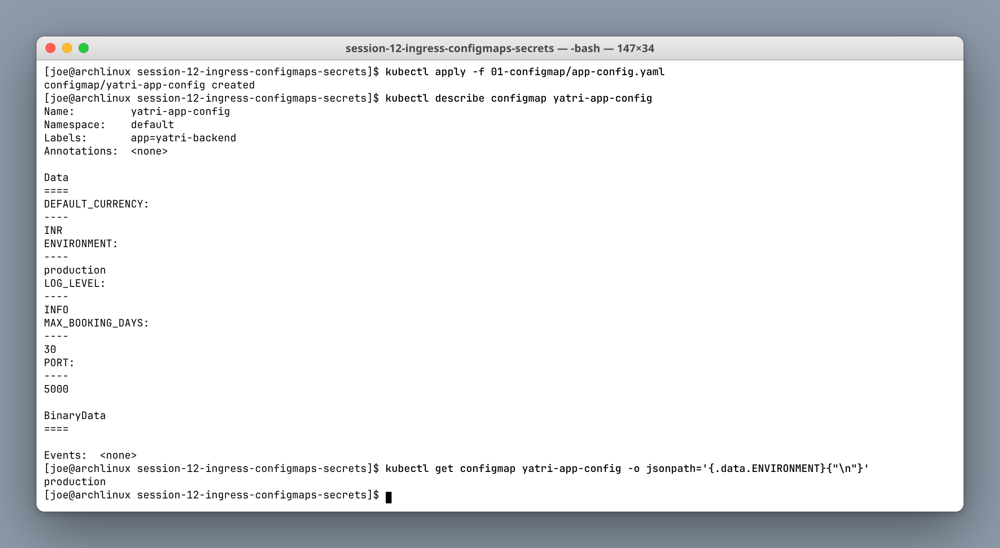

A ConfigMap holds plain key-value configuration — `ENVIRONMENT`, `LOG_LEVEL`, `PORT`, `DEFAULT_CURRENCY`, `MAX_BOOKING_DAYS`. Values are stored and displayed in **clear text**, which is exactly why credentials must never go here.

The point of externalising config is that the same container image ships to dev, staging and production unchanged; only the ConfigMap differs.

---

## Task 2: ConfigMap Changes Need a Restart

Patching a ConfigMap does **not** update environment variables in already-running containers.

```bash
kubectl exec deploy/yatri-backend -- printenv ENVIRONMENT          # production
kubectl patch configmap yatri-app-config --type merge -p '{"data":{"ENVIRONMENT":"staging"}}'
kubectl get configmap yatri-app-config -o jsonpath='{.data.ENVIRONMENT}'   # staging
kubectl exec deploy/yatri-backend -- printenv ENVIRONMENT          # STILL production
kubectl rollout restart deployment/yatri-backend
kubectl exec deploy/yatri-backend -- printenv ENVIRONMENT          # staging
```

**Screenshot:**

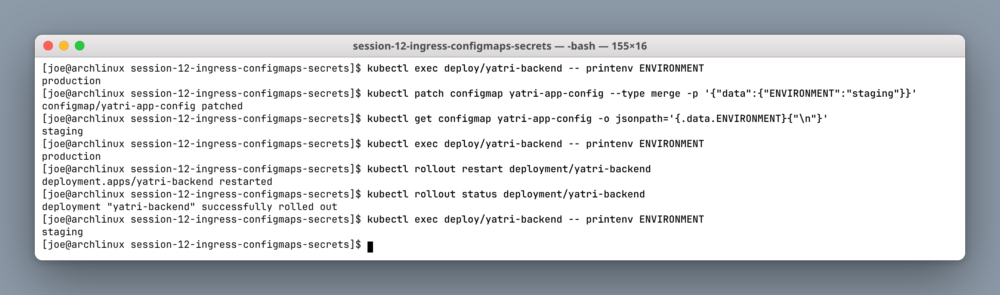

The ConfigMap in etcd says `staging` while the running pod still reports `production`. Environment variables are injected **once, at container start**, and the Linux process environment cannot be changed from outside afterwards.

`kubectl rollout restart` is the fix — it rolls the pods, and the new ones pick up the new value.

> **Exception:** a ConfigMap mounted as a **volume** *is* updated in place (within a kubelet sync period, typically ~60s). Applications that watch the file can reload without a restart. Environment variables never can. This trade-off is the reason config-as-a-file is preferred for anything that must change at runtime.

---

## Task 3: Secrets & Base64

```bash
kubectl apply -f 02-secret/db-secret.yaml
kubectl describe secret yatri-db-secret
kubectl get secret yatri-db-secret -o jsonpath='{.data.POSTGRES_PASSWORD}' | base64 --decode
```

**Screenshot:**

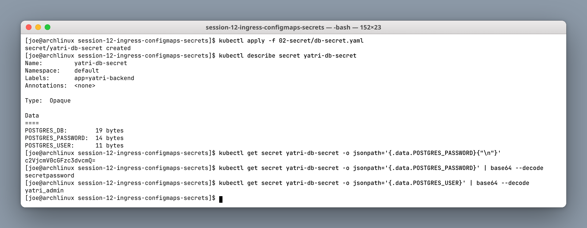

`kubectl describe` masks the values, showing only `14 bytes` instead of the password. That masking is **cosmetic only** — a single `jsonpath` query plus `base64 --decode` prints `secretpassword` in clear text.

**Base64 is encoding, not encryption.** Anyone with `get secrets` RBAC permission can read every value. The real protections are:

- RBAC, so few subjects can read Secrets at all
- Encryption at rest in etcd (`EncryptionConfiguration`)
- An external secret store, so the plaintext never lives in the cluster long-term (Task 5)

---

## Task 4: The Trailing Newline Gotcha

```bash
echo "secretpassword"    | base64    # WRONG → c2VjcmV0cGFzc3dvcmQK
echo -n "secretpassword" | base64    # RIGHT → c2VjcmV0cGFzc3dvcmQ=
```

**Screenshot:**

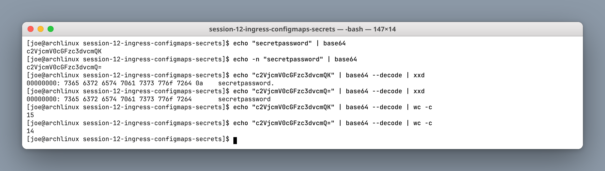

The `xxd` dump makes the bug visible: the first form ends in byte `0a` — a newline — and decodes to **15 bytes** instead of 14. The application then authenticates with `"secretpassword\n"` and the database rejects it.

This failure is notoriously hard to debug, because every log line and every `kubectl` output *looks* correct — the newline is invisible. Always use `echo -n` (or `printf`) when hand-encoding secret values, and verify with `| wc -c`.

---

## Task 5: Enterprise Secret Management

```bash
kubectl auth can-i get secrets --as=system:serviceaccount:default:default   # no
cat ../.gitignore
```

**Screenshot:**

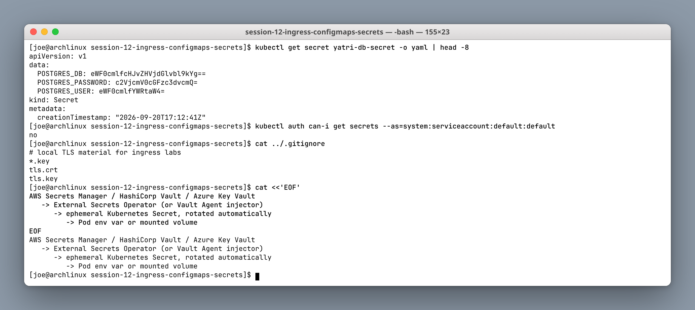

Committing Secret YAMLs to Git is acceptable for a classroom lab but not for production — git history is effectively permanent, so a leaked credential stays leaked even after the file is deleted. This repository's `.gitignore` therefore excludes the TLS material generated in Task 13.

The production pattern:

```
AWS Secrets Manager / HashiCorp Vault / Azure Key Vault
   → External Secrets Operator (or Vault Agent injector)
      → ephemeral Kubernetes Secret, rotated automatically
         → Pod env var or mounted volume
```

The operator syncs from the external store on a schedule, so the source of truth lives outside the cluster, rotation happens centrally, and access is audited. For CI/CD, GitHub Actions secrets or Azure DevOps variable groups inject values at deploy time so they never touch the repository.

The `kubectl auth can-i` check is the other half: least-privilege RBAC, verified rather than assumed.

---

## Task 6: Combined Injection (ConfigMap + Secret)

The backend uses `envFrom.configMapRef` for bulk config and `secretKeyRef` for individual credentials.

```bash
kubectl apply -f 04-full-demo/configmap.yaml -f 04-full-demo/secret.yaml -f 04-full-demo/backend.yaml
kubectl exec deploy/yatri-backend -- env | grep -E 'ENVIRONMENT|LOG_LEVEL|CURRENCY|POSTGRES'
```

**Screenshot:**

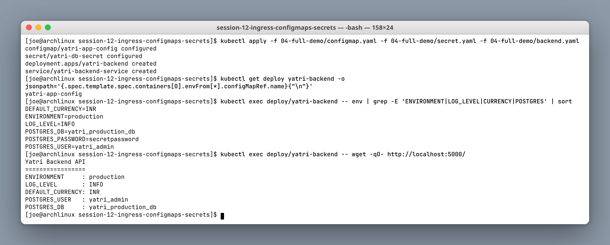

Two injection styles in one PodSpec:

| Style | Syntax | Behaviour |
|---|---|---|
| Bulk | `envFrom: [{configMapRef: {name: ...}}]` | Every key becomes an env var automatically |
| Selective | `env: [{valueFrom: {secretKeyRef: {name:, key:}}}]` | One named key, explicitly mapped |

`envFrom` is concise but implicit — adding a key to the ConfigMap silently adds an env var. `secretKeyRef` is deliberately explicit, which is the right default for credentials since it makes every injected secret visible in the manifest.

The application response confirms both sources arrived in the same process environment.

---

## Task 7: Ingress Resource vs Ingress Controller

```bash
kubectl apply -f 03-ingress/ingress-routes.yaml
kubectl get ingress yatri-ingress      # ADDRESS column is EMPTY
kubectl get pods -n ingress-nginx      # No resources found
kubectl get ingressclass               # No resources found
```

**Screenshot:**

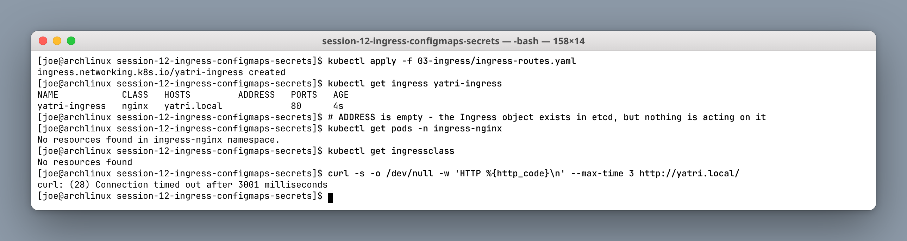

| Ingress **Resource** | Ingress **Controller** |
|---|---|
| A YAML object: hosts, paths, TLS references | A running reverse proxy (NGINX, Traefik, HAProxy) |
| Stored in etcd | Watches the API for Ingress objects |
| Does nothing on its own | Rewrites its config and actually routes traffic |

This is the single most common Ingress misunderstanding, and the screenshot demonstrates it directly: the Ingress object was created successfully, but `ADDRESS` is **empty**, no controller pods exist, there is no IngressClass, and `curl` times out. The rules are sitting in etcd with nothing to enforce them.

---

## Task 8: Enable the NGINX Ingress Controller

```bash
minikube addons enable ingress
kubectl wait -n ingress-nginx --for=condition=ready pod \
  -l app.kubernetes.io/component=controller --timeout=180s
kubectl get pods -n ingress-nginx
kubectl get ingressclass
kubectl get ingress yatri-ingress
```

**Screenshot:**

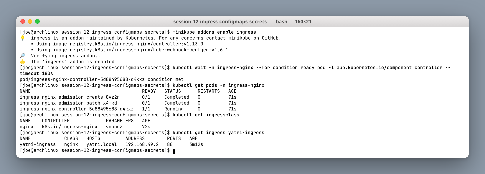

With the controller running, the **same unmodified Ingress object** now shows `ADDRESS: 192.168.49.2`. Nothing about the Ingress changed — a controller simply appeared and claimed it.

The two `Completed` admission jobs are the validating webhook's certificate setup; that webhook is what rejects malformed Ingress rules at apply time rather than silently breaking the proxy config.

---

## Task 9: `/etc/hosts` Mapping

```bash
MINIKUBE_IP=$(minikube ip)
echo "${MINIKUBE_IP}  yatri.local portal.campus.local api.campus.local" | sudo tee -a /etc/hosts
getent hosts yatri.local portal.campus.local
```

**Screenshot:**

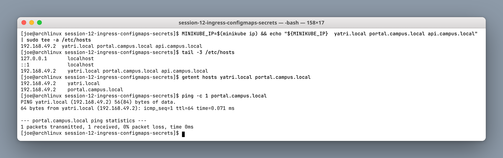

Host-based Ingress routing keys off the HTTP `Host` header, so the client has to *send* the right hostname. `.local` domains do not exist in public DNS, so `/etc/hosts` provides the mapping locally.

Note in the ping output that `portal.campus.local` resolves but reports back as `yatri.local` — all three names point at the same IP and the resolver returns the first entry on that line. That is harmless: the Ingress controller routes on the Host header, not on reverse DNS.

If you cannot edit `/etc/hosts`, `curl --resolve host:port:IP` or `curl -H "Host: ..."` achieves the same thing per-request.

---

## Task 10: Path-Based Routing

`yatri.local/` → frontend, `yatri.local/api/` → backend, with a rewrite that strips the `/api` prefix.

```bash
kubectl apply -f 04-full-demo/frontend.yaml -f 04-full-demo/ingress.yaml
kubectl describe ingress yatri-ingress
curl -s http://yatri.local/
curl -s http://yatri.local/api/
```

**Screenshot:**

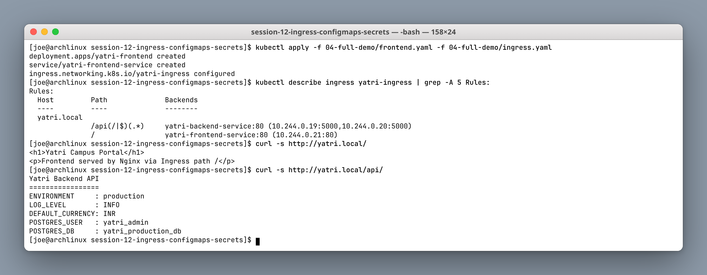

One hostname, one IP, two backend Services chosen by URL path. The relevant annotations:

| Annotation | Purpose |
|---|---|
| `nginx.ingress.kubernetes.io/use-regex: "true"` | Enables the regex path `/api(/|$)(.*)` |
| `nginx.ingress.kubernetes.io/rewrite-target: /$2` | Forwards capture group 2, stripping the `/api` prefix |
| `nginx.ingress.kubernetes.io/ssl-redirect: "false"` | Allows plain HTTP for this demo |

The rewrite matters: the backend serves its API at `/`, not at `/api/`. Without the rewrite it would receive `/api/` and return 404. The `describe` output also shows the Ingress resolving straight through to pod IPs and ports (`:5000` for the backend, `:80` for the frontend).

---

## Task 11: Host-Based Routing

`portal.campus.local` and `api.campus.local` share one entry IP and are distinguished by the `Host` header.

```bash
kubectl apply -f 03-ingress/ingress-tls.yaml
curl -sk -H "Host: portal.campus.local" https://$(minikube ip)/
curl -sk -H "Host: api.campus.local"    https://$(minikube ip)/api/
curl -sk -H "Host: unknown.campus.local" https://$(minikube ip)/    # 404
```

**Screenshot:**

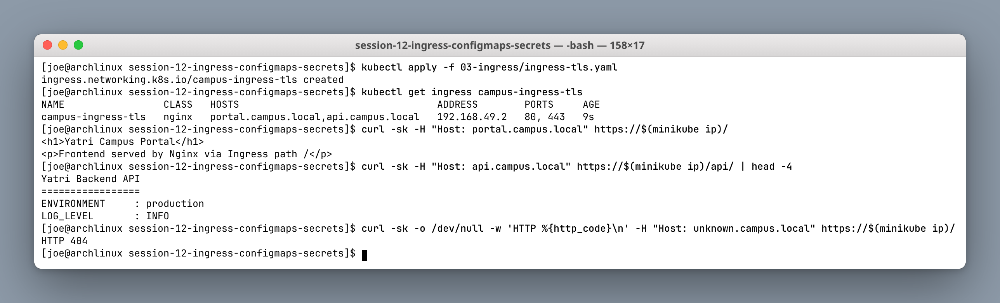

Identical IP, identical port, different Host header, different backend. An unmatched host returns **404** from the controller's default backend — proving the routing decision really is made on the header and not on the address.

This is virtual hosting, and it is what lets one cloud load balancer serve dozens of hostnames.

---

## Task 12: Hybrid Ingress (Host + Path + TLS)

`03-ingress/ingress-tls.yaml` combines all three mechanisms in one object.

```bash
kubectl describe ingress campus-ingress-tls
kubectl get ingress
```

**Screenshot:**

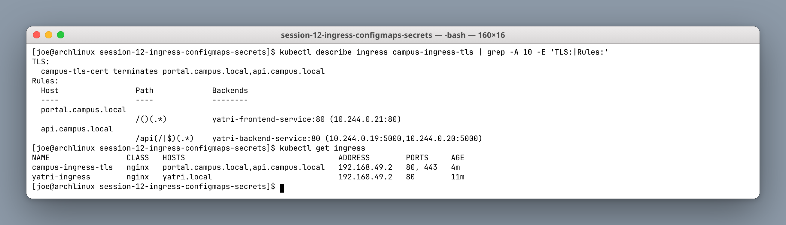

```
portal.campus.local  /()(.*)         → yatri-frontend-service:80
api.campus.local     /api(/|$)(.*)   → yatri-backend-service:80
```

The `PORTS` column reads `80, 443` because the `tls:` block is present, and the `TLS:` section names `campus-tls-cert` as terminating both hosts. Multiple Ingress objects can coexist on the same controller — `yatri-ingress` and `campus-ingress-tls` are both active — and NGINX merges them into one configuration.

---

## Task 13: TLS Termination

```bash
openssl req -x509 -nodes -days 365 -newkey rsa:2048 \
  -keyout tls.key -out tls.crt -subj "/CN=campus.local/O=CampusDevOps"
kubectl create secret tls campus-tls-cert --cert=tls.crt --key=tls.key
kubectl get secret campus-tls-cert
curl -k -s -o /dev/null -w 'HTTP %{http_code}\n' https://portal.campus.local/
curl -kv https://portal.campus.local/
```

**Screenshot:**

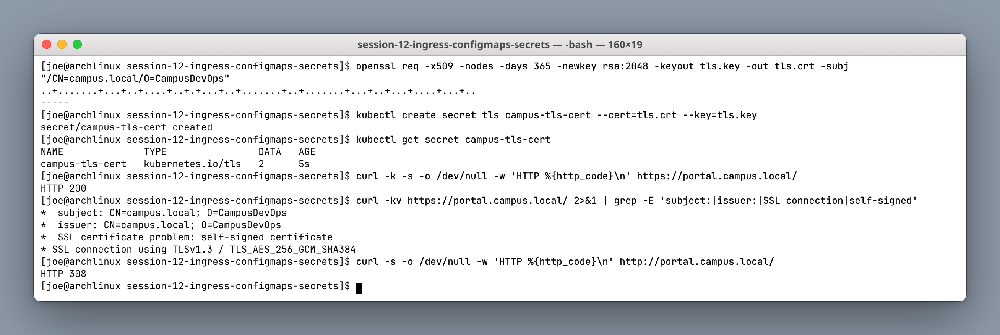

The Secret type is `kubernetes.io/tls` — a dedicated type requiring exactly the keys `tls.crt` and `tls.key`, which is why `kubectl create secret tls` exists rather than using a generic Opaque Secret.

The verbose output shows `subject` and `issuer` are the **same** — the definition of a self-signed certificate, which is why `-k` is required to skip verification. In production this Secret would be populated by cert-manager from Let's Encrypt and no `-k` would be needed.

The final command returns **HTTP 308**: plain HTTP is permanently redirected to HTTPS, because this Ingress sets `ssl-redirect: "true"`. TLS is terminated **at the Ingress controller** — traffic from there to the backend pods is plain HTTP inside the cluster network.

---

## Task 14: Full Demo Automation

```bash
cd 04-full-demo
bash run-demo.sh
kubectl get configmap,secret,ingress,deploy,svc
bash cleanup.sh
```

**Screenshots:**

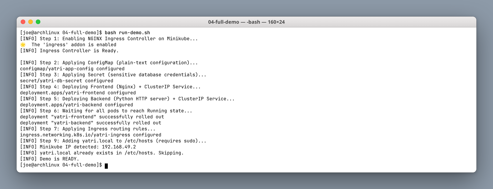

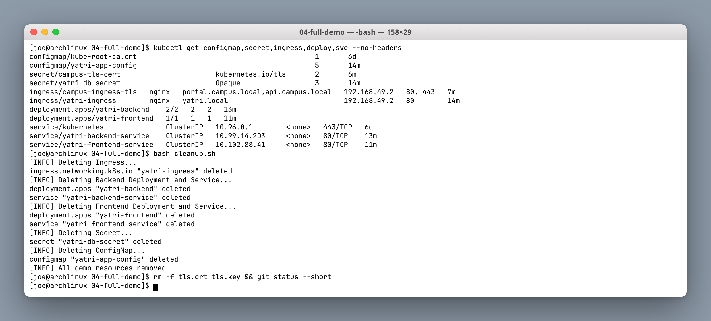

`run-demo.sh` performs the whole stack in order: enable the controller, wait for readiness, apply ConfigMap and Secret, deploy backend and frontend, wait for both rollouts, apply the Ingress, then add the hosts entry. Every `kubectl apply` reports `configured` rather than `created` here, because the objects already existed — `apply` is declarative and idempotent, so re-running the script is safe.

`cleanup.sh` tears down in reverse dependency order and uses `--ignore-not-found=true` so it never fails on a partially-deployed cluster. The `campus-tls-cert` Secret survives because it was created imperatively in Task 13 rather than from a manifest; the local `tls.crt` / `tls.key` are removed and are `.gitignore`d anyway, which the clean `git status` confirms.

---

## Quick Map: ConfigMap vs Secret vs Ingress

| Object | Purpose | Storage | Example |
|---|---|---|---|
| **ConfigMap** | Non-sensitive settings | Plain text in etcd | `LOG_LEVEL=INFO` |
| **Secret** | Credentials and keys | Base64 in etcd (encrypt at rest!) | `POSTGRES_PASSWORD` |
| **Ingress** | Layer-7 HTTP/HTTPS routing | Rules only — needs a controller | `/api` → backend Service |

## Key takeaways

1. Env vars from a ConfigMap need a pod restart; volume mounts update in place.
2. Base64 is encoding, not encryption — protect Secrets with RBAC and encryption at rest.
3. Always `echo -n` when hand-encoding a secret value.
4. An Ingress resource without a controller does absolutely nothing.
5. One Ingress + one load balancer replaces N LoadBalancer Services, with host and path routing and central TLS.
6. TLS terminates at the controller; internal traffic to pods stays plain HTTP.
