# Session 14 — Kubernetes Troubleshooting

**Author:** Joe Daniel
**Enrollment:** 24bcs10214
**Course:** SST DevOps & Cloud [SWE]
**Manifests:** `session-14-kubernetes-troubleshooting/`

Nine troubleshooting drills: first the four commands you reach for on any incident (`get`, `describe`, `logs`, `exec`), then events, then four deliberately broken workloads fixed one at a time. Run on Minikube (Kubernetes v1.34.0, Docker driver) on Arch Linux.

---

## Task 01: `kubectl get`

**Goal:** See the current status of resources — the first command on any incident.

```bash
kubectl apply -f 01-kubectl-get/pod.yaml
kubectl get pods
kubectl get pods -o wide
kubectl get all
```

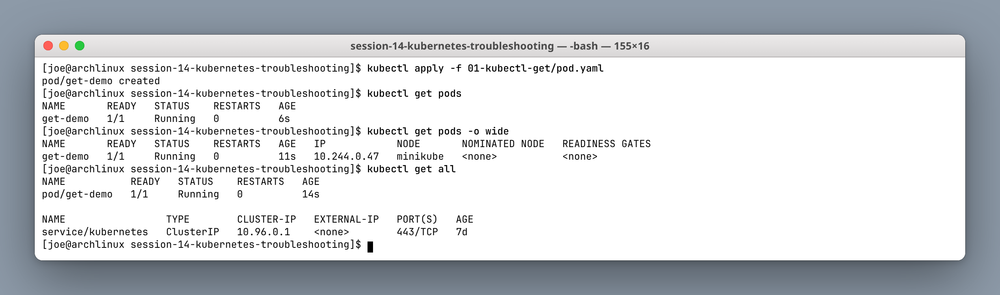

```text
NAME       READY   STATUS    RESTARTS   AGE   IP            NODE
get-demo   1/1     Running   0          11s   10.244.0.47   minikube
```

`READY 1/1` and `STATUS Running` are two different facts. `STATUS` is the container state; `READY` counts containers passing their readiness probe. A pod sitting at `0/1 Running` is the classic "it's up but serving nothing" case — worth internalising early, because `get` alone will not tell you why.

`-o wide` adds the pod IP and node, which is what you need the moment the problem might be scheduling or networking.

---

## Task 02: `kubectl describe`

**Goal:** Investigate one resource in detail — crucially, its **Events**.

```bash
kubectl apply -f 02-kubectl-describe/demo-pod.yaml
kubectl describe pod describe-demo
```

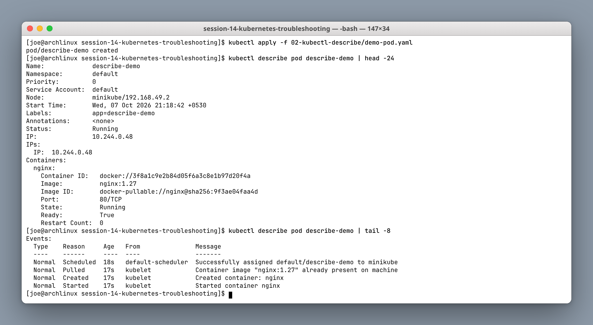

The top half gives the spec as the cluster resolved it: node, IP, image ID, container state, restart count. The bottom half is the **Events** timeline:

```text
Normal  Scheduled  18s  default-scheduler  Successfully assigned default/describe-demo to minikube
Normal  Pulled     17s  kubelet            Container image "nginx:1.27" already present on machine
Normal  Created    17s  kubelet            Created container: nginx
Normal  Started    17s  kubelet            Started container nginx
```

Read the `From` column. `default-scheduler` events are placement; `kubelet` events are runtime. Knowing which component complained narrows the problem instantly — and this is exactly how Tasks 06–08 get diagnosed.

> Events expire (one hour by default). A pod broken since yesterday will show an empty Events section — that absence is itself information, not a dead end.

---

## Task 03: `kubectl logs`

**Goal:** Read the application's own output from inside the container.

```bash
kubectl apply -f 03-kubectl-logs/pod.yaml
kubectl logs logs-demo
kubectl logs logs-demo --tail=2 -f
```

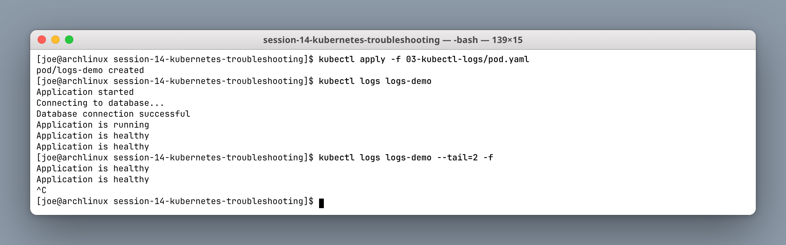

```text
Application started
Connecting to database...
Database connection successful
Application is running
Application is healthy
```

`logs` shows what the **process** wrote to stdout/stderr; `describe` shows what **Kubernetes** thinks. When they disagree, believe the logs about the app and `describe` about the platform.

Two flags worth memorising:

| Flag | Use |
|---|---|
| `-f` | Follow live, like `tail -f` |
| `--tail=N` | Last N lines only |
| `--previous` | Logs from the **crashed** previous container — essential for CrashLoopBackOff |
| `-c <name>` | Pick a container in a multi-container pod |

---

## Task 04: `kubectl exec`

**Goal:** Get a shell inside a running container.

```bash
kubectl apply -f 04-kubectl-exec/pod.yaml
kubectl exec -it exec-demo -- bash
ls /usr/share/nginx/html
curl -s localhost | grep title
```

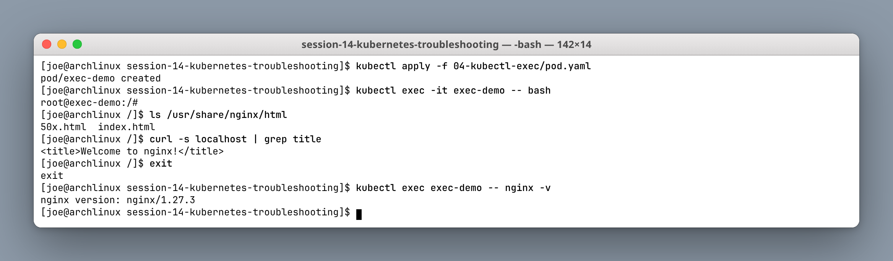

```text
50x.html  index.html
```

The `--` separator matters: everything after it is the command for the container, not flags for `kubectl`. Without it, `kubectl` tries to parse your command's flags as its own.

This is the tool for "the config looks right but the app disagrees" — check the file actually mounted, resolve a DNS name from where the app sits, or curl a dependency from inside the pod's network namespace. Note it only works if the image *has* a shell; distroless and scratch images do not, which is where ephemeral debug containers (`kubectl debug`) come in.

---

## Task 05: Kubernetes Events

**Goal:** See what the cluster has been doing, across all resources.

```bash
kubectl apply -f 05-events/pod.yaml
kubectl get events --sort-by=.metadata.creationTimestamp | tail -n 5
kubectl get events --field-selector involvedObject.name=events-demo
```

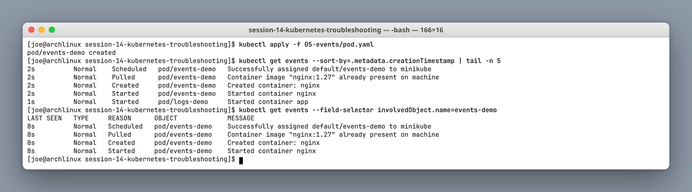

The `--sort-by` is not optional in practice — `kubectl get events` returns them in essentially arbitrary order, which makes an incident timeline unreadable. Sorting by creation timestamp is the difference between a wall of text and a story.

`--field-selector` narrows to a single object once you know which one is misbehaving.

---

## Task 06: CrashLoopBackOff

**Goal:** Diagnose a container that starts, fails, and exits repeatedly.

`06-crashloopbackoff/broken-pod.yaml` runs a script that prints and then `exit 1`.

```bash
kubectl apply -f 06-crashloopbackoff/broken-pod.yaml
kubectl get pods crash-demo
kubectl logs crash-demo
```

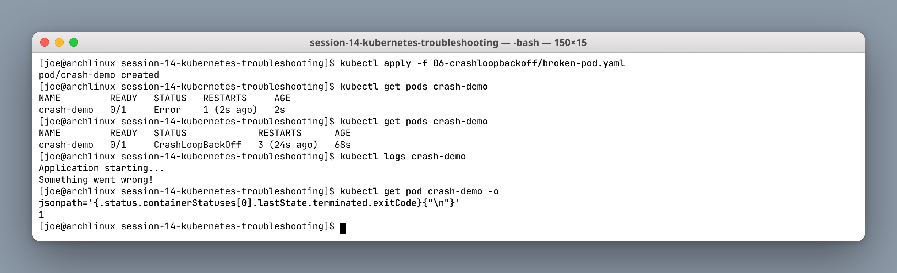

```text
NAME         READY   STATUS             RESTARTS      AGE
crash-demo   0/1     CrashLoopBackOff   3 (24s ago)   68s
```

The status progression is worth watching: `Error` first, then `CrashLoopBackOff` once the kubelet starts backing off. **CrashLoopBackOff is not an error in itself** — it is the kubelet saying "I am deliberately waiting before trying again", with the delay doubling 10s → 20s → 40s up to five minutes. The real error is in the logs and the exit code:

```text
Application starting...
Something went wrong!

exit code: 1
```

**Fix** — `fixed-pod.yaml` keeps the process alive instead of exiting:

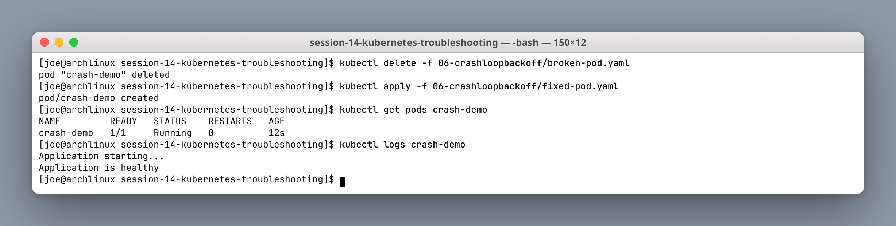

The pod must be deleted before re-applying, because `command` is immutable on an existing pod. A non-zero exit means the app genuinely failed; an exit code of `0` in a crash loop usually means the opposite problem — the process finished its work and returned, when Kubernetes expected a long-running service.

---

## Task 07: ImagePullBackOff

**Goal:** Diagnose a pod whose image cannot be pulled.

`07-imagepullbackoff/broken-pod.yaml` requests `nginx:this-image-does-not-exist`.

```bash
kubectl apply -f 07-imagepullbackoff/broken-pod.yaml
kubectl get pods image-demo
kubectl describe pod image-demo | grep -A 6 Events:
```

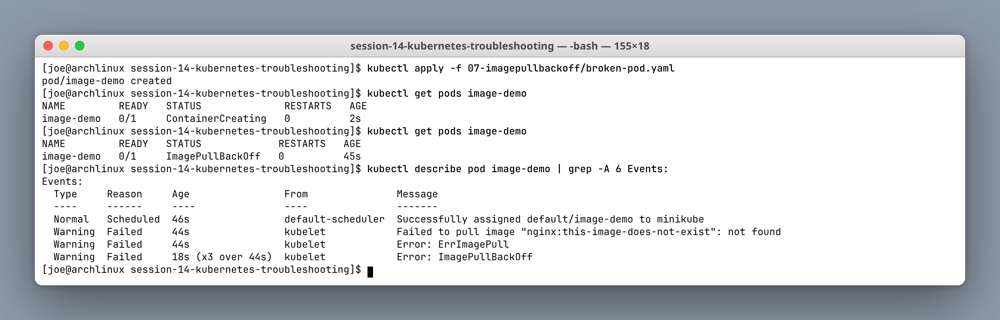

```text
Warning  Failed  44s  kubelet  Failed to pull image "nginx:this-image-does-not-exist": not found
Warning  Failed  44s  kubelet  Error: ErrImagePull
Warning  Failed  18s  kubelet  Error: ImagePullBackOff
```

`ErrImagePull` is the first failure; `ImagePullBackOff` is the backoff state after repeated attempts. Note the pod briefly shows `ContainerCreating` — the scheduler already placed it successfully, so this is purely a kubelet/registry problem.

The three causes, in order of likelihood: the tag does not exist (this case), the registry needs credentials and no `imagePullSecret` is set, or the registry is unreachable from the node. `describe` distinguishes them — "not found" versus "unauthorized" versus a timeout.

**Fix** — `fixed-pod.yaml` uses `nginx:1.27`:

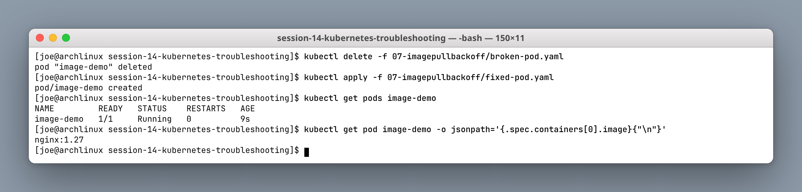

---

## Task 08: Pending Pods

**Goal:** Diagnose a pod that cannot be scheduled at all.

`08-pending-pods/broken-pod.yaml` pins itself with `nodeSelector: kubernetes.io/hostname: node-that-does-not-exist`.

```bash
kubectl apply -f 08-pending-pods/broken-pod.yaml
kubectl get pods pending-demo
kubectl describe pod pending-demo | grep -A 4 Events:
```

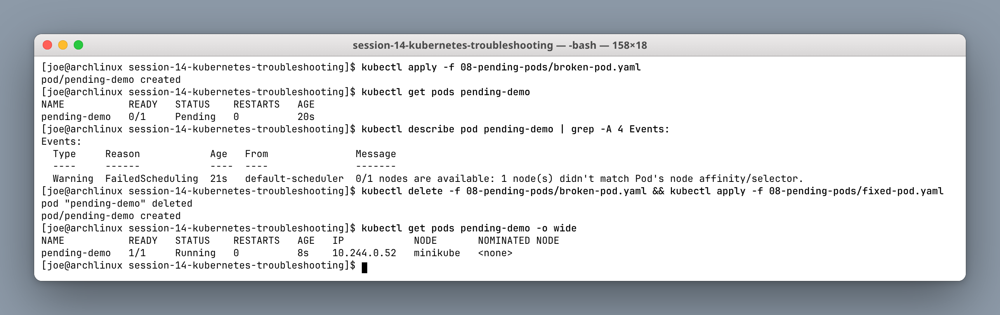

```text
Warning  FailedScheduling  21s  default-scheduler  0/1 nodes are available: 1 node(s) didn't match Pod's node affinity/selector.
```

`Pending` means the pod exists in etcd but has **no node**. The event comes from `default-scheduler`, not the kubelet — that single detail tells you this is placement, not runtime, so looking at logs would be wasted effort (there is no container to have logs).

The scheduler's message always names the count and the reason: `0/1 nodes are available` followed by why each was rejected. Common variants are `Insufficient cpu` / `Insufficient memory` (resource requests too large), `node(s) had untolerated taint`, and this one, an unsatisfiable `nodeSelector`.

**Fix** — `fixed-pod.yaml` drops the `nodeSelector` and the pod schedules immediately.

---

## Task 09: Service DNS & Selector Troubleshooting

**Goal:** Diagnose a Service that resolves but routes to nothing.

`09-service-dns-troubleshooting/service.yaml` selects `app: web-asd`, while the Deployment labels its pods `app: web`.

```bash
kubectl apply -f 09-service-dns-troubleshooting/deployment.yaml
kubectl apply -f 09-service-dns-troubleshooting/service.yaml
kubectl get pods -l app=web --show-labels
kubectl get service broken-service -o jsonpath='{.spec.selector}'
```

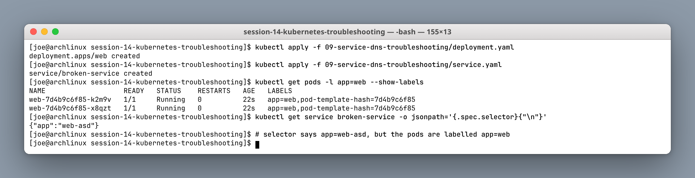

The mismatch is visible side by side — pods carry `app=web`, the Service asks for `{"app":"web-asd"}`.

```bash
kubectl get service broken-service
kubectl get endpoints broken-service
kubectl exec dns-test -- nslookup broken-service
```

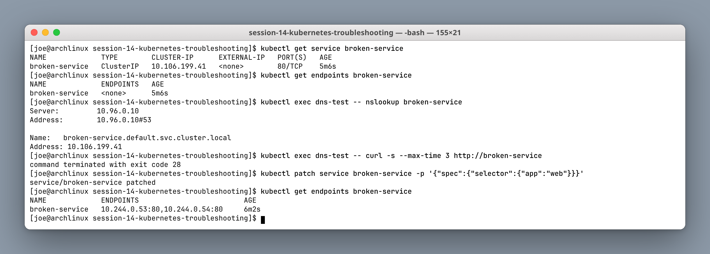

```text
NAME             TYPE        CLUSTER-IP      PORT(S)   AGE
broken-service   ClusterIP   10.106.199.41   80/TCP    5m6s

NAME             ENDPOINTS   AGE
broken-service   <none>      5m6s
```

This is the instructive part. **DNS resolves perfectly** — `nslookup` returns `10.106.199.41` — because a ClusterIP is allocated the moment the Service is created, entirely independent of whether any pod backs it. The connection then hangs and times out (`exit code 28`).

So "the DNS name works" proves nothing. `ENDPOINTS: <none>` is the real signal: no pod matched the selector, so `kube-proxy` has nothing to forward to.

**Fix** — point the selector at the labels that actually exist:

```bash
kubectl patch service broken-service -p '{"spec":{"selector":{"app":"web"}}}'
kubectl get endpoints broken-service
# 10.244.0.53:80,10.244.0.54:80
```

Endpoints populate within a second, because the EndpointSlice controller is watching and reconciles immediately.

---

## Cleanup

```bash
kubectl delete -f 09-service-dns-troubleshooting/ --ignore-not-found
kubectl delete pod get-demo describe-demo logs-demo exec-demo events-demo crash-demo image-demo pending-demo --ignore-not-found
```

---

## Triage summary

| Symptom | Layer | First command | Usual cause |
|---|---|---|---|
| `Pending` | Scheduler | `describe` → Events | Resources, taints, nodeSelector |
| `ContainerCreating` (stuck) | Kubelet | `describe` → Events | Volume mount, image pull, CNI |
| `ImagePullBackOff` | Registry | `describe` → Events | Bad tag, missing credentials |
| `CrashLoopBackOff` | Application | `logs --previous` | Non-zero exit, bad config |
| `Running` but `0/1` | Application | `describe` → readiness probe | Probe failing |
| Service times out | Networking | `get endpoints` | Selector/label mismatch |

The pattern underneath all nine tasks: **`get` to spot it, `describe` to find which component complained, then `logs` or `exec` depending on whether that component was the kubelet or the app.**
