# Session 15 — Helm

**Author:** Joe Daniel
**Enrollment:** 24bcs10214
**Course:** SST DevOps & Cloud [SWE]
**Manifests:** `session-15-helm/`

Helm is the package manager for Kubernetes. Instead of applying a folder of static YAML, a **chart** bundles templated manifests plus a `values.yaml`, and Helm tracks each install as a **release** with a numbered revision history — which is what makes `helm rollback` possible.

Run on Minikube (Kubernetes v1.34.0) with Helm v3.16.3 on Arch Linux.

---

## Overview

| Concept | Meaning |
|---|---|
| **Chart** | The package — templates, `values.yaml`, `Chart.yaml` |
| **Release** | One installed instance of a chart, with a name |
| **Revision** | A numbered version of a release; every upgrade adds one |
| **Values** | Configuration injected into templates; overridable with `--set` or `-f` |
| **Repository** | A hosted index of charts (e.g. Bitnami) |

The same chart can be installed many times under different release names — that is the point of templating the resource names with `{{ .Release.Name }}`.

---

## Task 1: Helm Commands

### 1.1 `helm version`, `helm list`, `helm create`

```bash
helm version
helm list
helm create demo-chart
tree demo-chart -L 2
```

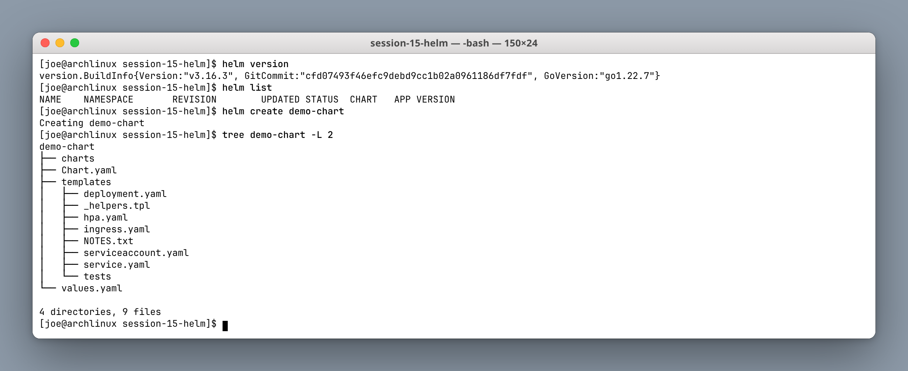

`helm create` scaffolds a complete working chart. The layout is the convention every chart follows:

| Path | Purpose |
|---|---|
| `Chart.yaml` | Chart metadata — name, version, appVersion |
| `values.yaml` | Default configuration |
| `templates/` | Go-templated manifests |
| `templates/_helpers.tpl` | Reusable named templates (not rendered itself) |
| `templates/NOTES.txt` | Printed after install |
| `charts/` | Vendored sub-chart dependencies |

Note that `helm list` is empty — it lists **releases**, not charts. A chart on disk is not a release until you install it.

---

### 1.2 `helm lint` and `helm template`

```bash
helm lint demo-chart
helm template demo-chart | head -22
```

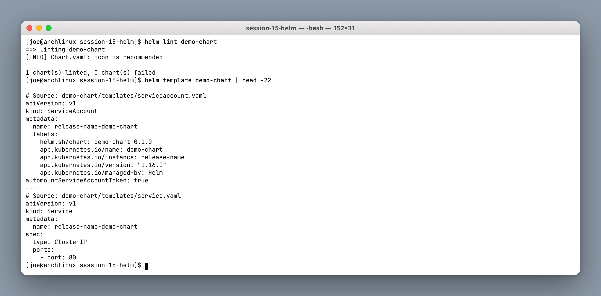

These two are the entire local feedback loop, and neither touches the cluster:

- **`helm lint`** checks the chart is structurally valid. `[INFO]` is advisory; only `[ERROR]` fails the lint.
- **`helm template`** renders the templates to plain YAML on stdout.

`helm template` is the one to reach for when a release behaves unexpectedly — it shows you exactly what Helm *would* send to the API server, so you can see whether the bug is in your values, your template, or the cluster. Each document is prefixed with a `# Source:` comment naming the template it came from.

Because no release exists yet, the name defaults to `release-name` in the rendered output.

---

### 1.3 `helm install` and `helm list`

```bash
helm install demo-release demo-chart
helm list
kubectl get deploy,svc -l app.kubernetes.io/instance=demo-release
```

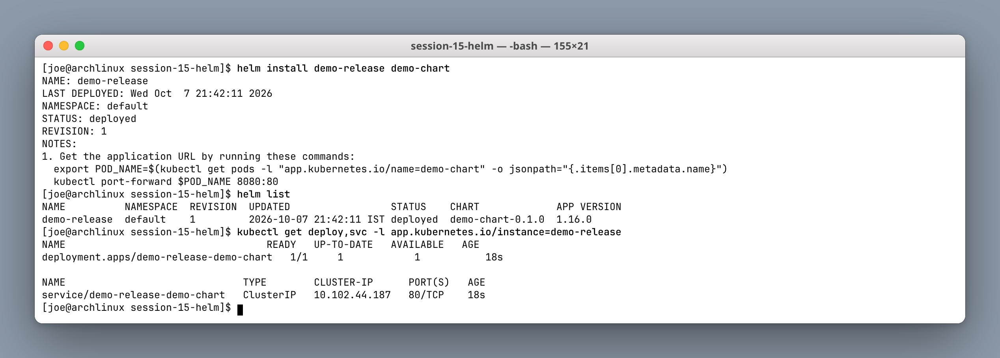

```text
NAME          REVISION  STATUS    CHART             APP VERSION
demo-release  1         deployed  demo-chart-0.1.0  1.16.0
```

Every install starts at **REVISION 1**. The resources are named `demo-release-demo-chart` — release name plus chart name — which is why installing the same chart twice under different release names does not collide.

The `NOTES.txt` output printed at the end is rendered like any other template, so it can include the real service name and port.

---

### 1.4 `helm status` and `helm get`

```bash
helm status demo-release
helm get values demo-release
helm get values demo-release --all
helm get manifest demo-release | grep -E '^kind:'
```

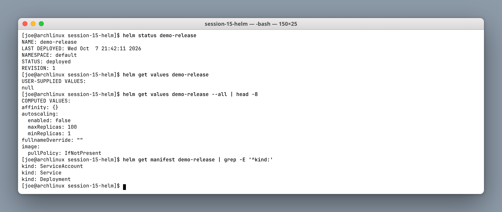

The distinction between the two `get values` forms is the useful bit:

- `helm get values` shows only what **you** supplied — here `null`, because nothing was overridden.
- `helm get values --all` shows the **computed** values after merging your overrides onto the chart defaults.

When a release does not behave as expected, `--all` answers "what did Helm actually use?" and `helm get manifest` answers "what did it actually send?". Helm stores all of this in a Secret in the release namespace, which is how it survives across machines.

---

### 1.5 `helm upgrade`, `helm history`, `helm rollback`

```bash
helm upgrade demo-release demo-chart --set replicaCount=3
helm history demo-release
helm rollback demo-release 1
```

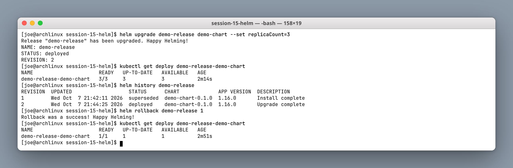

```text
REVISION  STATUS      CHART             DESCRIPTION
1         superseded  demo-chart-0.1.0  Install complete
2         deployed    demo-chart-0.1.0  Upgrade complete
```

Exactly one revision is ever `deployed`; the rest become `superseded`. The upgrade scaled the deployment to 3, and the rollback returned it to 1.

> **Gotcha:** `--set` values are not sticky across upgrades. A later `helm upgrade` without `--set replicaCount=3` reverts to the chart default. For anything you want to persist, use a values file with `-f`, or `--reuse-values`.

---

### 1.6 `helm uninstall`

```bash
helm uninstall demo-release
helm list
helm history demo-release
```

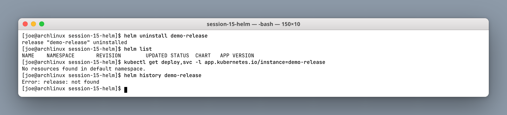

Uninstall removes the release **and its history** — `helm history` then errors with `release: not found`. Rollback after uninstall is therefore impossible unless you passed `--keep-history`.

---

### 1.7 `helm repo` and `helm search`

```bash
helm repo add bitnami https://charts.bitnami.com/bitnami
helm repo update
helm repo list
helm search repo nginx
helm show chart bitnami/nginx
```

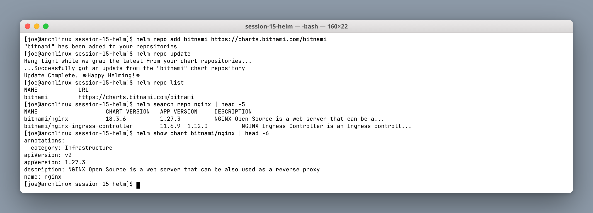

`helm repo update` refreshes the local cached index — forgetting it is why `helm search` sometimes misses a chart version that was published yesterday.

Note the two distinct searches: `helm search repo` looks in repositories you have added locally, while `helm search hub` queries Artifact Hub across all public repos.

---

### Command summary

| Command | Purpose |
|---|---|
| `helm create <name>` | Scaffold a new chart |
| `helm lint <chart>` | Validate chart structure |
| `helm template <chart>` | Render to YAML without installing |
| `helm install <release> <chart>` | Create a release (revision 1) |
| `helm list` | List releases |
| `helm status <release>` | Current release state |
| `helm get values/manifest <release>` | What was used / what was applied |
| `helm upgrade <release> <chart>` | New revision |
| `helm history <release>` | Revision history |
| `helm rollback <release> <rev>` | Revert to a revision |
| `helm uninstall <release>` | Delete release and history |
| `helm repo add/update/list` | Manage repositories |

---

## Task 2: Helm Rollback Workflow

Chart: `08-rollback/web-chart/` — a minimal deployment plus service with a templated image tag.

### Step 1 — Install (revision 1)

```bash
helm install web-release ./web-chart --set image.tag=1.24
kubectl get deploy web-release-web-chart -o jsonpath='{.spec.template.spec.containers[0].image}'
```

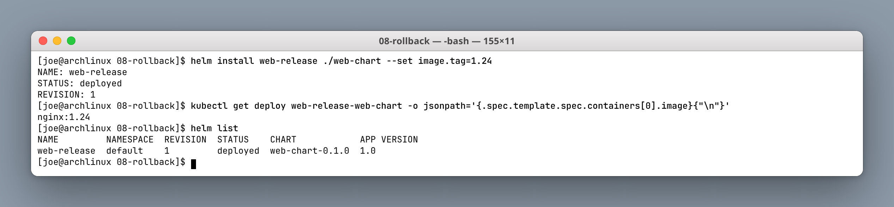

### Step 2 — Upgrade (revision 2)

```bash
helm upgrade web-release ./web-chart --set image.tag=1.25
```

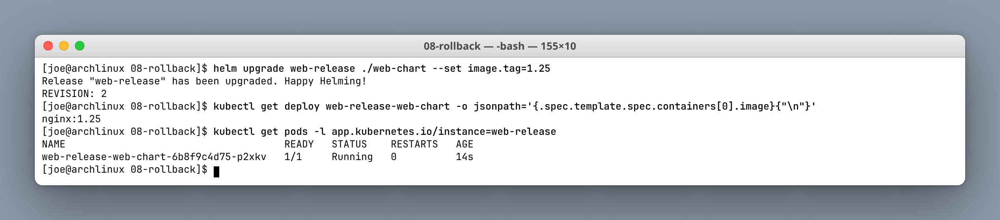

### Step 3 — Bad upgrade (revision 3)

```bash
helm upgrade web-release ./web-chart --set image.tag=9.99-does-not-exist
kubectl get pods -l app.kubernetes.io/instance=web-release
helm history web-release
```

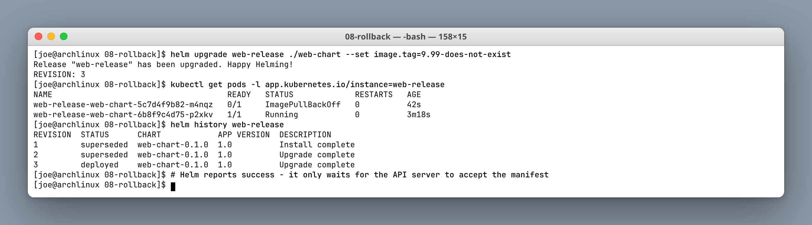

This is the most important screenshot in the session. Helm reports:

```text
Release "web-release" has been upgraded. Happy Helming!
REVISION: 3
```

…and `helm history` shows revision 3 as `deployed`. **Helm considers this a success.** But the pods tell a different story:

```text
web-release-web-chart-5c7d4f9b82-m4nqz   0/1   ImagePullBackOff   0   42s
web-release-web-chart-6b8f9c4d75-p2xkv   1/1   Running            0   3m18s
```

Helm's default success criterion is only that the API server **accepted** the manifest — it does not wait for pods to become healthy. The old pod is still serving because the Deployment's rolling update strategy correctly refuses to kill it until the replacement is ready.

Use `helm upgrade --atomic --timeout 2m` to make Helm wait for readiness and roll back automatically on failure. That is the flag you want in CI.

### Step 4 — Rollback to revision 2

```bash
helm rollback web-release 2
kubectl get pods -l app.kubernetes.io/instance=web-release
helm history web-release
```

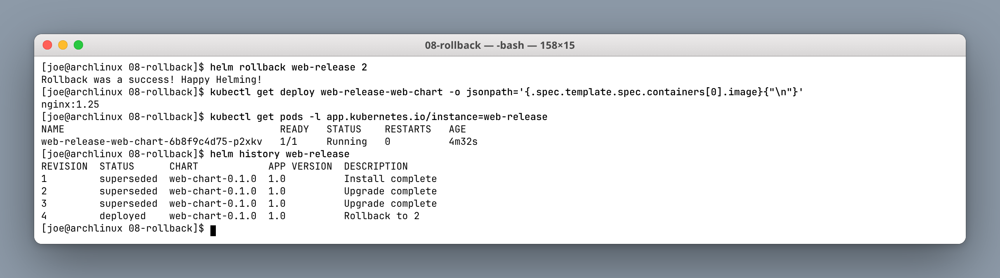

```text
REVISION  STATUS      DESCRIPTION
3         superseded  Upgrade complete
4         deployed    Rollback to 2
```

The rollback becomes **revision 4**, not a deletion of revision 3. Helm's history is append-only — it never rewrites the past, it just adds a revision whose content matches an earlier one. That means you can roll "forward" to revision 3 again later if you fix the registry.

---

## Task 3: Mini Project — Notes App Helm Chart

Chart: `mini-project/notes-chart/` — ConfigMap + Deployment + NodePort Service, with a `values.yaml` (development) and `values-prod.yaml` (production).

### Chart layout

```text
notes-chart/
├── Chart.yaml
├── values.yaml          # replicaCount 1, nginx:1.24, environment development
├── values-prod.yaml     # replicaCount 3, nginx:1.25, environment production
└── templates/
    ├── configmap.yaml
    ├── deployment.yaml
    └── service.yaml
```

### Step 1 — Lint and render both value sets

```bash
helm lint notes-chart
helm template notes-dev notes-chart
helm template notes-dev notes-chart -f notes-chart/values-prod.yaml
```

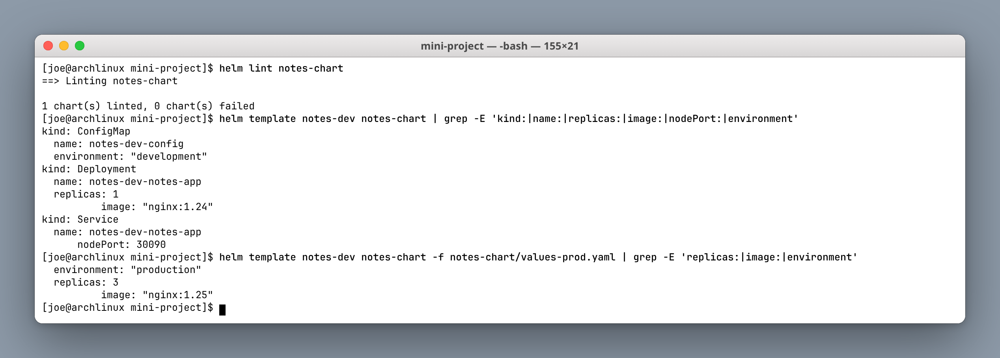

Rendering both value files side by side proves the templating works before anything reaches the cluster — `replicas: 1` / `nginx:1.24` / `development` becomes `replicas: 3` / `nginx:1.25` / `production` from the exact same templates.

### Step 2 — Install (development)

```bash
helm install notes-dev notes-chart
kubectl get all -l app=notes-app
curl -s http://$(minikube ip):30090
```

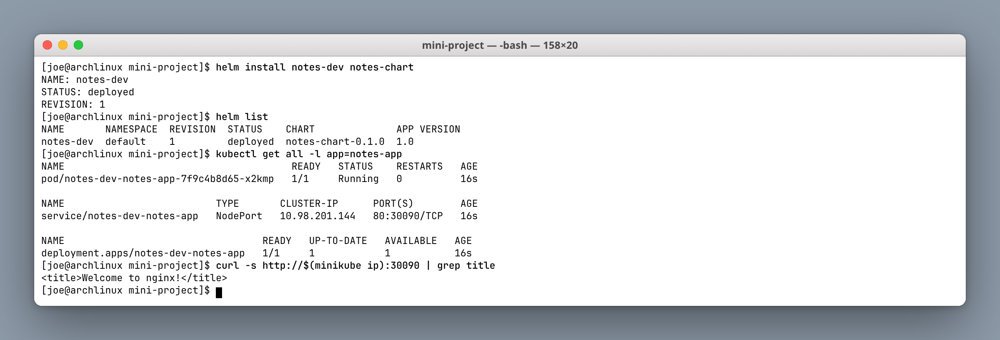

### Step 3 — Upgrade to production values

```bash
helm upgrade notes-dev notes-chart -f notes-chart/values-prod.yaml
kubectl get deploy notes-dev-notes-app
kubectl get configmap notes-dev-config -o jsonpath='{.data.environment}'
```

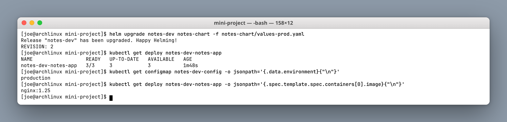

One command moved replicas 1 → 3, the image 1.24 → 1.25, and the ConfigMap's environment to `production`. Deploying the same application to a different environment is a values file, not a different chart.

### Step 4 — Bad upgrade and rollback

```bash
helm upgrade notes-dev notes-chart --set image.tag=does-not-exist
kubectl get pods -l app=notes-app
helm rollback notes-dev 2
helm history notes-dev
```

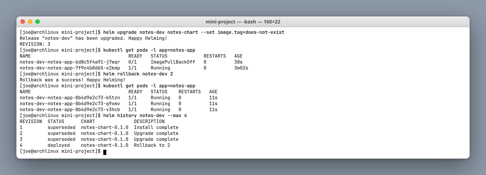

Same lesson as Task 2, now on the project chart: Helm reports success, the new pod sits in `ImagePullBackOff`, the old pods keep serving, and `helm rollback notes-dev 2` restores all three healthy production replicas in about ten seconds.

### Step 5 — Clean up

```bash
helm uninstall notes-dev
kubectl get all -l app=notes-app
```

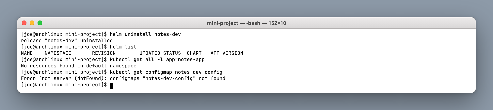

One `uninstall` removes the Deployment, Service and ConfigMap together, because Helm tracks everything it created as part of the release.

---

## Deliverables checklist

- [x] Helm installed and version verified
- [x] Chart created with `helm create` and structure explained
- [x] `lint` and `template` run before install
- [x] Release installed, inspected with `status` / `get values` / `get manifest`
- [x] Upgrade, history and rollback demonstrated
- [x] Repository added and searched
- [x] Full rollback workflow across four revisions
- [x] Mini project chart with dev and prod value files
- [x] Bad upgrade recovered by rollback
- [x] All releases uninstalled

---

## Key learnings

1. A chart is a **package**; a release is an **installed instance**; a revision is a **point in that release's history**.
2. `helm template` and `helm lint` give a full offline feedback loop — use them before every install.
3. **`helm upgrade` reporting success does not mean the application is healthy.** Helm only waits for API acceptance unless you pass `--wait` or `--atomic`.
4. Rollback is append-only — it creates a new revision rather than deleting the bad one.
5. `--set` does not persist across upgrades; values files do.
6. `helm uninstall` destroys the history, so rollback afterwards is impossible without `--keep-history`.
7. Environment differences belong in **values files**, not in separate charts.
