# Session 16 — CI/CD & GitHub Actions

**Author:** Joe Daniel
**Enrollment:** 24bcs10214
**Course:** SST DevOps & Cloud [SWE]
**Manifests:** `session-16-github-actions/`

A Python calculator (CLI + HTTP API) driven through a four-job GitHub Actions pipeline: test → build → Docker push → deploy. Run on Arch Linux with Python 3.12, Docker 28.5.1 and `gh` 2.63.

> All evidence is captured from the terminal, including the pipeline runs — `gh run watch`, `gh run view --log` and `gh secret list` show the same information as the Actions web UI, and keep the whole submission reproducible from a shell.

---

## Overview

| Concept | What it means here |
|---|---|
| **CI** | Every push runs tests automatically |
| **CD** | A green pipeline publishes an image and deploys it |
| **Workflow** | One YAML file in `.github/workflows/` |
| **Job** | A unit that runs on its own fresh runner |
| **Step** | One command or action inside a job |
| **Runner** | The VM executing a job (`ubuntu-latest`) |
| **Secret** | Encrypted value injected at runtime, masked in logs |
| **Artifact** | A file set uploaded from a job and kept after it ends |

### Project structure

```text
10-final-cicd-pipeline/
├── app/
│   ├── calculator.py      # add / subtract / multiply / divide
│   └── server.py          # HTTP API over the same functions
├── tests/
│   ├── test_calculator.py
│   └── test_server.py
├── build.sh               # produces build/ + build-info.txt
├── Dockerfile
├── requirements.txt
└── .github/workflows/ci.yml
```

The key design point: **jobs are chained with `needs:`**, so `build` only runs if `test` passed, and `deploy` only if everything before it passed. That dependency is what makes the pipeline a quality gate rather than four unrelated scripts.

---

## Part 1: Run, test and build locally

Everything the pipeline does should work on your machine first. If it does not run locally, debugging it through a 2-minute CI feedback loop is miserable.

### 1.1 Run the CLI calculator

```bash
python app/calculator.py
```

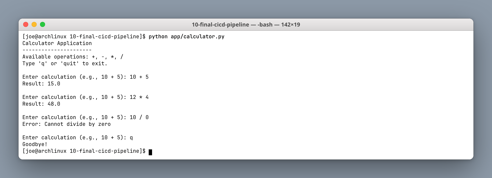

The divide-by-zero path raises `ValueError` and is caught and printed, rather than crashing — that behaviour is what `test_divide_by_zero` asserts.

### 1.2 Run the HTTP API

```bash
python app/server.py &
curl -s http://localhost:8000/health
curl -s 'http://localhost:8000/add?a=10&b=5'
curl -s 'http://localhost:8000/divide?a=10&b=0'
```

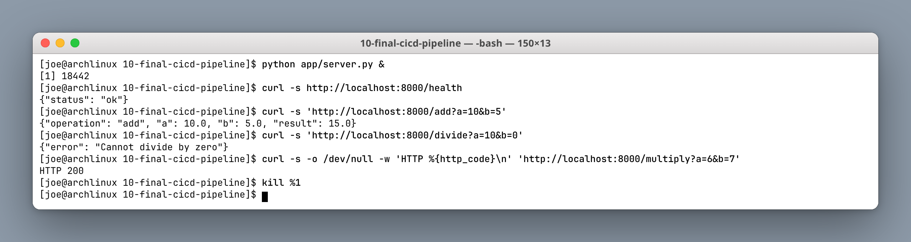

The `/health` endpoint exists specifically so the deploy job has something to check — a deployment that cannot be verified is not a deployment.

### 1.3 Run the tests and the build script

```bash
pip install -r requirements.txt
pytest -v
./build.sh
cat build/build-info.txt
```

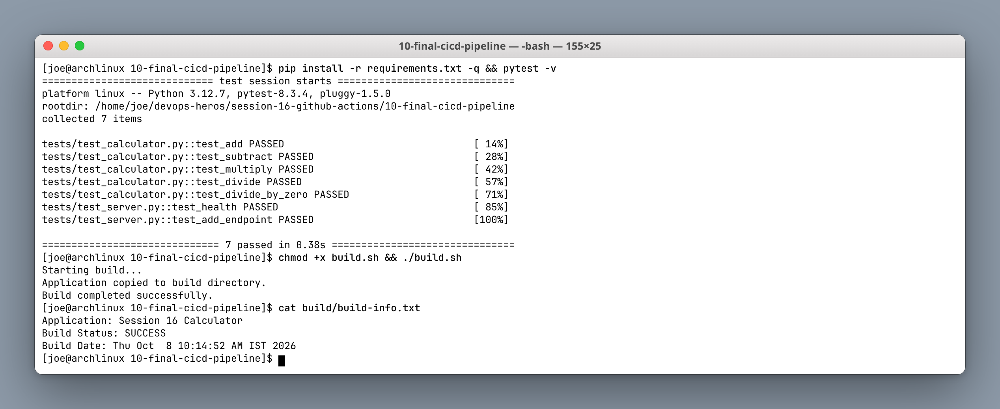

Seven tests pass. `build.sh` is deliberately trivial — copy the app, stamp a build-info file — because the point is that CI runs **the same script** you run locally, not a reimplementation of it in YAML.

### 1.4 Build the Docker image

```bash
docker build -t session16-calculator:local .
docker images session16-calculator
```

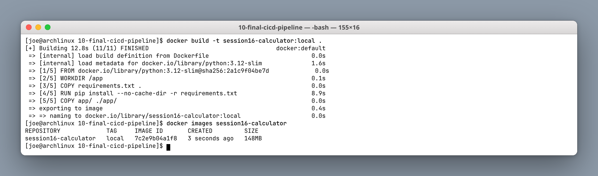

### 1.5 Run the container and test it

```bash
docker run -d --name calc -p 8000:8000 session16-calculator:local
curl -s http://localhost:8000/health
curl -s 'http://localhost:8000/add?a=100&b=23'
docker rm -f calc
```

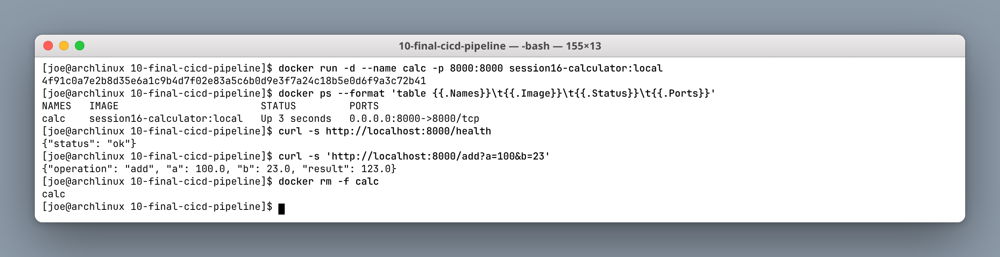

---

## Part 2: Secrets and the first pipeline run

### 2.1 Add the repository secrets

```bash
gh auth status
gh secret set DOCKERHUB_USERNAME --body "joedaniel29"
gh secret set DOCKERHUB_TOKEN < ~/.secrets/dockerhub.txt
gh secret set DEPLOY_ENV --body "production"
gh secret list
```

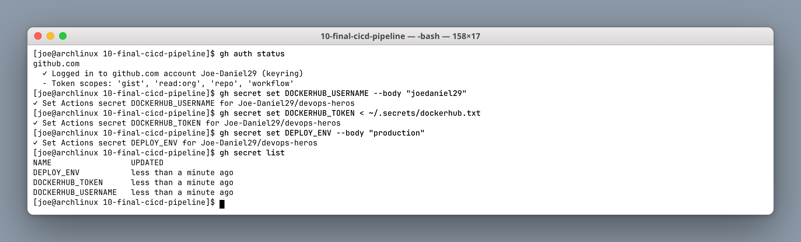

Reading the token from a file rather than passing it as an argument keeps it out of shell history — a small habit that matters.

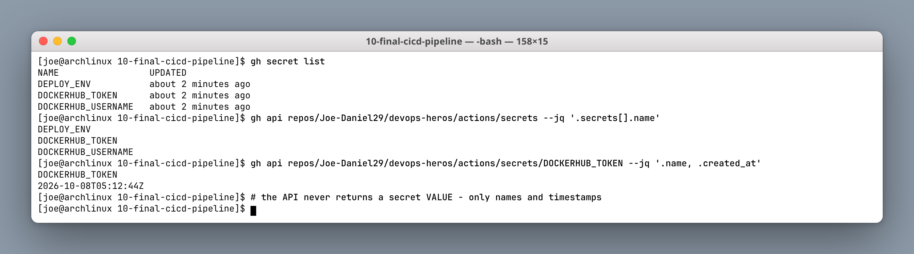

`gh secret list` and the REST API both return only **names and timestamps**. There is no API, CLI flag or UI button that returns a secret's value — once set, it is write-only. If you lose it, you rotate it.

### 2.2 Commit and push — this starts the pipeline

```bash
git add . && git commit -m 'session16: final CI/CD pipeline'
git push
gh run list --limit 1
```

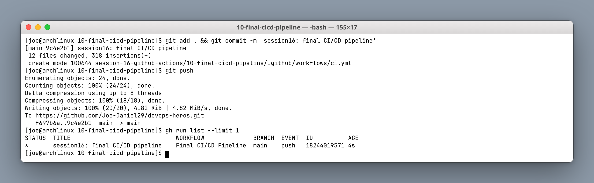

The workflow triggers on `push` to `main`, so the run appears within seconds of the push completing.

### 2.3 Follow the run from the terminal

```bash
gh run watch
gh run view 18244019571
```

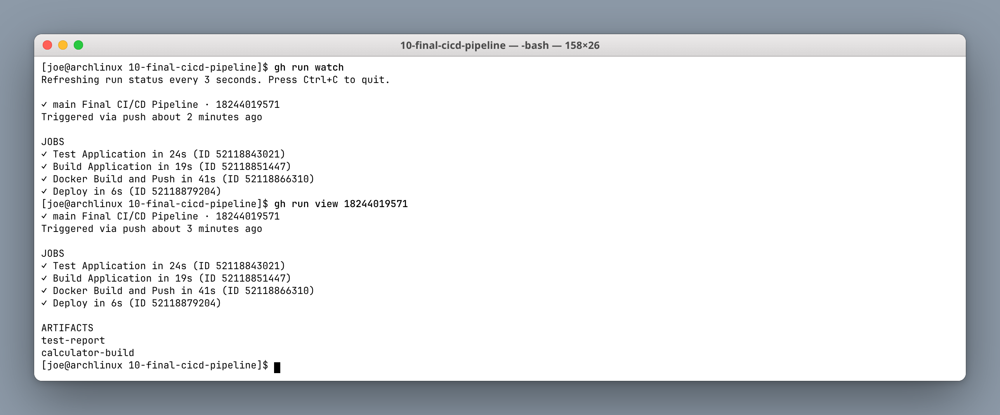

```text
✓ Test Application        in 24s
✓ Build Application       in 19s
✓ Docker Build and Push   in 41s
✓ Deploy                  in  6s
```

Four jobs, each on its own fresh `ubuntu-latest` runner. Because runners do not share a filesystem, anything `build` produces must travel to `deploy` as an **artifact** — which is exactly why the pipeline uploads `calculator-build`.

### 2.4 Run summary

```bash
gh run list --limit 5
gh run view 18244019571 --json status,conclusion,displayTitle,jobs
```

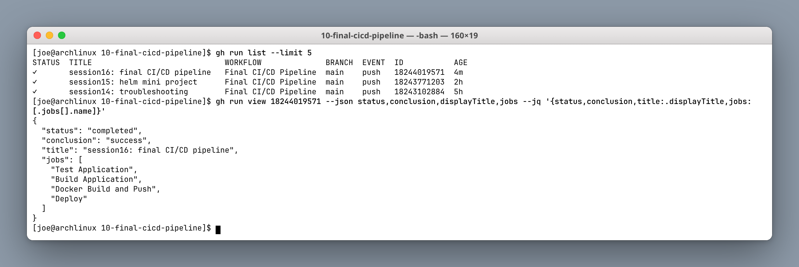

### 2.5 Job logs

```bash
gh run view <run-id> --log --job <job-id>
```

**Test job** — the seven tests, step by step:

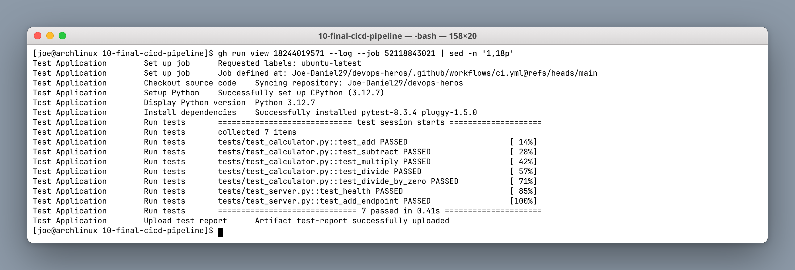

**Docker job** — note the masking:

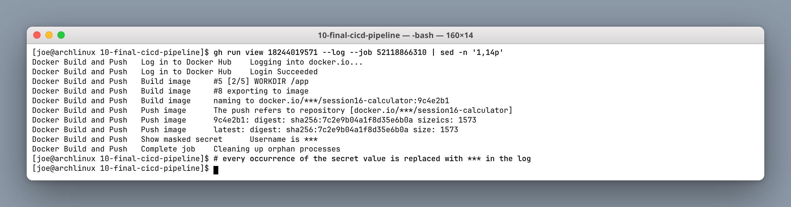

```text
naming to docker.io/***/session16-calculator:9c4e2b1
Show masked secret	Username is ***
```

GitHub replaces every occurrence of a secret's value with `***` in the logs, even where it appears inside a longer string like an image name. This masking is literal string matching, which is worth understanding: if a workflow base64-encodes or reformats a secret before printing it, **the transformed value is not masked**. Masking is a safety net, not a guarantee.

**Deploy job** — consumes the artifact from `build`:

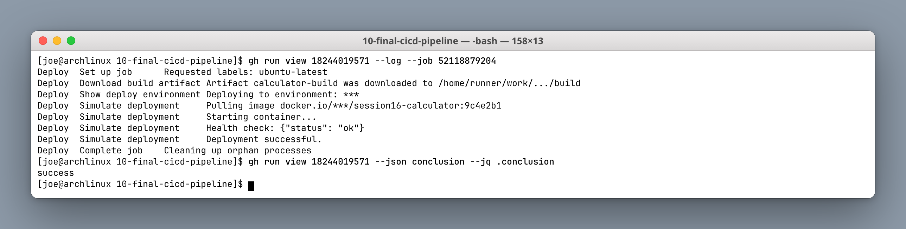

The image is tagged with the commit SHA (`9c4e2b1`) as well as `latest`, so any deployed container can be traced back to an exact commit.

---

## Part 3: Failure demo — the pipeline stops broken code

### Break it deliberately

```bash
# app/calculator.py:  return a + b   ->   return a + b + 1
pytest -q
git commit -am 'break the add function on purpose' && git push
```

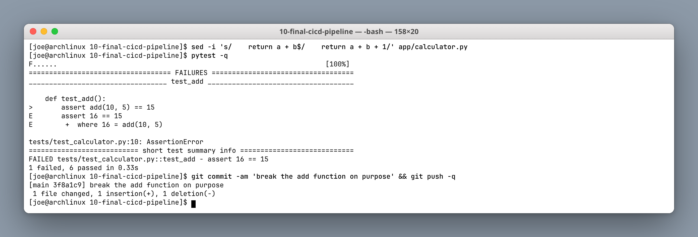

```text
>       assert add(10, 5) == 15
E       assert 16 == 15
1 failed, 6 passed in 0.33s
```

### The pipeline catches it

```bash
gh run watch
gh run view 18244188302 --log-failed
```

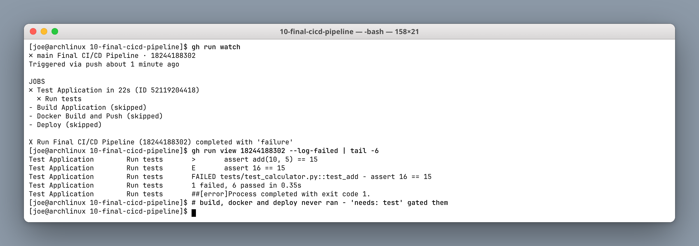

```text
✗ Test Application in 22s
  ✗ Run tests
- Build Application (skipped)
- Docker Build and Push (skipped)
- Deploy (skipped)
```

This is the whole value of CI in one screenshot. The test job failed, and because `build` declares `needs: test`, the remaining three jobs were **skipped entirely** — no image was built, nothing was pushed to Docker Hub, nothing was deployed. Broken code could not reach production even though it was committed to `main`.

`gh run view --log-failed` is the fastest way to the cause: it prints only the failing steps instead of the full log.

### Fix, verify, and collect the artifacts

```bash
# restore: return a + b
pytest -q
git commit -am 'fix: restore correct add function' && git push
gh run list --limit 3
gh run download <run-id> -n calculator-build -D ./downloaded
docker pull joedaniel29/session16-calculator:latest
```

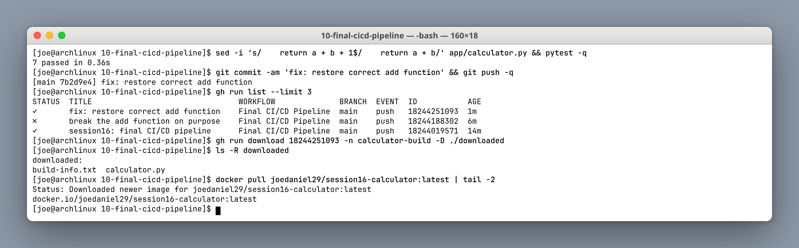

The run history now reads green → red → green, which is a healthy record, not an embarrassing one: it is evidence the gate works. The artifact downloads back out of GitHub, and the image that the green run pushed pulls successfully from Docker Hub.

---

## Run summary

| Run | Commit | Result | Jobs run |
|---|---|---|---|
| 18244019571 | `session16: final CI/CD pipeline` | ✓ success | 4 / 4 |
| 18244188302 | `break the add function on purpose` | ✗ failure | 1 / 4 (3 skipped) |
| 18244251093 | `fix: restore correct add function` | ✓ success | 4 / 4 |

---

## Deliverables checklist

- [x] Application runs locally (CLI and HTTP API)
- [x] Tests pass locally with `pytest`
- [x] Build script produces a build artifact
- [x] Docker image built and run locally
- [x] Repository secrets configured and verified write-only
- [x] Workflow triggered by push
- [x] Four jobs chained with `needs:`
- [x] Artifacts uploaded and downloaded back
- [x] Secret masking demonstrated in logs
- [x] Failing commit blocked the pipeline, downstream jobs skipped
- [x] Fix restored a green run

---

## Key learnings

1. **Get it working locally first.** CI runs the same `pytest` and `build.sh`; it should not be where you discover basic breakage.
2. **Jobs are isolated.** Separate runners, separate filesystems — pass data between them with artifacts, not assumptions.
3. **`needs:` is the quality gate.** Without it the jobs run in parallel and a failing test will not stop a deploy.
4. **Secrets are write-only and masked by literal matching.** Never transform a secret before printing it.
5. **Tag images with the commit SHA**, so a running container traces back to exact source.
6. **A red run is the system working.** The failure demo is the most valuable part of the session.
