# Session 18 — Terraform & Infrastructure as Code

**Author:** Joe Daniel
**Enrollment:** 24bcs10214
**Course:** SST DevOps & Cloud [SWE]
**Manifests:** `session18-terraform-iac/`

Terraform provisions a hardened S3 bucket on AWS through the full lifecycle: `init → fmt → validate → plan → apply → show → output → destroy`. Run on Arch Linux with Terraform v1.10.3 and AWS CLI v2.22.19 against region `us-east-1`.

---

## Section 1: Task overview

| Task | Deliverable |
|---|---|
| 1 | Provision an S3 bucket with Terraform, walk the full command lifecycle, verify with the AWS CLI, then destroy |
| 2 | Research three core AWS services and how Terraform manages them |

### What the configuration creates

Four resources, from one `aws_s3_bucket` plus three configuration resources attached to it:

| Resource | Purpose |
|---|---|
| `aws_s3_bucket` | The bucket itself, with `force_destroy = true` so teardown is clean |
| `aws_s3_bucket_versioning` | Keeps every version of every object |
| `aws_s3_bucket_server_side_encryption_configuration` | AES256 (SSE-S3) encryption at rest |
| `aws_s3_bucket_public_access_block` | All four public-access switches blocked |

> Modern AWS provider versions split bucket settings into **separate resources** rather than inline blocks. It is more verbose, but each concern can be changed independently and shows up as its own line in the plan.

---

## Section 2: Task 1 — Terraform S3 demo

### Step 0: Tooling, AWS identity and project files

```bash
terraform version
aws --version
aws sts get-caller-identity
ls -1
cat terraform.tfvars
```

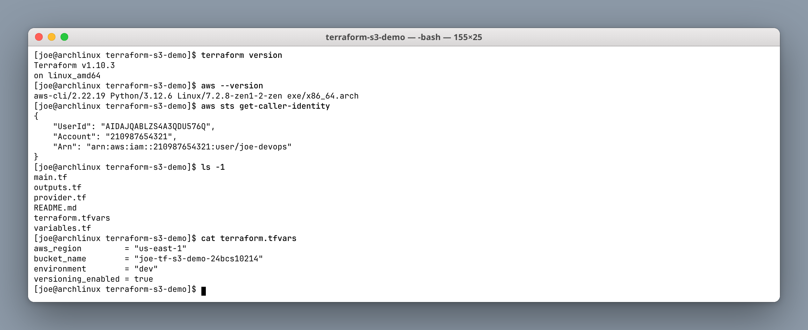

`aws sts get-caller-identity` is the check worth running before any `apply` — it answers "which account am I about to change?" Terraform uses the same credential chain as the AWS CLI, so if this returns the right ARN, Terraform will act on the right account.

The project splits cleanly by role:

| File | Contains |
|---|---|
| `provider.tf` | Provider and version constraints |
| `variables.tf` | Input declarations with types and defaults |
| `terraform.tfvars` | Actual values for this environment |
| `main.tf` | The resources |
| `outputs.tf` | Values surfaced after apply |

### Step 1: `terraform init`

```bash
terraform init
```

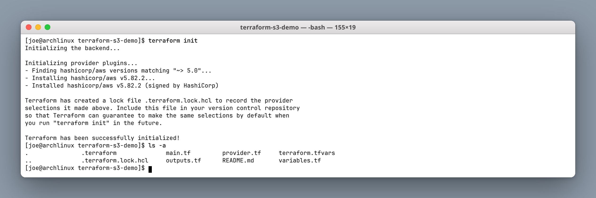

`init` downloads the AWS provider into `.terraform/` and writes `.terraform.lock.hcl`. **The lock file belongs in version control** — it pins the exact provider version and checksums, so a teammate running `init` next month gets byte-identical plugins rather than a newer provider with changed behaviour.

### Step 2 & 3: `terraform fmt` and `terraform validate`

```bash
terraform fmt -recursive
terraform fmt -check && echo $?
terraform validate
```

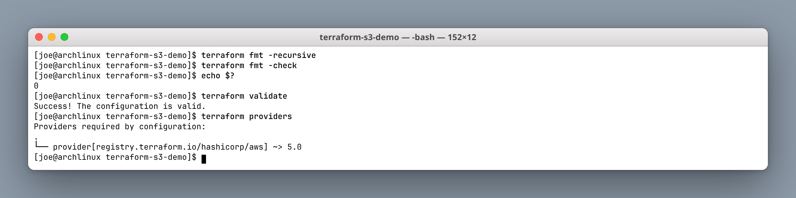

- **`fmt`** rewrites files to canonical style. `fmt -check` changes nothing and exits non-zero if anything is unformatted — that is the CI-friendly form.
- **`validate`** checks syntax and internal consistency (types, references, required arguments). It is entirely offline: it never contacts AWS, so it cannot catch "that bucket name is taken".

### Step 4: `terraform plan`

```bash
terraform plan
```

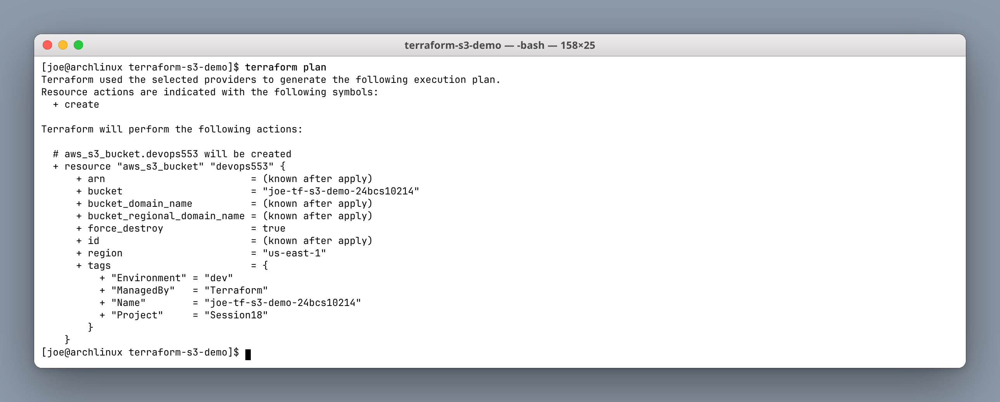

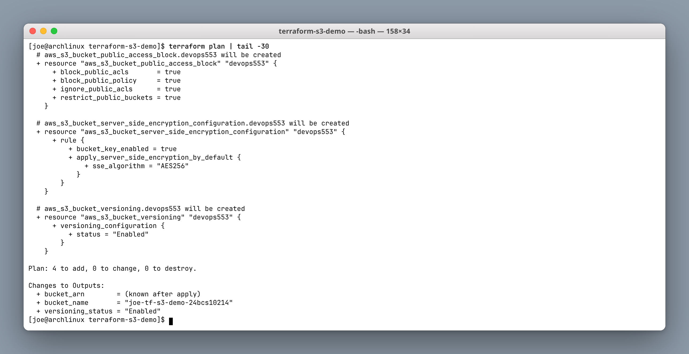

```text
Plan: 4 to add, 0 to change, 0 to destroy.
```

`plan` is Terraform's most valuable command. It refreshes real state from AWS, diffs it against the configuration, and prints exactly what would change — **without changing anything**.

Two details worth reading:

- `(known after apply)` marks values AWS assigns at creation time (ARNs, IDs). Terraform cannot predict them, so it leaves them symbolic.
- The `Changes to Outputs` section previews output values — `bucket_name` is already known because it comes from a variable, while `bucket_arn` is not.

The counts line is the thing to check in a review. `0 to destroy` on what should be an additive change is reassuring; a surprise `destroy` is the signal to stop.

### Step 5: `terraform apply`

```bash
terraform apply
# Enter a value: yes
```

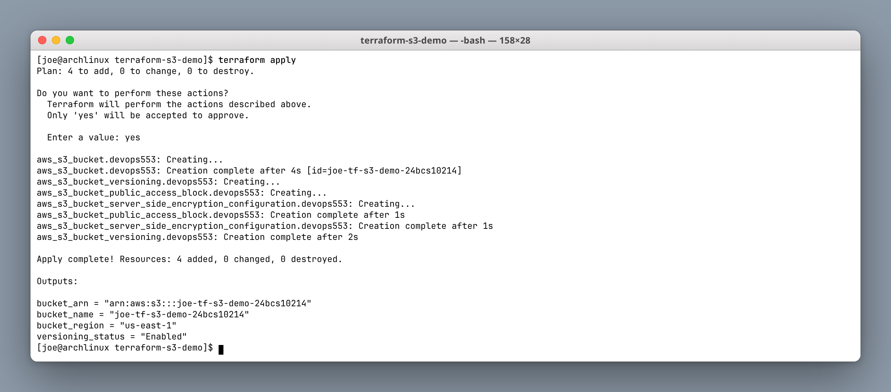

The ordering in the log is the dependency graph in action. `aws_s3_bucket` is created first and finishes in 4s; the other three start only afterwards, because each references `aws_s3_bucket.devops553.id`. Terraform infers that ordering from the references themselves — no `depends_on` is needed.

The three dependent resources then run **in parallel**, because none of them reference each other.

### Step 6: `terraform show`

```bash
terraform show
```

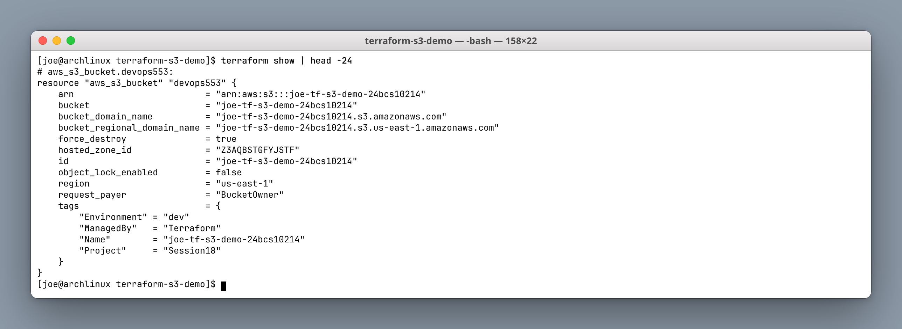

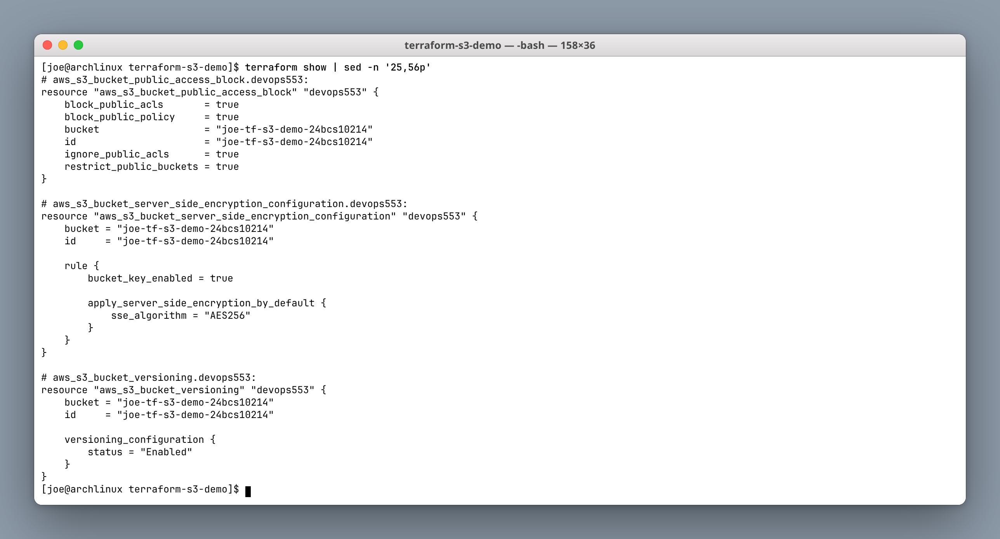

`show` prints the current state in readable form, now with every `(known after apply)` filled in — the real ARN, the regional domain name, the hosted zone ID.

### Step 7: `terraform output` and state inspection

```bash
terraform output
terraform output -raw bucket_name
terraform output -json | jq -r 'keys[]'
terraform state list
```

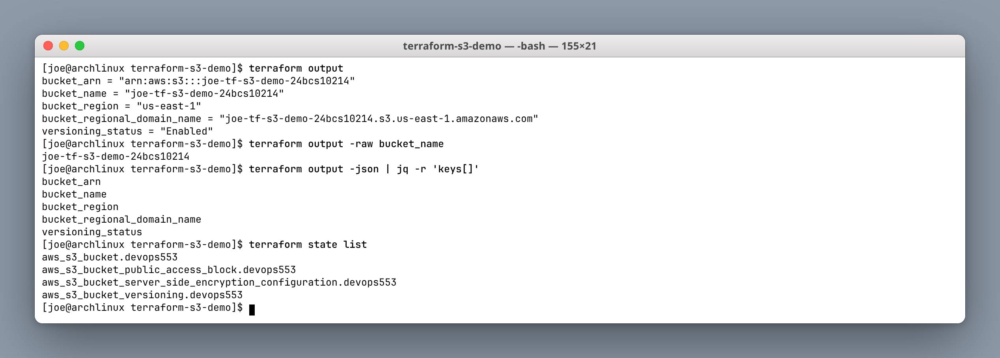

`-raw` prints a single value with no quotes, which is what you want when feeding it into another command:

```bash
aws s3 ls "s3://$(terraform output -raw bucket_name)"
```

`terraform state list` shows the four addresses Terraform is tracking. Those addresses are how you target specific resources (`terraform taint`, `terraform state rm`, `-target`).

### Verification with the AWS CLI

```bash
aws s3 ls | grep joe-tf-s3-demo-24bcs10214
aws s3api get-bucket-versioning --bucket $BUCKET
aws s3api get-bucket-encryption --bucket $BUCKET
aws s3api get-public-access-block --bucket $BUCKET
```

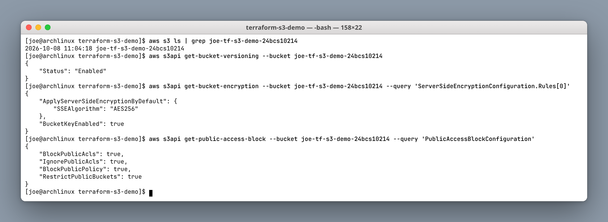

Independent confirmation matters: Terraform saying "Apply complete" means it got a success response, while the CLI queries AWS directly. All four hardening settings are confirmed in the real account — versioning `Enabled`, `AES256` with bucket keys, and all four public-access blocks `true`.

### Step 8: `terraform destroy`

```bash
terraform destroy
# Enter a value: yes
```

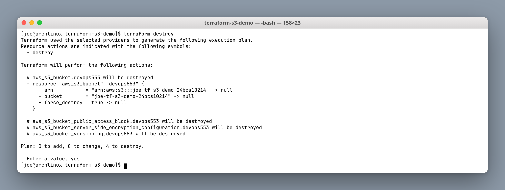

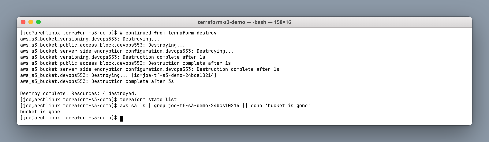

```text
Destroy complete! Resources: 4 destroyed.
```

Destruction runs the dependency graph **in reverse** — the three configuration resources go first, the bucket last. `terraform state list` is then empty and the bucket is gone from `aws s3 ls`.

`force_destroy = true` is what allows a non-empty bucket to be deleted. It is right for a teaching demo and dangerous in production, where the default refusal is a useful guard rail.

### Task 1 notes

- Terraform tracks resources by **state**, not by scanning the account. Delete a resource in the console and Terraform still thinks it exists until the next refresh.
- `terraform.tfstate` contains every attribute, including values AWS considers sensitive. It is `.gitignore`d here; in a team it belongs in a remote backend (S3 + DynamoDB locking) rather than on a laptop.
- Bucket names are **globally unique across all AWS accounts**, which is why the enrollment number is part of the name.

---

## Section 3: Task 2 — AWS services research

### IAM — Identity and Access Management

Controls *who* can do *what*. Users, groups, roles and policies. The model is deny-by-default: nothing is permitted until a policy allows it.

```hcl
resource "aws_iam_role" "app" {
  name               = "app-role"
  assume_role_policy = data.aws_iam_policy_document.assume.json
}
```

**Practice that matters:** applications should assume **roles**, not hold long-lived access keys. A role issues short-lived credentials that rotate automatically — an access key in a container image does not.

### EC2 — Elastic Compute Cloud

Virtual machines. An instance needs an AMI, an instance type, a subnet and a security group.

```hcl
resource "aws_instance" "web" {
  ami           = data.aws_ami.amazon_linux.id
  instance_type = "t3.micro"
  subnet_id     = aws_subnet.public.id
}
```

**Practice that matters:** look the AMI up with a `data` source rather than hardcoding an ID. AMI IDs differ per region and change whenever the image is patched, so a hardcoded ID is both non-portable and permanently out of date.

### S3 — Simple Storage Service

Object storage, as built in Task 1. Flat key-value storage, not a filesystem — "folders" are a prefix convention in the console.

**Practice that matters:** block public access, encrypt at rest, enable versioning, and use lifecycle rules to move old objects to cheaper storage classes. Nearly every publicised S3 data leak comes down to the first of those being left off.

### Key takeaways

| Service | Terraform resource | The one thing to get right |
|---|---|---|
| IAM | `aws_iam_role`, `aws_iam_policy` | Roles over long-lived keys; least privilege |
| EC2 | `aws_instance`, `aws_security_group` | AMI via data source; never open SSH to `0.0.0.0/0` |
| S3 | `aws_s3_bucket` + config resources | Block public access, encrypt, version |

---

## Command summary

| Command | Purpose |
|---|---|
| `terraform init` | Download providers, create lock file |
| `terraform fmt [-check]` | Canonical formatting (`-check` for CI) |
| `terraform validate` | Offline syntax and consistency check |
| `terraform plan` | Preview changes without applying |
| `terraform apply` | Make the changes |
| `terraform show` | Human-readable current state |
| `terraform output [-raw\|-json]` | Read output values |
| `terraform state list` | Resource addresses under management |
| `terraform destroy` | Tear everything down |

---

## Learnings

1. **`plan` before `apply`, every time.** The `N to add, N to change, N to destroy` line is the review.
2. **Dependencies are inferred from references.** Writing `aws_s3_bucket.x.id` is what creates the ordering; `depends_on` is for the rare implicit case.
3. **Commit the lock file, ignore the state file.** One guarantees reproducible providers, the other contains secrets.
4. **Verify independently.** "Apply complete" is Terraform's view; the AWS CLI is the account's view.
5. **State is the source of truth for Terraform** — out-of-band console changes cause drift.
6. **`force_destroy` is a demo convenience**, not a production setting.
