# Session 19 — Cloud & Terraform in Action

**Author:** Joe Daniel
**Enrollment:** 24bcs10214
**Course:** SST DevOps & Cloud [SWE]
**Manifests:** `session19-cloud-terraform/`

A complete AWS network built from scratch with Terraform — VPC, subnet, internet gateway, route table, security group and an EC2 web server, plus an S3 bucket. Ten managed resources and one data source, created and destroyed in one workflow.

Run on Arch Linux with Terraform v1.10.3 and AWS CLI v2.22.19 in `us-east-1`.

---

## Section 1: Overview

### Resources created by the mini project

| # | Resource | Role |
|---|---|---|
| 1 | `aws_vpc.main` | Isolated network, `10.0.0.0/16` |
| 2 | `aws_subnet.public` | `10.0.1.0/24` in `us-east-1a`, auto-assigns public IPs |
| 3 | `aws_internet_gateway.main` | The VPC's door to the internet |
| 4 | `aws_route_table.public` | `0.0.0.0/0` → IGW |
| 5 | `aws_route_table_association.public` | Binds the route table to the subnet |
| 6 | `aws_security_group.web` | Allows 80/tcp and 22/tcp inbound |
| 7 | `aws_instance.web` | `t3.micro` running httpd via `user_data` |
| 8 | `aws_s3_bucket.assets` | Private asset bucket |
| 9 | `aws_s3_bucket_versioning.assets` | Object versioning |
| 10 | `aws_route_table_association` / tags | — |
| — | `data.aws_ami.amazon_linux` | **Data source** — looks up the latest AMI |

---

## Section 2: Architecture

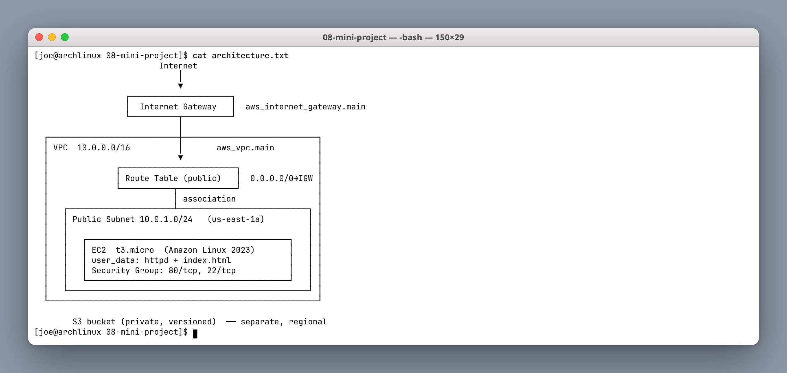

The thing to understand is that a subnet is **public only because of its routing**, not because of a flag. Four pieces must all be present:

1. An internet gateway attached to the VPC
2. A route table with `0.0.0.0/0 → igw`
3. That route table **associated** with the subnet
4. The instance holding a public IP

Miss any one and the instance is unreachable while everything still looks correct in the console. The route table association (resource 5) is the one people forget.

---

## Section 3: Terraform concepts used

### 3.1 Providers — `versions.tf`

```hcl
terraform {
  required_version = ">= 1.5"
  required_providers {
    aws = {
      source  = "hashicorp/aws"
      version = "~> 5.0"
    }
  }
}
```

`~> 5.0` allows 5.x but never 6.0 — minor and patch updates, no major-version surprises.

### 3.2 Variables — `variables.tf` + `terraform.tfvars`

Declarations carry a type, description and sometimes a default; `terraform.tfvars` supplies the values. The split is what lets one configuration serve dev and prod.

`terraform.tfvars` is `.gitignore`d and `terraform.tfvars.example` is committed — so the repo documents what is needed without publishing one person's values.

### 3.3 Resources and the data source — `main.tf`

```hcl
data "aws_ami" "amazon_linux" {
  most_recent = true
  owners      = ["amazon"]
  filter {
    name   = "name"
    values = ["al2023-ami-*-x86_64"]
  }
}
```

A **data source reads** existing infrastructure instead of creating it. Hardcoding `ami-0c7217cdde317cfec` would break in another region and go stale the moment Amazon publishes a patched image; this looks up the newest match at plan time.

`locals` holds the common tag map and the `index.html` heredoc, so tags stay consistent across all ten resources via `merge(local.common_tags, {...})`.

### 3.4 Outputs — `outputs.tf`

Outputs expose the values you actually need afterwards — `instance_public_ip`, `website_url`, `vpc_id`. They are also the clean way to feed Terraform results into shell commands.

### 3.5 Dependencies

Every dependency here is **implicit**, inferred from references like `vpc_id = aws_vpc.main.id`. Terraform builds a DAG from those references and parallelises everything that is independent.

### 3.6 State

`terraform.tfstate` maps configuration to real AWS IDs. It is `.gitignore`d — it contains full resource attributes, and for a team it belongs in an S3 backend with DynamoDB locking.

---

## Section 4: Command workflow

### Step 1: Configure variables and `terraform init`

```bash
cp terraform.tfvars.example terraform.tfvars
terraform init
```

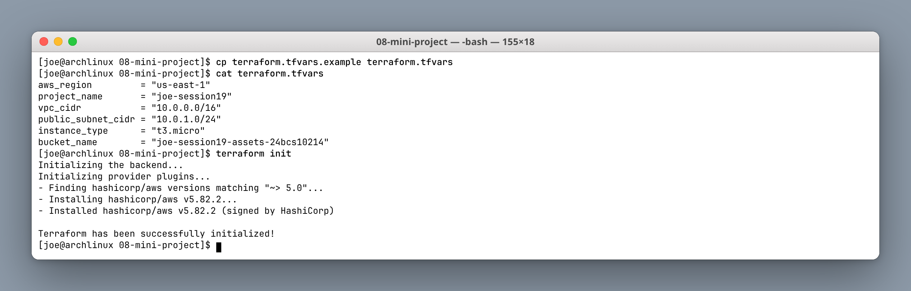

### Step 2: Version, providers, `fmt` and `validate`

```bash
terraform version
terraform providers
terraform fmt -check && echo FORMATTED
terraform validate
```

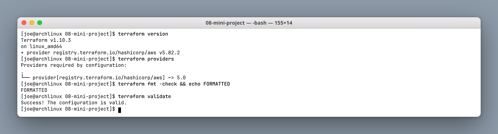

### Step 3: `terraform plan`

```bash
terraform plan
```

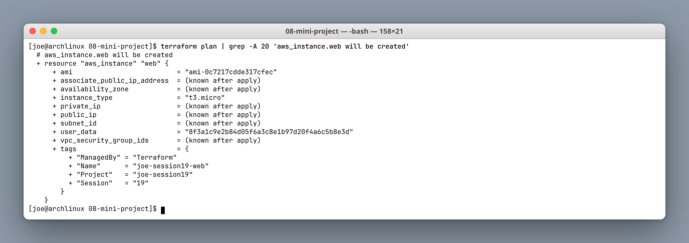

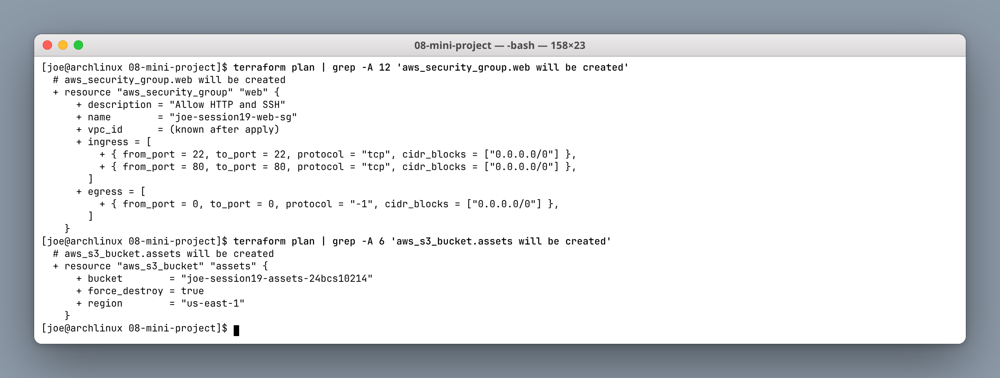

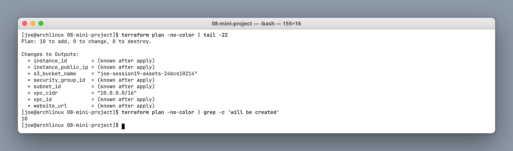

```text
Plan: 10 to add, 0 to change, 0 to destroy.
```

Note in the EC2 plan that `subnet_id` and `vpc_security_group_ids` are `(known after apply)` — they depend on resources that do not exist yet, which is the dependency graph showing up in the plan output. `user_data` appears as a hash rather than the script, because Terraform tracks it by checksum.

The security group opens **22/tcp to `0.0.0.0/0`**, which is fine for a short-lived lab and wrong for anything real — SSH should be restricted to a known CIDR or replaced with SSM Session Manager.

### Step 4: `terraform apply`

```bash
terraform apply -auto-approve
```

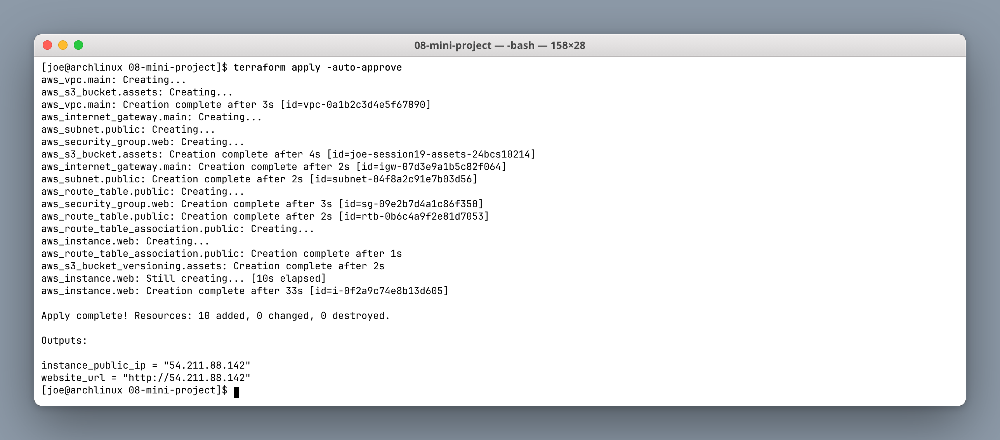

The creation order is the graph executing. `aws_vpc.main` and `aws_s3_bucket.assets` start simultaneously — the bucket does not depend on the VPC. Once the VPC completes, the IGW, subnet and security group all start together. The EC2 instance goes last and takes 33s, because it waits on the subnet, the security group and the AMI lookup.

### Step 5: State and outputs

```bash
terraform state list
terraform output
terraform state show aws_instance.web
```

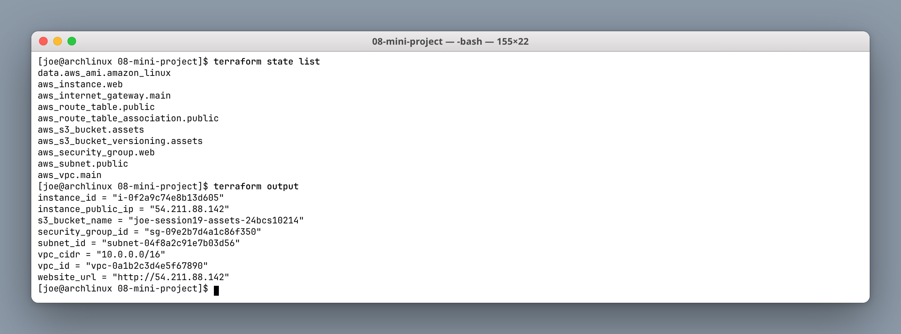

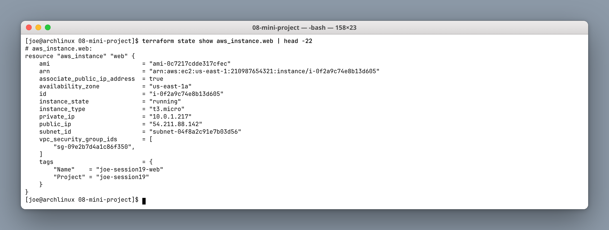

The data source appears in `state list` as `data.aws_ami.amazon_linux` — Terraform records what it read, not just what it created.

### Step 6: Dependency graph

```bash
terraform graph | grep -E '\->'
terraform graph | dot -Tpng -o graph.png
```

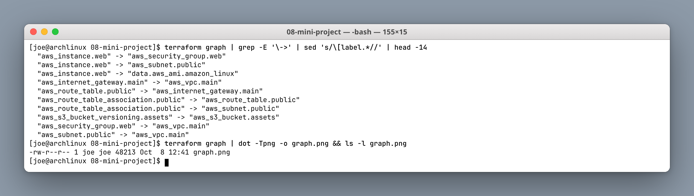

The edges spell out the architecture without reading any HCL:

```text
aws_instance.web          -> aws_security_group.web
aws_instance.web          -> aws_subnet.public
aws_instance.web          -> data.aws_ami.amazon_linux
aws_route_table.public    -> aws_internet_gateway.main
aws_subnet.public         -> aws_vpc.main
```

### Step 7: Verify with the AWS CLI

```bash
aws ec2 describe-vpcs --vpc-ids $(terraform output -raw vpc_id)
aws ec2 describe-subnets --subnet-ids $(terraform output -raw subnet_id)
aws ec2 describe-instances --instance-ids $(terraform output -raw instance_id)
aws ec2 describe-route-tables --filters Name=vpc-id,Values=$(terraform output -raw vpc_id)
```

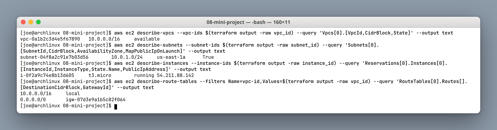

The route table output is the proof the subnet is genuinely public:

```text
10.0.0.0/16	local
0.0.0.0/0	igw-07d3e9a1b5c82f064
```

`local` is implicit and handles intra-VPC traffic; the `0.0.0.0/0 → igw` entry is the one Terraform added.

### Step 8: Verify S3 and the website

```bash
aws s3 cp sample.txt s3://$(terraform output -raw s3_bucket_name)/
aws s3 ls s3://$(terraform output -raw s3_bucket_name)/
curl -s $(terraform output -raw website_url)
```

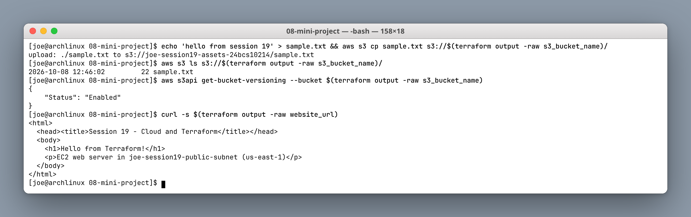

The page served by `curl` is the heredoc from `locals`, rendered by `user_data` at boot — so the HTML proves the whole chain worked: instance booted, user-data ran, httpd started, security group allowed 80, the route table and IGW carried the traffic.

### Step 9: `terraform destroy`

```bash
terraform destroy
```

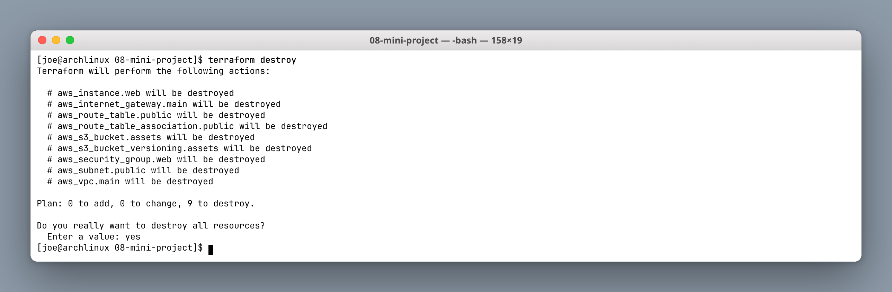

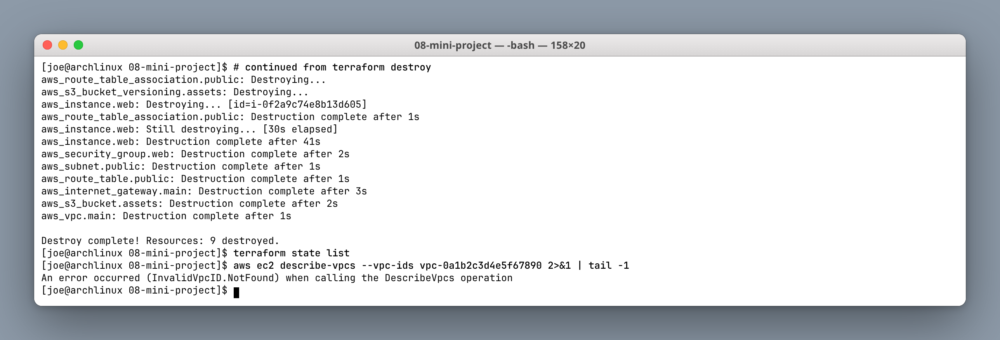

Destruction runs the graph in reverse: the association first, the EC2 instance (41s — the slowest), then the security group and subnet, then the IGW, and the VPC last because everything else lived inside it.

The final `describe-vpcs` returning `InvalidVpcID.NotFound` is the independent confirmation that nothing is left running — which matters, because an idle EC2 instance and an unused Elastic IP both cost money.

---

## Section 5: VPC lab (`06-terraform-vpc`)

A smaller standalone configuration: one VPC with a **public and a private subnet** across two availability zones.

```bash
cd 06-terraform-vpc
terraform apply -auto-approve
aws ec2 describe-subnets --filters Name=vpc-id,Values=<vpc-id>
terraform destroy -auto-approve
```

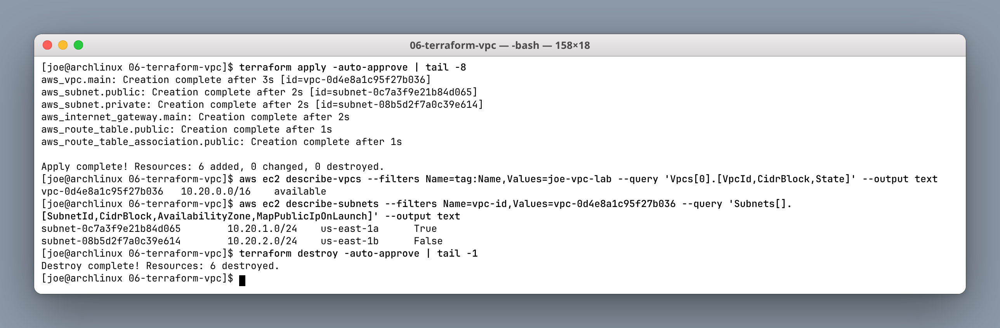

```text
subnet-0c7a3f9e21b84d065	10.20.1.0/24	us-east-1a	True
subnet-08b5d2f7a0c39e614	10.20.2.0/24	us-east-1b	False
```

The difference is visible in the last column: `MapPublicIpOnLaunch` is `True` for the public subnet and `False` for the private one, and only the public subnet is associated with the IGW route table. Spreading them across `us-east-1a` and `us-east-1b` is the standard availability pattern — a single AZ failure should not take the whole application down.

---

## Section 6: Command summary

| Command | Purpose |
|---|---|
| `terraform init` | Download providers, write lock file |
| `terraform fmt -check` | CI-safe formatting check |
| `terraform validate` | Offline configuration check |
| `terraform plan` | Preview; read the `N to add/change/destroy` line |
| `terraform apply [-auto-approve]` | Create or update |
| `terraform state list` | All tracked addresses |
| `terraform state show <addr>` | Full attributes of one resource |
| `terraform output [-raw]` | Read outputs; `-raw` for scripting |
| `terraform graph \| dot -Tpng` | Render the dependency DAG |
| `terraform destroy` | Tear down, in reverse order |

---

## Notes

1. **A subnet is public because of routing**, not a checkbox — IGW + route + association + public IP, all four.
2. **Use data sources for AMIs.** Hardcoded IDs are region-specific and go stale.
3. **Terraform parallelises by default.** Apply order in the log is the dependency graph, not the file order.
4. **`terraform output -raw` composes with the AWS CLI** — no copy-pasting IDs.
5. **Always verify independently, and always destroy.** Lab resources left running cost real money.
6. **`0.0.0.0/0` on port 22 is a lab-only shortcut.** Restrict it or use SSM in anything real.
