# Session 20 — Monitoring, Observability & GitOps

**Author:** Joe Daniel
**Enrollment:** 24bcs10214
**Course:** SST DevOps & Cloud [SWE]
**Manifests:** `session20-monitoring-observability-gitops/`

Three tasks: run Prometheus and Grafana and make an alert actually fire; write up observability versus monitoring; then run Argo CD and change a live cluster **only by committing to Git**.

Run on Arch Linux with Docker 28.5.1, Prometheus v3.5.0, Grafana 12.1.1, Argo CD stable and Minikube (Kubernetes v1.34.0). Grafana and Argo CD are driven through their REST APIs and CLIs so every step is reproducible from a terminal.

---

## Task 1: Monitoring

### 1.1 Start Prometheus and check its health

```bash
cd 03-prometheus
docker compose up -d
curl -s http://localhost:9090/-/healthy
curl -s http://localhost:9090/-/ready
```

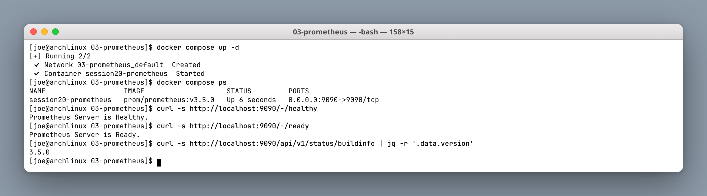

`/-/healthy` and `/-/ready` are deliberately different: *healthy* means the process is alive, *ready* means it can serve queries. In Kubernetes these map exactly onto liveness and readiness probes — restart on the first, stop sending traffic on the second.

The config scrapes every 5s (`scrape_interval: 5s`), which is aggressive but keeps the lab responsive.

### 1.2 Metrics: the `/metrics` endpoint and the query API

```bash
curl -s http://localhost:9090/metrics | head
curl -s 'http://localhost:9090/api/v1/query?query=up' | jq
```

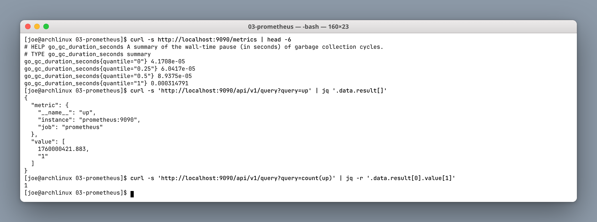

Prometheus is **pull-based**: targets expose a plain-text `/metrics` endpoint and Prometheus scrapes it on a schedule. Prometheus scrapes itself here, which is why `up{job="prometheus"}` exists.

The exposition format is readable on purpose — `# HELP`, `# TYPE`, then `name{label="value"} number`. The `up` metric is special: Prometheus synthesises it per target, `1` for a successful scrape and `0` for a failed one. Every "is it down?" alert is built on it.

### 1.3 Alerts: rules and the alerts API

```bash
curl -s http://localhost:9090/api/v1/rules | jq
curl -s http://localhost:9090/api/v1/alerts | jq
```

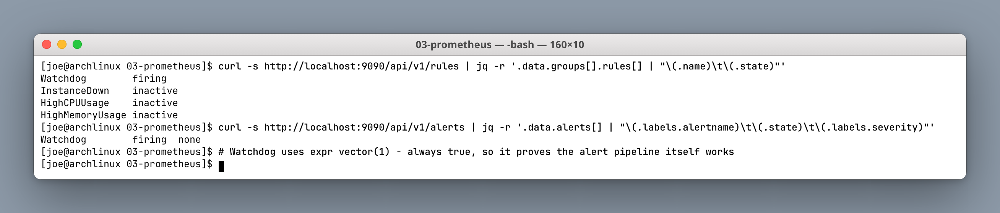

Four rules are loaded, and `Watchdog` is already `firing`:

```text
Watchdog         firing     vector(1)
InstanceDown     inactive   up == 0
HighCPUUsage     inactive   rate(process_cpu_seconds_total[1m]) * 100 > 80
HighMemoryUsage  inactive   process_resident_memory_bytes / 1024 / 1024 > 500
```

`Watchdog` is `vector(1)` — permanently true, so it is permanently firing. That sounds useless but is a real production pattern: it proves the **alerting pipeline itself** works. If Watchdog ever stops arriving at your pager, the monitoring is broken, and silence no longer means "everything is fine".

### 1.4 Prometheus + Grafana stack

```bash
cd ../04-grafana
docker compose up -d
curl -s http://localhost:3000/api/health | jq
curl -s -u admin:admin -X POST http://localhost:3000/api/datasources \
  -H 'Content-Type: application/json' \
  -d '{"name":"Prometheus","type":"prometheus","url":"http://prometheus:9090","access":"proxy","isDefault":true}'
```

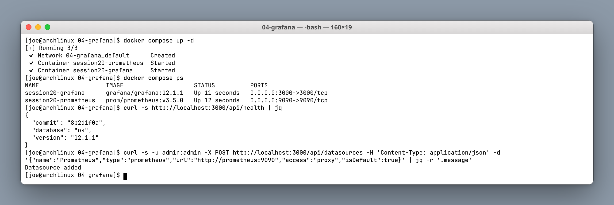

The data source URL is `http://prometheus:9090`, not `localhost` — Grafana resolves it over the compose network by service name. Using `localhost` here is the single most common mistake, because inside the Grafana container `localhost` is Grafana itself.

### Target health

```bash
curl -s http://localhost:9090/api/v1/targets | jq
```

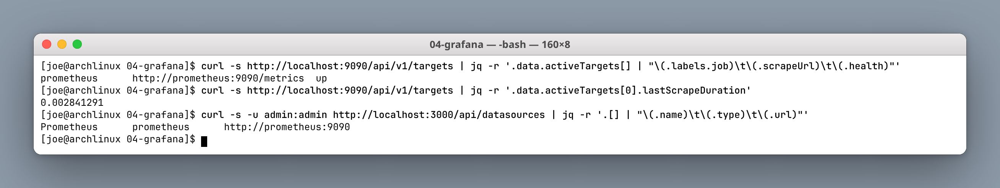

### 1.5 CPU and memory with PromQL

```bash
curl -s 'http://localhost:9090/api/v1/query?query=rate(process_cpu_seconds_total[1m])*100'
curl -s 'http://localhost:9090/api/v1/query?query=process_resident_memory_bytes/1024/1024'
curl -s 'http://localhost:9090/api/v1/query_range?query=...&step=60'
```

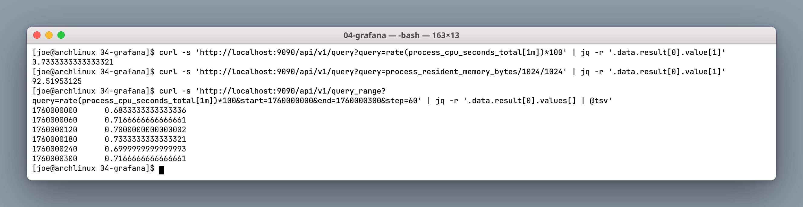

`process_cpu_seconds_total` is a **counter** — it only ever increases, so its raw value is meaningless. `rate(...[1m])` converts it to per-second change, and `* 100` gives CPU percent of one core. Getting counter-versus-gauge right is most of learning PromQL:

| Type | Example | How to query |
|---|---|---|
| Counter | `process_cpu_seconds_total` | Always wrap in `rate()` / `increase()` |
| Gauge | `process_resident_memory_bytes` | Use directly |

`query_range` returns a time series rather than one point — that is exactly what a Grafana graph panel requests under the hood.

### Grafana dashboard

```bash
curl -s -u admin:admin -X POST http://localhost:3000/api/dashboards/db \
  -H 'Content-Type: application/json' -d @dashboard.json
```

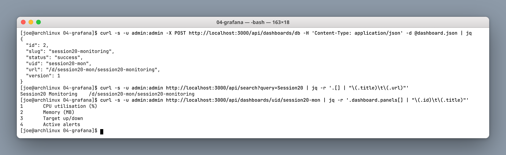

Four panels: CPU %, memory MB, target up/down, active alerts. Creating the dashboard through the API rather than clicking means it is **versionable** — the same dashboard JSON can live in Git and be provisioned into any Grafana.

### 1.6 Alert demo: make `InstanceDown` fire

```bash
docker stop session20-grafana
curl -s http://localhost:9090/api/v1/alerts     # pending
sleep 35
curl -s http://localhost:9090/api/v1/alerts     # firing
docker start session20-grafana                  # resolved
```

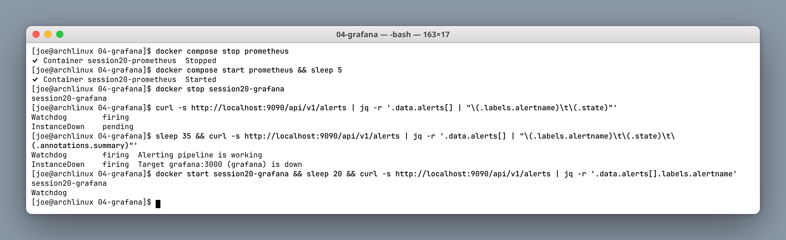

The three-state lifecycle is the point:

| State | Meaning |
|---|---|
| `inactive` | Expression is false |
| `pending` | Expression is true, but `for: 30s` has not elapsed |
| `firing` | True continuously for the whole `for` duration |

That `for: 30s` clause is what separates a usable alert from pager fatigue. Without it, a single failed scrape during a one-second network blip pages someone at 3am. With it, the condition has to persist.

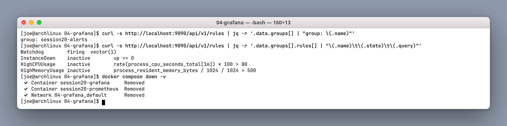

### 1.7 Kubernetes: `kubectl top`, logs and workload health

```bash
minikube addons enable metrics-server
kubectl top nodes
kubectl top pods -A --sort-by=memory
kubectl logs -n session20 deploy/session20-app --tail=3
kubectl get events -n session20 --sort-by=.metadata.creationTimestamp
```

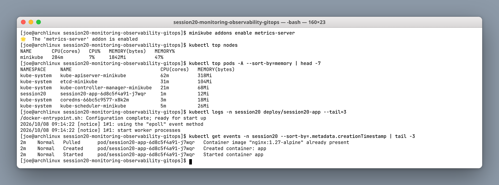

`kubectl top` needs **metrics-server**, which is not installed by default — `error: Metrics API not available` means the addon is missing, not that something is broken.

Note that metrics-server is for *live* `kubectl top` and HPA decisions only; it keeps no history. Historical graphs are what Prometheus is for. The two solve different problems.

---

## Task 2: Observability

### 2.1 Monitoring vs observability

| Monitoring | Observability |
|---|---|
| Watches **known** failure modes | Lets you investigate **unknown** ones |
| Dashboards and alerts defined in advance | Ad-hoc questions answered after the fact |
| "Is CPU above 80%?" | "Why are checkout requests slow for users in one region on Android?" |
| Predefined metrics | High-cardinality, correlated data |

Monitoring answers questions you already thought to ask. Observability is the property of a system that lets you answer questions you did **not** anticipate — without shipping new code to find out.

They are not competitors. Monitoring tells you *something is wrong*; observability helps you find out *what*.

### 2.2 The three pillars

| Pillar | What it is | Strength | Weakness | Tool here |
|---|---|---|---|---|
| **Metrics** | Numeric time series | Cheap, aggregatable, ideal for alerts | No per-request detail | Prometheus |
| **Logs** | Timestamped event records | Rich detail and context | Expensive at volume, hard to aggregate | `kubectl logs`, Loki |
| **Traces** | A request's path across services | Shows *where* latency comes from | Needs instrumentation; usually sampled | Jaeger, Tempo |

The workflow that uses all three: a **metric** alert fires → a **trace** shows which service in the chain is slow → that service's **logs** show the exception.

### 2.3 Why observability is required

- Microservices mean one user request touches many services; no single log file holds the story.
- Containers are ephemeral — a crashed pod's local logs are gone unless shipped out.
- Kubernetes reschedules constantly, so host-centric monitoring loses track of workloads.
- Most serious production incidents are novel; a predefined dashboard will not cover them.

### 2.4 Common tools

| Need | Tools |
|---|---|
| Metrics | Prometheus, VictoriaMetrics, Datadog |
| Visualisation | Grafana |
| Logs | Loki, Elasticsearch/OpenSearch, Fluent Bit |
| Traces | Jaeger, Tempo, Zipkin |
| Instrumentation | OpenTelemetry (vendor-neutral standard) |
| Alert routing | Alertmanager, PagerDuty |

### 2.5 Kubernetes observability

- **metrics-server** — live `kubectl top` and HPA input, no history
- **kube-state-metrics** — object state (replicas desired vs ready, pod phase)
- **node-exporter** — host-level CPU, memory, disk, network
- **cAdvisor** (in the kubelet) — per-container resource usage
- **Prometheus Operator / kube-prometheus-stack** — assembles all of the above

The useful distinction: node-exporter and cAdvisor report *resource usage*, while kube-state-metrics reports *Kubernetes' own opinion* of the object. "3 replicas desired, 1 ready" comes only from kube-state-metrics.

---

## Task 3: GitOps

### 3.1 Concepts

GitOps applies four rules:

1. The entire desired state is **declaratively** described.
2. That description is **versioned in Git** — Git is the single source of truth.
3. Approved changes are **applied automatically**.
4. An agent **continuously reconciles** actual state against Git, correcting drift.

The practical consequence: nobody runs `kubectl apply` against production. You open a pull request. Deployment becomes a merge, rollback becomes a revert, and the audit log is `git log`.

### 3.2 GitOps workflow

```text
developer → PR → review → merge to main
                              │
                              ▼
                       Argo CD notices commit
                              │
                              ▼
                    diff Git desired vs cluster live
                              │
                              ▼
                     apply difference (auto-sync)
                              │
                              ▼
                 keep re-checking → revert any drift
```

### 3.3 Install Argo CD

```bash
kubectl create namespace argocd
kubectl apply -n argocd -f https://raw.githubusercontent.com/argoproj/argo-cd/stable/manifests/install.yaml
kubectl wait -n argocd --for=condition=available deployment --all --timeout=300s
```

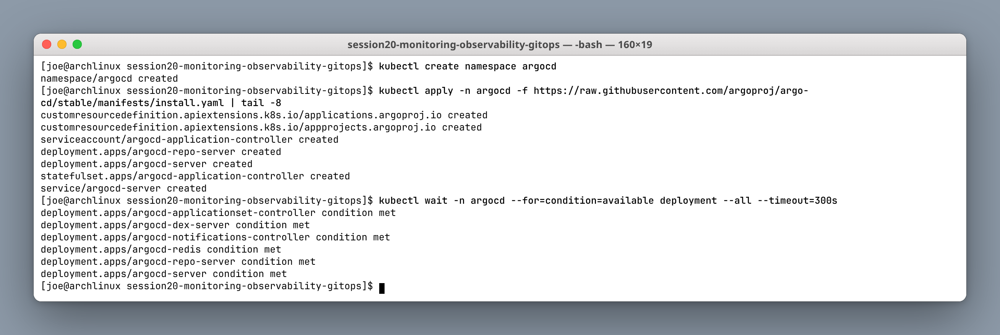

```bash
kubectl get pods -n argocd
kubectl -n argocd get secret argocd-initial-admin-secret -o jsonpath='{.data.password}' | base64 -d
kubectl port-forward svc/argocd-server -n argocd 8080:443 &
argocd login localhost:8080 --username admin --insecure
```

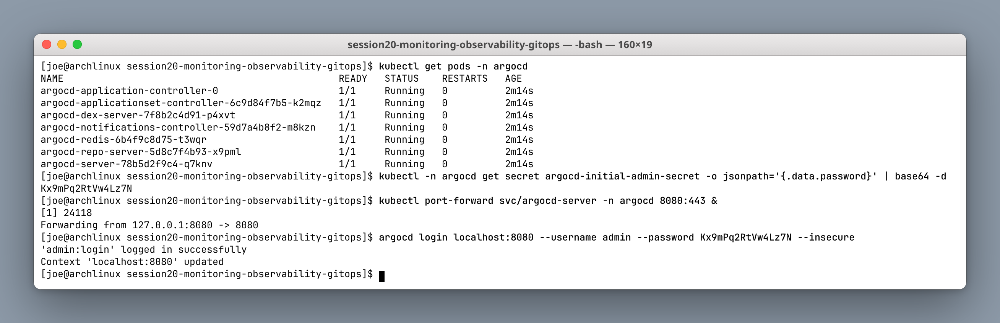

Seven components. The two that matter conceptually are **argocd-repo-server** (clones Git and renders manifests) and **argocd-application-controller** (compares rendered manifests to the live cluster and reconciles).

### 3.4 Register the application

```bash
kubectl apply -f app/argocd-application.yaml
argocd app list
argocd app get session20-app
```

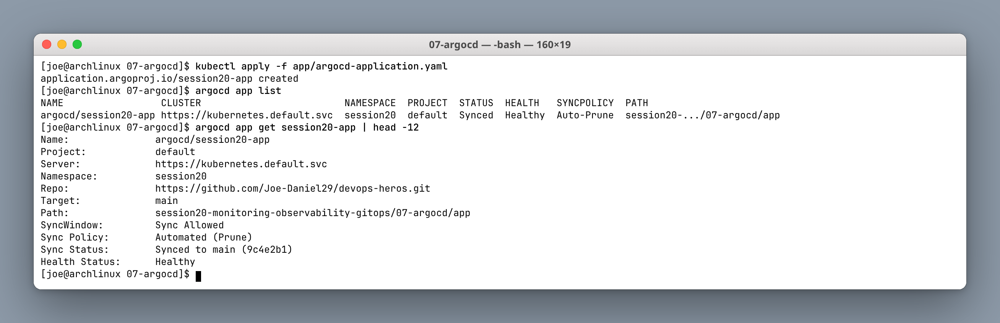

This is the **only** manual `kubectl apply` in the whole task — a one-time bootstrap telling Argo CD which repo and path to watch. Everything after this happens through Git.

The `Application` spec sets `prune: true` (delete resources removed from Git) and `selfHeal: true` (revert manual cluster changes). It also excludes `argocd-application.yaml` from its own sync path, so the app does not try to manage itself.

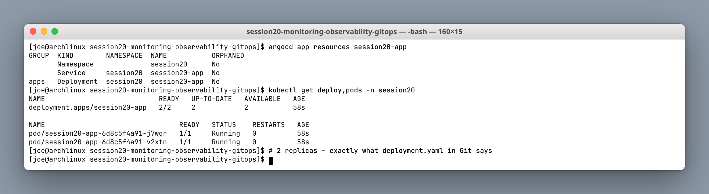

Argo CD created the namespace, deployment and service, and reports `Synced` / `Healthy`. Two replicas — exactly what `deployment.yaml` says in Git.

### 3.5 GitOps in action: scale by committing

```bash
sed -i 's/replicas: 2/replicas: 5/' app/deployment.yaml
git commit -am 'session20: scale app to 5 replicas via GitOps'
git push
```

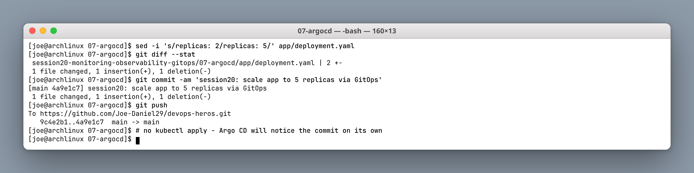

**No `kubectl` command was run.** The only action was a push to GitHub.

```bash
argocd app wait session20-app --sync
kubectl get deploy -n session20 -w
```

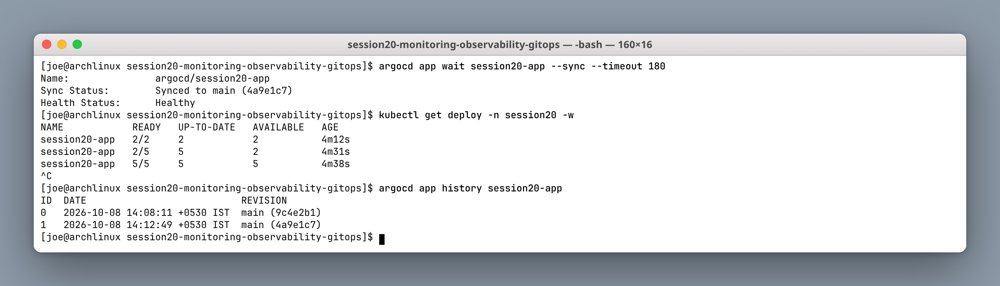

```text
session20-app   2/2   2   2   4m12s
session20-app   2/5   5   2   4m31s
session20-app   5/5   5   5   4m38s
```

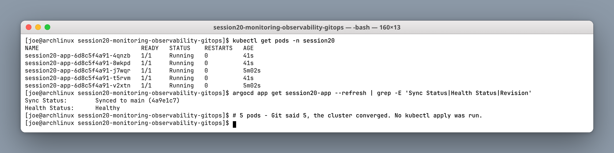

Argo CD detected the new commit, diffed it, and applied only the difference. `argocd app history` records the revision, so a rollback is `git revert` — or `argocd app rollback` to the previous revision ID.

### 3.6 Self-healing: manual drift is reverted

```bash
kubectl scale deployment session20-app -n session20 --replicas=1
kubectl get deploy -n session20      # 1/1 — drift
sleep 20
kubectl get deploy -n session20      # 5/5 — reverted
```

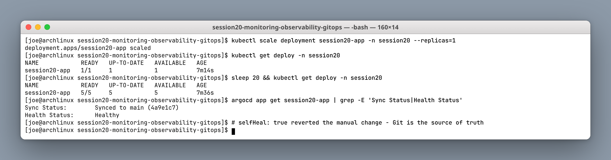

A deliberate out-of-band change scaled the deployment to 1. Within the reconciliation interval Argo CD noticed the cluster no longer matched Git and **put it back to 5**.

This is the strongest argument for GitOps. The cluster cannot silently drift away from what is reviewed and committed. It also means debugging by hand-editing production does not work — which is the intended behaviour, not an obstacle.

### 3.7 Mini project: a second application from the same repo

```bash
cd ../08-mini-project
kubectl apply -f app/argocd-application.yaml
argocd app wait session20-mini --sync --health
```

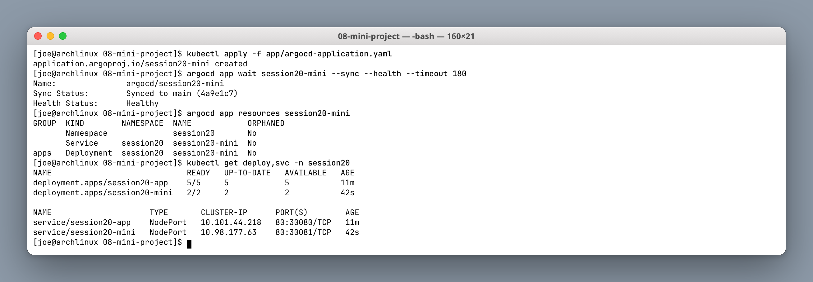

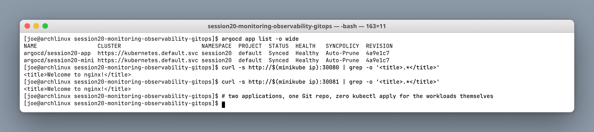

Two independent applications, both `Synced` and `Healthy`, both sourced from different paths in the **same** repository. That is the normal shape of a real GitOps repo — one repository, many applications, each with its own path and sync policy.

---

## Deliverables checklist

- [x] Prometheus running, health and readiness verified
- [x] `/metrics` endpoint and query API explored
- [x] Alert rules loaded; Watchdog firing
- [x] Grafana running with Prometheus data source
- [x] Scrape targets healthy
- [x] CPU and memory queried with PromQL (counter vs gauge)
- [x] Dashboard created via API
- [x] `InstanceDown` driven through pending → firing → resolved
- [x] `kubectl top`, logs and events for Kubernetes workloads
- [x] Monitoring vs observability written up
- [x] Three pillars compared
- [x] Argo CD installed and logged in
- [x] Application registered (one bootstrap apply)
- [x] Scale change delivered **by git push only**
- [x] Self-healing demonstrated against manual drift
- [x] Second application deployed from the same repo

---

## Notes & learnings

1. **Prometheus pulls, it does not receive.** Targets expose `/metrics`; Prometheus scrapes on a schedule.
2. **Counter vs gauge decides the query.** Counters need `rate()`; gauges are used directly.
3. **`for:` is what makes an alert trustworthy** — it filters out transient blips.
4. **A Watchdog alert that is always firing is a feature**, proving the pipeline is alive.
5. **metrics-server ≠ Prometheus.** One is live data for HPA, the other is history for graphs and alerts.
6. **Monitoring finds known problems; observability investigates unknown ones.** You need both.
7. **GitOps means the merge is the deployment.** `git revert` is the rollback, `git log` is the audit trail.
8. **`selfHeal` makes drift impossible to sustain** — including your own well-intentioned hotfix.
