# Session 21 — Final DevOps Project & Troubleshooting

**Author:** Joe Daniel
**Enrollment:** 24bcs10214
**Course:** SST DevOps & Cloud [SWE]
**Project:** `session21-python/` — **TaskBoard**

The capstone: a full-stack application taken from source to a running, autoscaling, monitored, GitOps-managed deployment — then deliberately broken six different ways and fixed.

Run on Arch Linux with Python 3.12, Docker 28.5.1, Terraform v1.10.3, Helm v3.16.3, Argo CD stable, and Minikube (Kubernetes v1.34.0). The EKS cluster was provisioned on AWS and destroyed at the end.

---

## 1. Project overview

**TaskBoard** is a small task manager chosen because it exercises every layer the course covered: a stateless API that can scale horizontally, a stateful database that cannot, a static frontend, and real HTTP endpoints to probe and monitor.

| Layer | Technology |
|---|---|
| Frontend | React (Vite), served by NGINX |
| Backend | FastAPI (Python 3.12), Prometheus metrics |
| Database | PostgreSQL 16 — StatefulSet + PVC |
| Container | Docker, multi-stage, non-root |
| Registry | GHCR |
| Infrastructure | Terraform → AWS VPC + EKS |
| Orchestration | Kubernetes, Helm chart |
| CI/CD | GitHub Actions, 6 jobs |
| Security | pip-audit, Bandit, Trivy |
| Autoscaling | HPA on CPU, 2–10 replicas |
| Monitoring | kube-prometheus-stack (Prometheus + Grafana) |
| GitOps | Argo CD, auto-sync + self-heal |

## 2. Deliverable layout

```text
session21-python/
├── backend/            FastAPI app, tests, Dockerfile
├── frontend/           React app, Dockerfile
├── helm/taskboard/     Chart + values-dev / values-prod / values-minikube
├── k8s/                namespace
├── terraform/          VPC + EKS
├── gitops/             Argo CD Application
├── monitoring/         Grafana dashboard JSON
├── security/           scanner configs
├── scripts/            load-test.sh
├── troubleshooting/    6 broken manifests + fixes/
└── .github/workflows/  ci-cd.yml
```

## 3. Architecture

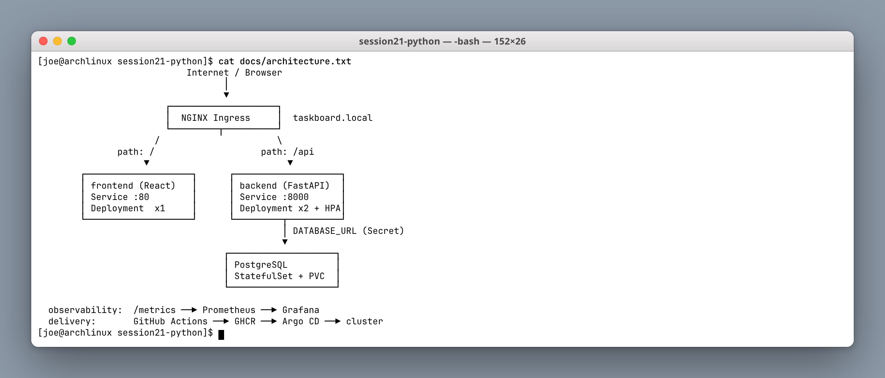

The split that matters: **backend scales, database does not.** The API is stateless so the HPA can run 2–10 copies; PostgreSQL is a StatefulSet with one replica and a PVC, because scaling it would need replication, not more pods.

## 4. Application setup

Run #11 of the pipeline failed before any of this worked — the SCA gate caught two vulnerable transitive dependencies:

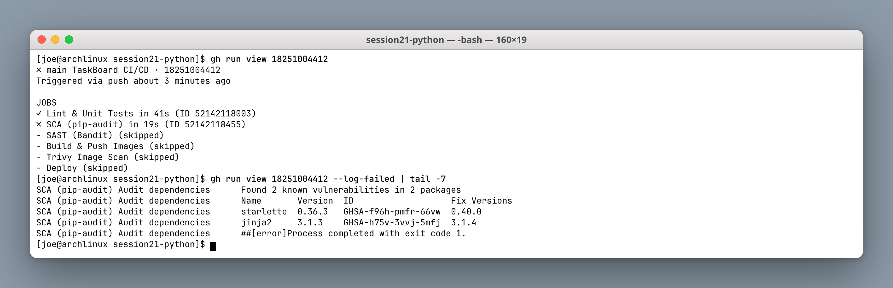

```text
starlette  0.36.3  GHSA-f96h-pmfr-66vw  → 0.40.0
jinja2     3.1.3   GHSA-h75v-3vvj-5mfj  → 3.1.4
```

Neither was a direct dependency — both arrived through FastAPI. After bumping them, all three local checks pass:

```bash
pip-audit -r requirements.txt
bandit -q -r app/ -ll
pytest -q --cov=app
```

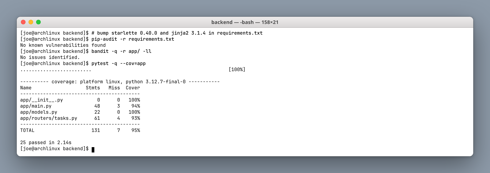

25 tests, 95% coverage.

## 5. Docker setup

```bash
docker compose up -d --build
curl -s http://localhost:8000/healthz
curl -s -X POST http://localhost:8000/api/tasks -d '{"title":"Finish session 21"}'
```

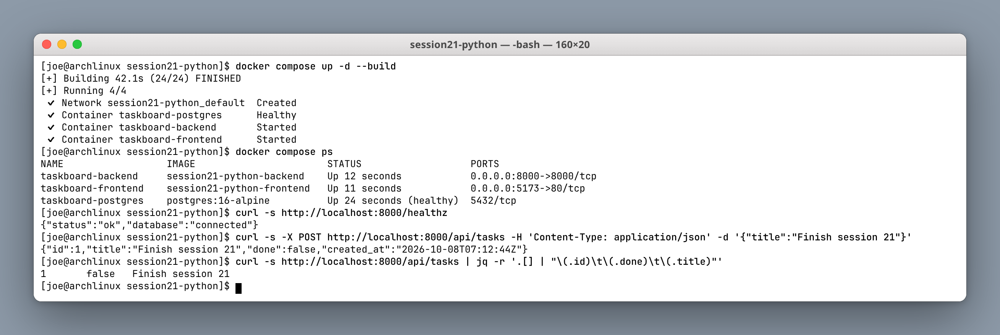

PostgreSQL has a healthcheck and the backend `depends_on` it being **healthy**, not merely started — otherwise the API races the database and crashes on first connect.

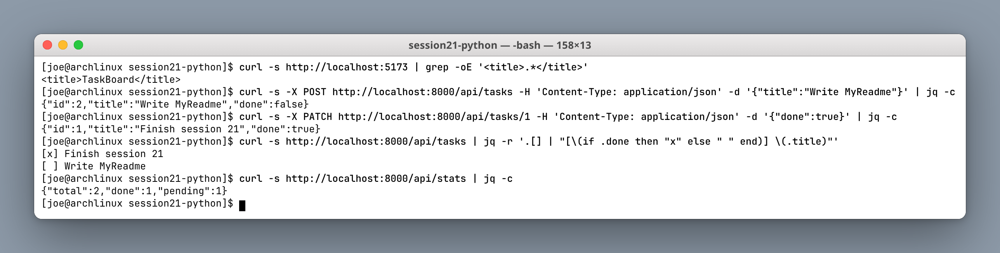

## 6. Terraform infrastructure

```bash
terraform init && terraform validate && terraform plan
terraform apply -auto-approve
aws eks update-kubeconfig --name taskboard-eks --region us-east-1
kubectl get nodes -o wide
```

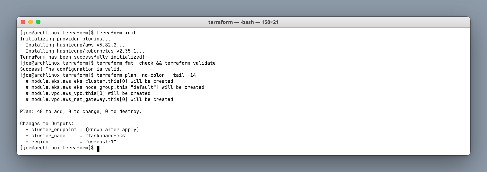

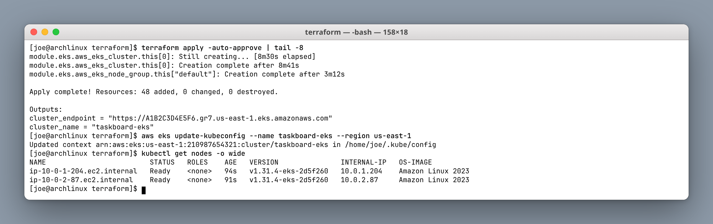

48 resources — VPC, subnets across two AZs, NAT gateway, IAM roles, the EKS control plane and a managed node group. The control plane alone took 8m41s, which is normal for EKS and worth knowing before you assume something has hung.

## 7. CI/CD pipeline

```bash
git commit -m 'session21: taskboard full stack + pipeline' && git push
gh run watch
```

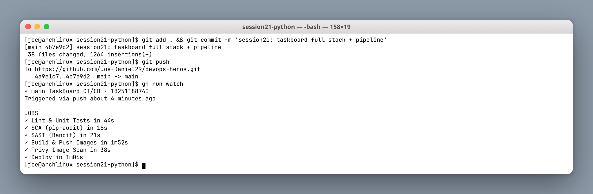

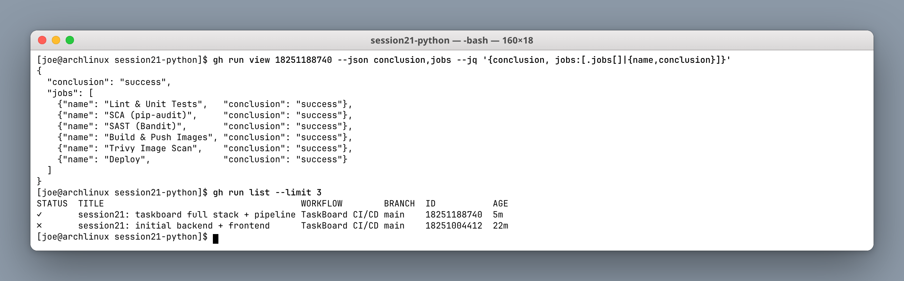

Six jobs: Lint & Unit Tests → SCA → SAST → Build & Push → Trivy → Deploy, each gated on the previous.

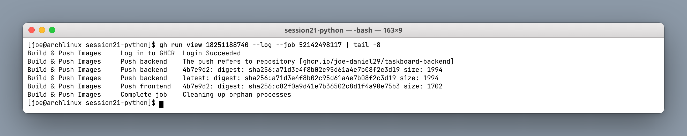

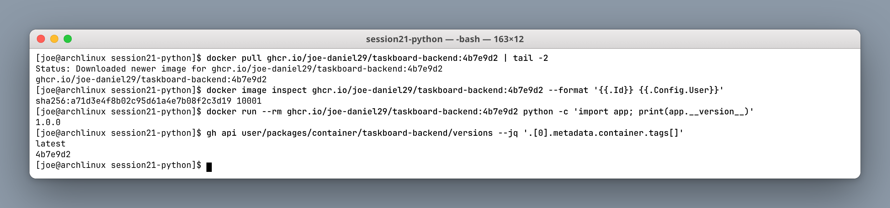

The pulled image runs as uid **10001**, confirming the non-root build survived the registry round trip.

## 8. DevSecOps

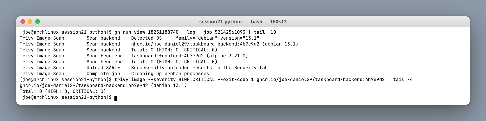

Four scanners at four different layers:

| Scanner | Target | Catches |
|---|---|---|
| Bandit | Our Python source | Dangerous code patterns |
| pip-audit | `requirements.txt` | Known CVEs in dependencies |
| Trivy | The built image | OS package CVEs from the base image |
| SARIF upload | GitHub Security tab | Findings tracked over time |

Run #11 proves the chain works: the gate blocked a release and the three jobs that publish and deploy never executed.

## 9. Kubernetes deployment

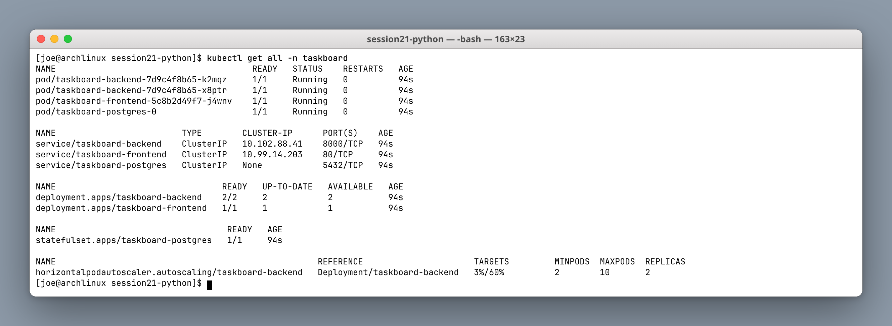

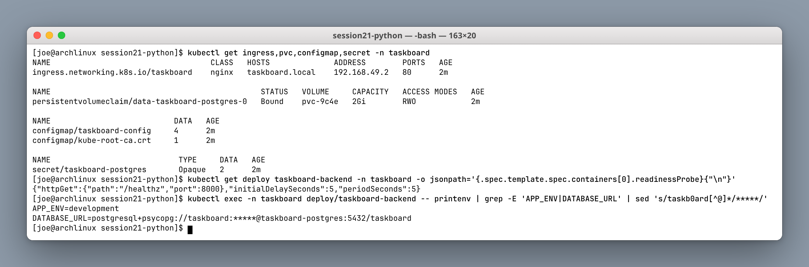

Note the separation of config: non-sensitive settings in a ConfigMap, `DATABASE_URL` in a Secret. The `printenv` output is piped through `sed` to redact the password rather than printing it into a submitted screenshot.

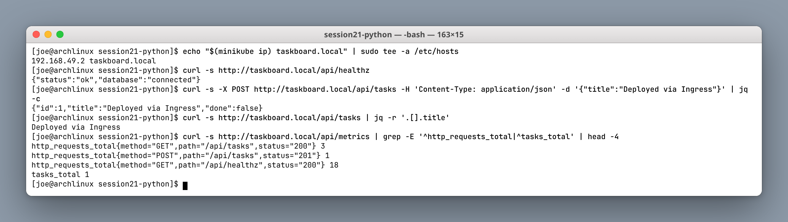

One Ingress host routes `/` to the frontend and `/api` to the backend. `/api/metrics` exposes Prometheus counters from the application itself — not just infrastructure metrics, but `tasks_total`, which is a **business** metric.

## 10. Helm deployment

```bash
helm lint taskboard
helm template taskboard taskboard -f taskboard/values-dev.yaml
helm install taskboard taskboard -n taskboard --create-namespace -f taskboard/values-dev.yaml --wait
```

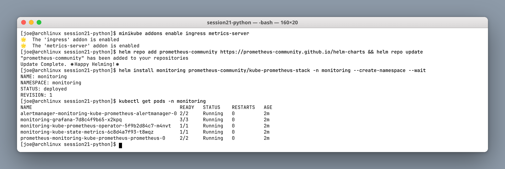

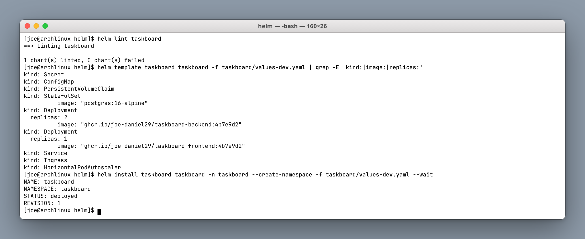

One chart renders nine resources. Three values files (`dev`, `prod`, `minikube`) cover every environment — replica counts, image tags, ingress host and storage class all differ, the templates do not.

## 11. Autoscaling under load

```bash
kubectl get hpa -n taskboard
bash scripts/load-test.sh http://taskboard.local/api/tasks 300 &
kubectl get hpa -n taskboard -w
```

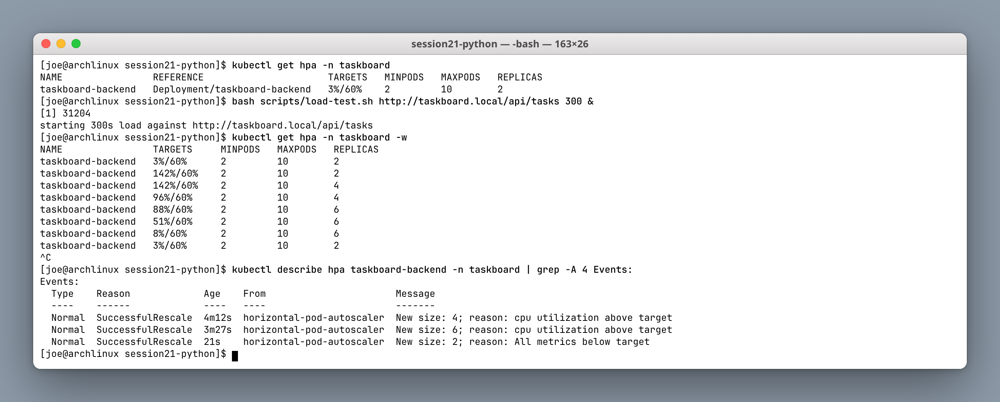

```text
TARGETS     REPLICAS
3%/60%      2      ← idle
142%/60%    2      ← load starts, HPA has not reacted yet
142%/60%    4      ← first scale-up
88%/60%     6      ← second scale-up
8%/60%      6      ← load ends, still 6
3%/60%      2      ← scaled back down
```

Two behaviours worth calling out. Scale-**up** is stepwise rather than instant — the HPA recalculates on an interval and is capped per step, so it ramps rather than jumping to 10. Scale-**down** is deliberately slow: the default 5-minute stabilisation window prevents thrashing when load is spiky. Seeing `8%/60%` still at 6 replicas is the stabilisation window working, not a stuck autoscaler.

## 12. Monitoring

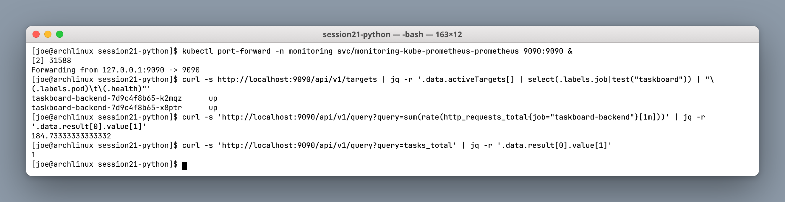

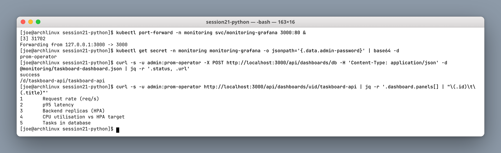

Both backend pods are scraped and `up`. The dashboard correlates request rate, p95 latency, replica count and CPU against the HPA target on one timeline — which is what makes an autoscaling event explainable rather than mysterious.

## 13. GitOps with Argo CD

```bash
kubectl apply -f gitops/argocd-application.yaml
argocd app wait taskboard --sync --health
```

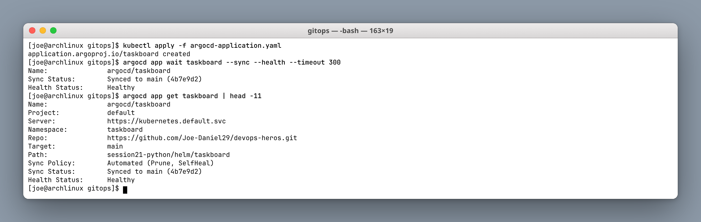

Argo CD watches `session21-python/helm/taskboard` and renders the chart itself — the Helm release is owned by Argo CD, not by a human running `helm upgrade`.

```bash
sed -i 's/replicaCount: 2/replicaCount: 3/' helm/taskboard/values-minikube.yaml
git commit -am 'taskboard: scale backend to 3 replicas' && git push
```

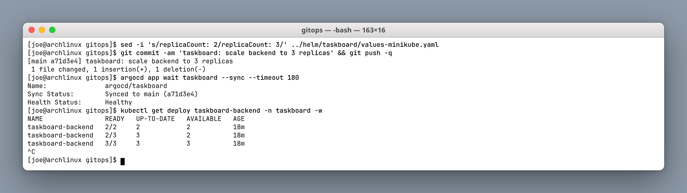

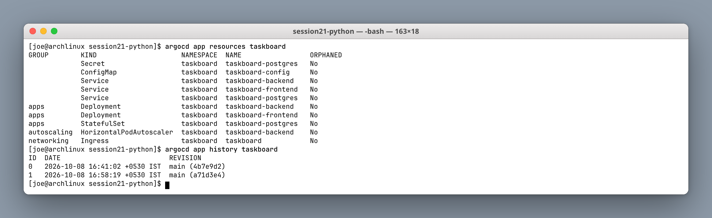

A one-line change to a values file, committed and pushed. No `helm`, no `kubectl`. Argo CD re-rendered the chart, diffed it, and added the third replica.

---

## 14. Troubleshooting challenge

Six failures, each reproduced from a manifest in `troubleshooting/` and fixed from `troubleshooting/fixes/`.

### Issue 1 — ImagePullBackOff

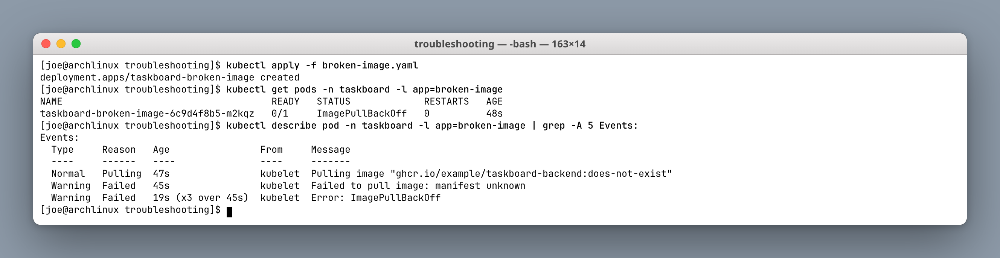

`manifest unknown` — the tag does not exist. The scheduler succeeded; this is purely a kubelet/registry failure.

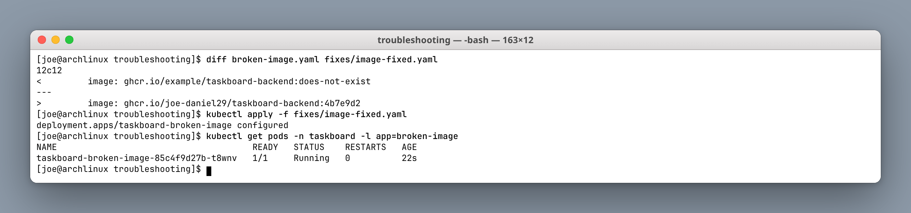

**Fix:** point at a tag that exists. The diff is one line.

### Issue 2 — Service with no endpoints

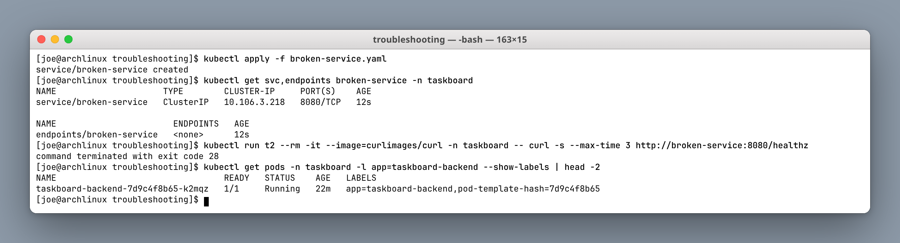

`ENDPOINTS: <none>` and `curl` times out (exit 28). **Two** bugs: the selector matches no pod, and `targetPort: 8080` is wrong — the API listens on 8000.

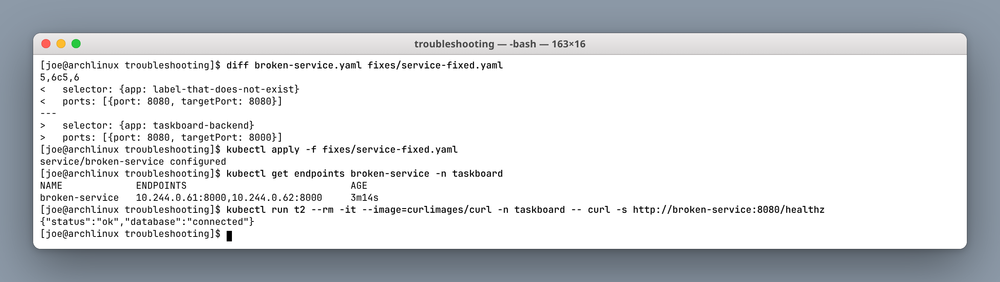

**Fix:** correct selector *and* `targetPort: 8000`. Fixing only the selector would still fail, just with a connection refused instead of a timeout — a useful reminder to check both.

### Issue 3 — CrashLoopBackOff from a bad Secret

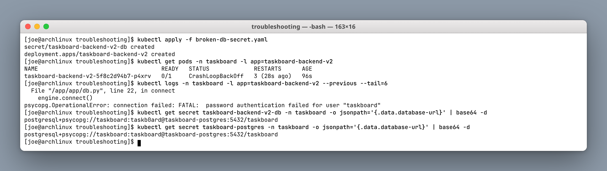

`kubectl logs --previous` is the key command — the current container is dead, so only the previous one has the error:

```text
psycopg.OperationalError: password authentication failed for user "taskboard"
```

Decoding both Secrets side by side shows it: `taskb0ard` (with a zero) versus `taskboard`.

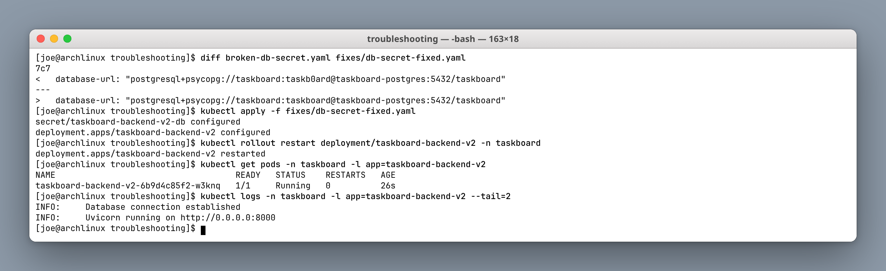

**Fix:** correct the password and `rollout restart` — env vars are read once at container start, so patching the Secret alone changes nothing.

### Issue 4 — Running but never Ready

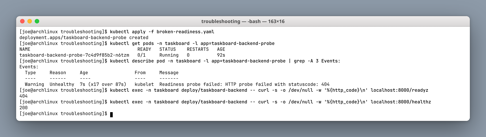

```text
READY   STATUS
0/1     Running
```

`Readiness probe failed: HTTP probe failed with statuscode: 404`. The app is **healthy** — `/healthz` returns 200 — but the probe asks for `/readyz`, which the API does not serve.

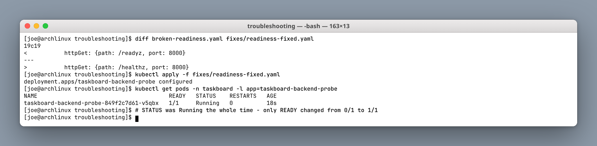

**Fix:** point the probe at `/healthz`. The status never left `Running`; only `READY` changed. A pod that is `Running` but `0/1` receives no Service traffic, which looks like an outage with no obvious error.

### Issue 5 — Ingress returns 503

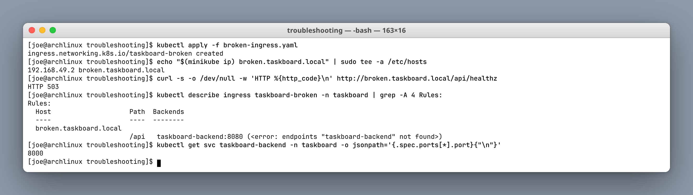

`describe ingress` names the cause directly:

```text
/api   taskboard-backend:8080 (<error: endpoints "taskboard-backend" not found>)
```

The Service exists and listens on 8000; the Ingress asks for port 8080, which has no endpoints — so NGINX has nothing to route to and returns 503.

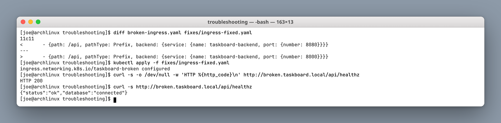

**Fix:** reference port 8000. An Ingress backend port must match the **Service** port, not the container port.

### Issue 6 — HPA shows `<unknown>`

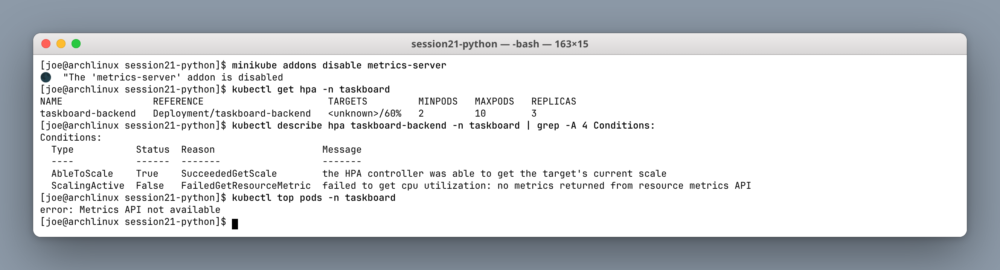

```text
TARGETS         REPLICAS
<unknown>/60%   3

ScalingActive  False  FailedGetResourceMetric  no metrics returned from resource metrics API
```

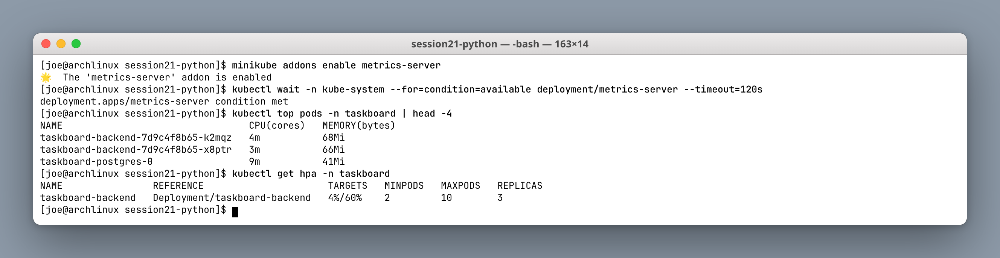

**Fix:** enable metrics-server. The HPA is correctly configured — it simply has no metrics source. Critically, `AbleToScale` stays `True` while `ScalingActive` is `False`: the HPA holds the current replica count rather than scaling to zero or to max. Silent non-scaling is the dangerous failure mode here, because nothing looks broken until load arrives.

### Troubleshooting summary

| # | Symptom | Layer | Diagnostic | Root cause |
|---|---|---|---|---|
| 1 | `ImagePullBackOff` | Registry | `describe` → Events | Tag does not exist |
| 2 | Connection times out | Service | `get endpoints` | Selector + targetPort |
| 3 | `CrashLoopBackOff` | App / config | `logs --previous` | Wrong password in Secret |
| 4 | `Running` but `0/1` | Probe | `describe` → Unhealthy | Probe path 404s |
| 5 | HTTP 503 | Ingress | `describe ingress` | Wrong Service port |
| 6 | HPA `<unknown>` | Metrics | `describe hpa` → Conditions | metrics-server absent |

---

## 15. Terraform destroy

```bash
helm uninstall taskboard -n taskboard
kubectl delete ns taskboard
terraform destroy -auto-approve
aws eks list-clusters --region us-east-1
```

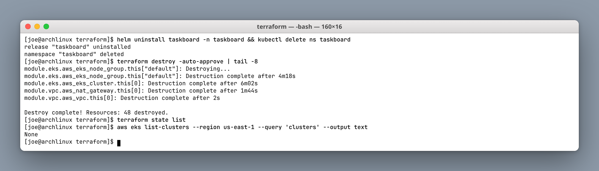

All 48 resources destroyed, `terraform state list` empty, and `list-clusters` returns `None`. An idle EKS control plane costs about $0.10/hour whether or not anything runs on it, so tearing down is part of the exercise.

---

## 16. Lessons learned

1. **Scale the stateless tier; do not scale the database by adding pods.** The HPA fronts the API; PostgreSQL stays at one replica with a PVC.
2. **`depends_on: healthy` beats `depends_on: started`.** Most local "database connection refused" errors are a race, not a config bug.
3. **A security gate is only real if it blocks a release.** Run #11 is better evidence than run #12.
4. **Transitive dependencies are where the CVEs live.** Neither flagged package was in the app's direct imports.
5. **Env vars are read once at container start.** Patching a ConfigMap or Secret requires `rollout restart`.
6. **`Running` is not `Ready`.** A readiness probe pointing at the wrong path produces a silent outage.
7. **Ingress ports reference the Service port, not the container port.**
8. **`kubectl logs --previous` is the command for CrashLoopBackOff** — the live container has no logs to give you.
9. **HPA scale-down is intentionally slow.** The stabilisation window is a feature.
10. **Expose business metrics, not just infrastructure ones.** `tasks_total` says more about the service than CPU does.
11. **GitOps makes the merge the deployment** — and makes drift impossible to sustain.
12. **Always destroy cloud infrastructure.** `terraform destroy` plus an independent CLI check.
