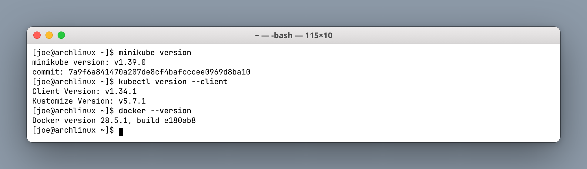
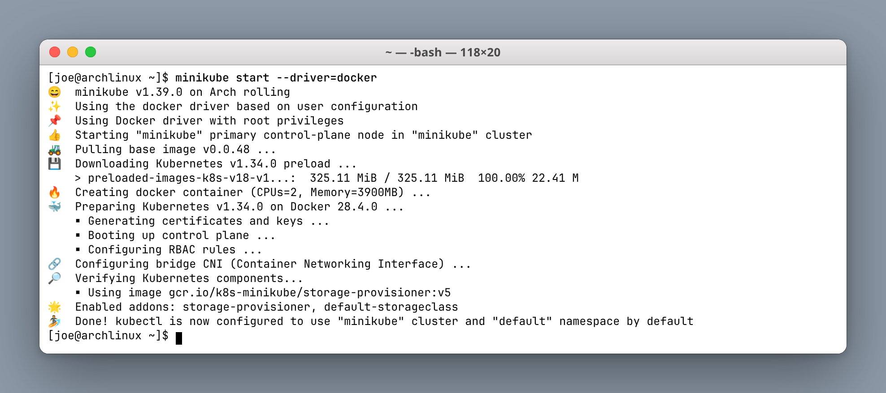
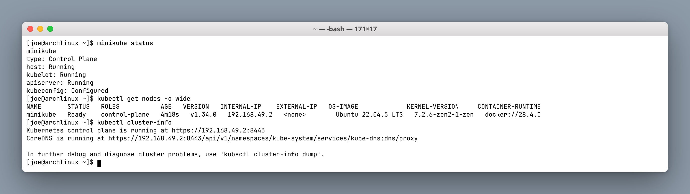
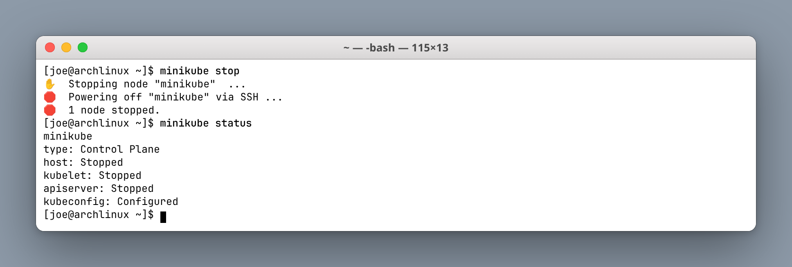

# Session 9: Kubernetes Fundamentals & Cluster Architecture

**Author:** Joe Daniel
**Enrollment:** 24bcs10214
**Course:** SST DevOps & Cloud [SWE]
**Session:** 09 — Kubernetes Fundamentals
**Repository:** devops-heros / session9-k8s

---

## Task 1: Minikube & CLI Installation Verification

Verify that Minikube, the Kubernetes CLI (`kubectl`), and the Docker runtime are installed on the local Arch Linux workstation.

**Commands:**
```bash
minikube version
kubectl version --client
docker --version
```

**Output:**
```
minikube version: v1.39.0
commit: 7a9f6a841470a207de8cf4bafcccee0969d8ba10

Client Version: v1.34.1
Kustomize Version: v5.7.1

Docker version 28.5.1, build e180ab8
```

**Screenshot:**



---

## Task 2: Starting the Minikube Kubernetes Cluster

Bring up the local single-node cluster on the Docker driver. Minikube pulls its base image, downloads the Kubernetes preload bundle, then boots the control plane inside a container.

**Command:**
```bash
minikube start --driver=docker
```

**Output:**
```
😄  minikube v1.39.0 on Arch rolling
✨  Using the docker driver based on user configuration
📌  Using Docker driver with root privileges
👍  Starting "minikube" primary control-plane node in "minikube" cluster
🚜  Pulling base image v0.0.48 ...
💾  Downloading Kubernetes v1.34.0 preload ...
🔥  Creating docker container (CPUs=2, Memory=3900MB) ...
🐳  Preparing Kubernetes v1.34.0 on Docker 28.4.0 ...
    ▪ Generating certificates and keys ...
    ▪ Booting up control plane ...
    ▪ Configuring RBAC rules ...
🔗  Configuring bridge CNI (Container Networking Interface) ...
🔎  Verifying Kubernetes components...
🌟  Enabled addons: storage-provisioner, default-storageclass
🏄  Done! kubectl is now configured to use "minikube" cluster and "default" namespace by default
```

**Screenshot:**



---

## Task 3: Verifying Cluster Status & Node Health

Check the control plane, kubelet, and API server, then confirm the node reports `Ready`.

**Commands:**
```bash
minikube status
kubectl get nodes -o wide
kubectl cluster-info
```

**Output:**
```
minikube
type: Control Plane
host: Running
kubelet: Running
apiserver: Running
kubeconfig: Configured

NAME       STATUS   ROLES           AGE     VERSION   INTERNAL-IP    EXTERNAL-IP   OS-IMAGE             KERNEL-VERSION     CONTAINER-RUNTIME
minikube   Ready    control-plane   4m18s   v1.34.0   192.168.49.2   <none>        Ubuntu 22.04.5 LTS   7.2.6-zen2-1-zen   docker://28.4.0

Kubernetes control plane is running at https://192.168.49.2:8443
CoreDNS is running at https://192.168.49.2:8443/api/v1/namespaces/kube-system/services/kube-dns:dns/proxy
```

**Screenshot:**



> The node's `KERNEL-VERSION` is the Arch host kernel (`7.2.6-zen2-1-zen`), because the Docker driver runs the "node" as a container that shares the host kernel. The `OS-IMAGE` is Minikube's Ubuntu base image.

---

## Task 4: Stopping the Minikube Cluster

Gracefully power down the cluster container to release CPU and memory.

**Commands:**
```bash
minikube stop
minikube status
```

**Output:**
```
✋  Stopping node "minikube"  ...
🛑  Powering off "minikube" via SSH ...
🛑  1 node stopped.

minikube
type: Control Plane
host: Stopped
kubelet: Stopped
apiserver: Stopped
kubeconfig: Configured
```

**Screenshot:**



> This screenshot was captured after the Session 10–12 labs finished, so the cluster stayed available for those assignments.

---

## Task 5: Kubernetes Cluster Architecture & Component Analysis

Breakdown of Control Plane vs Worker Node components, based on the [official Kubernetes architecture docs](https://kubernetes.io/docs/concepts/architecture/).

```
+-------------------------------------------------------------------------------+
|                             CONTROL PLANE (MASTER)                            |
|                                                                               |
|   +-------------------+       +--------------------+       +--------------+   |
|   |       etcd        |<----->|  kube-apiserver    |<----->|kube-scheduler|   |
|   | (State Database)  |       |    (Front Door)    |       +--------------+   |
|   +-------------------+       +---------+----------+                          |
|                                         |                                     |
|                                         v                                     |
|                             +------------------------+                        |
|                             | kube-controller-manager|                        |
|                             +------------------------+                        |
+-----------------------------------------+-------------------------------------+
                                          |
                                          v
                        +------------------------------------+
                        |            WORKER NODE             |
                        |   kubelet      |     kube-proxy    |
                        |   CRI (dockerd / containerd) -> Pods|
                        +------------------------------------+
```

### Control Plane (Master)

- **kube-apiserver** — The single front door. Every `kubectl` call and every controller talks to the API server. Only the API server talks to etcd.
- **etcd** — The cluster state database. Desired specs and observed status both live here.
- **kube-scheduler** — Watches for unscheduled Pods and picks a node using CPU/memory requests, affinity rules, taints, and tolerations.
- **kube-controller-manager** — Runs the reconciliation loops. The node controller, ReplicaSet controller, and EndpointSlice controller each work to make current state equal desired state.

### Worker Node (Data Plane)

- **kubelet** — The node agent. Receives PodSpecs, tells the container runtime to start containers, and reports health back to the API server.
- **kube-proxy** — Programs iptables/IPVS rules so Service VIPs load-balance across Pod IPs.
- **CRI (dockerd / containerd)** — Actually runs the containers. Modern Kubernetes talks to a CRI-compliant runtime, not the legacy Docker daemon directly.
- **Pod** — The smallest deployable unit. One or more containers sharing a network namespace and volumes.

### How they interact

1. You run `kubectl apply`.
2. The API server validates the object and writes it to etcd.
3. The scheduler assigns it to a node.
4. The kubelet on that node starts the containers via the CRI.
5. Controllers keep watching and repairing drift — restarts, replica counts, endpoint updates.

---

# Resources

- https://kubernetes.io/docs/concepts/overview/

- https://minikube.sigs.k8s.io/docs/start/

- https://kubernetes.io/docs/concepts/architecture/

- https://github.com/Nency-Ravaliya/Kubernetes
